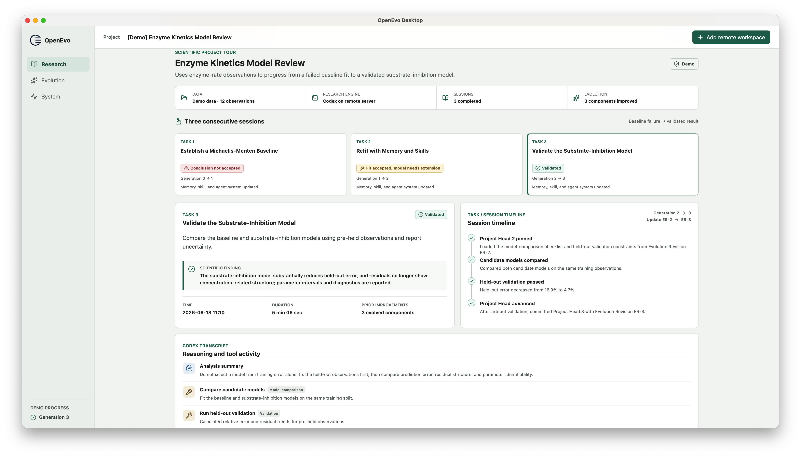

<p align="center">
  
</p>

# OpenEvo

OpenEvo runs scientific tasks through a real agent harness and evolves reusable
context between sessions. Researchers work entirely in the macOS Desktop app;
OpenEvo installs and controls its matching Daemon on a remote Linux server.

OpenEvo has two user-facing applications:

- **OpenEvo Desktop Client** is the macOS interface researchers install and use.
- **OpenEvo Daemon** is the Linux service that Desktop installs and controls on
  the selected remote server.

[Download the current Preview](https://github.com/CompLifeLab-ZJU/OpenEvo/releases/tag/openevo-desktop-v0.1.5-exhibition.29827786454.1)
| [Read the user guide](docs/user/README.md)
| [Report a problem](https://github.com/CompLifeLab-ZJU/OpenEvo/issues)



## What OpenEvo Does

- Runs literature, data, coding, and analysis tasks with Codex on your remote
  server.
- Captures each task's timeline and transcript without exposing raw private
  chain-of-thought.
- Evolves any user-selected combination of textual memory, reusable skills,
  and agent-system instructions.
- Applies accepted evolution artifacts to the next task, never midway through
  the task that produced them.
- Shows task execution, Project Head progression, evolution revisions,
  readable artifacts, and previous-versus-current diffs in Desktop.
- Keeps server installation, upgrades, service checks, repair, and private
  tunnelling behind the Desktop interface.

OpenEvo does not replace Codex or call a model API directly in the current
subscription mode. It runs the existing Codex CLI harness on the selected
server, captures its transcript, and wraps it with project and evolution
lifecycle management.

## Try It Before Connecting A Server

The first launch includes two read-only demonstration projects:

- **Enzyme Kinetics Model Review** follows a failed baseline through corrected
  fitting and held-out validation.
- **Protein Stability Evidence Review** combines plate-aware DSF analysis
  with orthogonal SEC evidence.

Each project contains three task sessions and complete textual-memory,
trajectory-to-skill, and agent-system evolution histories. The examples require
no account, server, or network access and never create authoritative project
state.

## Current Preview

The current public release is **OpenEvo Desktop 0.1.5 Preview**. It supports the
following exhibition profile:

| Component | Current support |
| --- | --- |
| Desktop | Apple Silicon Mac, macOS 12 or later |
| Remote host | Linux x86-64 with SSH and Docker user-container access |
| Harness | Codex CLI already installed and signed in for the SSH user |
| Execution | Codex subscription with transcript capture |
| Evolution | Textual memory, trajectory-to-skill, and agent-system evolution |
| Network | Direct HTTPS or a remote HTTP/HTTPS proxy configured in Desktop |

Self-deployed inference, parameter or adapter evolution, other harnesses,
automatic Codex installation/login, Intel Mac builds, and a general clean-host
matrix are not part of this Preview. It is unsigned and not notarized. Use the
documented host profile and do not depend on it for production-critical work.

## Install On macOS

1. Open the immutable
   [OpenEvo Desktop 0.1.5 Preview release](https://github.com/CompLifeLab-ZJU/OpenEvo/releases/tag/openevo-desktop-v0.1.5-exhibition.29827786454.1).
2. Download `OpenEvo-Desktop-0.1.5-aarch64.dmg` and `SHA256SUMS`.
3. Verify the DMG before opening it:

   ```bash
   grep '  OpenEvo-Desktop-0.1.5-aarch64.dmg$' SHA256SUMS \
     | shasum -a 256 -c -
   ```

4. Open the DMG and move **OpenEvo Desktop** to **Applications**.
5. Because this Preview is unsigned, either choose **Open Anyway** in
   **System Settings > Privacy & Security**, or clear quarantine from only the
   checksum-verified application:

   ```bash
   xattr -dr com.apple.quarantine "/Applications/OpenEvo Desktop.app"
   ```

Do not install a Python package or clone this repository to install Desktop.
See the [Desktop quickstart](docs/user/desktop-quickstart.md) for the complete
installation and removal procedure.

## Prepare A Remote Server

The remote account must be reachable over SSH and provide:

- a writable home directory with enough project and container storage;
- Docker access for the selected user;
- outbound HTTPS, directly or through the proxy saved in Desktop;
- Codex CLI installed and authenticated to a subscription for that same user.

Your SSH identity must be available through the macOS SSH agent. Desktop does
not accept or upload private-key bytes. On first connection, compare the shown
`SHA256:` host fingerprint with a value obtained from the server administrator
through a trusted channel.

Desktop then transfers the release-matched Daemon, prepares the managed science
runtime, starts or attaches services, verifies compatibility, and establishes
the private tunnel. Users do not upload an image, install OpenEvo on the server,
or operate the Daemon through SSH. Host-level Docker policy and Codex login are
administrator prerequisites in this Preview.

See [Remote server setup](docs/user/remote-server-setup.md) and
[proxy configuration](docs/user/proxy-and-network.md) for details.

## Run Your First Project

1. In Desktop, choose **Add remote workspace** and enter the server address,
   SSH port, and remote user.
2. Connect and confirm the server fingerprint.
3. Create a project with a task objective and either an empty managed workspace
   or a snapshot of a local folder.
4. Select the Codex model and reasoning effort available on the server.
5. Enable only the evolution carriers you want. For every enabled carrier,
   choose one of the methods reported by the connected Daemon.
6. Save and activate the project. Desktop checks Codex, Docker, the managed
   runtime, the Daemon, and the selected evolution methods before allowing a
   run.
7. Start the task and follow the timeline, safe transcript summaries, tool
   activity, and output in **Research**.
8. After evolution completes, inspect memory, skills, agent-system artifacts,
   and diffs in **Evolution**.
9. Start another task to use the accepted successor Project Head.

You can enable one, several, or none of the available evolution carriers; a run
does not implicitly enable all methods. Evolution is cross-session: outputs
from one completed task become eligible only for a later task.

Closing Desktop does not stop a remote task. Reopen the app, make the SSH key
available to the macOS agent, and reconnect to recover authoritative state and
missed events.

## Data And Security

- Task inputs and required context are sent through the remote user's Codex
  subscription according to that service's terms.
- Transcripts, project snapshots, and evolution artifacts are stored on the
  remote server under the selected user account.
- SSH private keys remain in the macOS SSH agent. Desktop stores the explicitly
  accepted host identity and fails closed on an unexplained key change.
- Desktop and Daemon communicate through an authenticated private SSH tunnel;
  the Daemon API is not exposed as a normal user surface.
- The two built-in demonstrations are local and read-only.

Review the [security policy](SECURITY.md) before using private research data.

## Troubleshooting

- **macOS says the app is damaged or cannot be verified:** verify the DMG
  checksum, then use **Open Anyway** or the scoped `xattr` command above.
- **SSH connection fails:** check the host, port, user, network, and that the
  correct key is loaded in the macOS SSH agent.
- **The server identity changed:** stop and confirm the new fingerprint with
  the administrator. Never bypass host-key verification.
- **Activation reports missing Codex or Docker:** these are host prerequisites
  in this Preview. Ask the administrator to prepare the same SSH account, then
  choose **Retry** in Desktop.
- **A restricted network blocks downloads:** save the remote proxy settings in
  the workspace and retry the Desktop-managed preparation.
- **The next task is not ready:** wait for the current task and its successor
  evolution revision to finish; OpenEvo will not silently use partial state.

Typed errors include a stable code and a next action. The
[troubleshooting guide](docs/user/troubleshooting.md) explains the common codes
and safe recovery flow.

## Documentation

### For Researchers

- [User documentation](docs/user/README.md)
- [Desktop quickstart](docs/user/desktop-quickstart.md)
- [Remote server setup](docs/user/remote-server-setup.md)
- [Proxy and network settings](docs/user/proxy-and-network.md)
- [Troubleshooting](docs/user/troubleshooting.md)
- [Security policy](SECURITY.md)

### For Maintainers And Contributors

Ordinary users should not run repository command entrypoints, install OpenEvo
from PyPI, or operate the Daemon manually. The Python and command-line surfaces
in this repository are backend launchers, maintenance tools, CI tools, and
benchmark automation.

- [Contribution guide](CONTRIBUTING.md)
- [Repository development rules](AGENTS.md)
- [Architecture documentation](docs/architecture/README.md)
- [Product and release contract](docs/maintainer/productization/spec.md)
- [Maintainer testing guide](docs/maintainer/testing.md)
- [Release process](docs/maintainer/release-process.md)

Repository boundaries:

```text
src/openevo/   OpenEvo Core and Daemon backend
desktop/       macOS Desktop Client, native host, and private sidecar
benchmarks/    standalone maintainer benchmark automation
docs/          user, architecture, and maintainer documentation
tests/         contract, regression, integration, and release tests
```

OpenEvo Core is shared implementation used by the Daemon, not a third product.
Benchmark packages call Core capabilities but are not bundled into Desktop or
Daemon.

## License

OpenEvo is distributed under the terms in [LICENSE](LICENSE).
