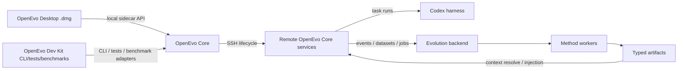

# OpenEvo Architecture Docs

This directory is the publish-facing architecture index for OpenEvo. The public
surfaces are:

- **OpenEvo Core**: execution, capture, dataset/job/artifact, method, context,
  runtime, and benchmark-adapter contracts.
- **OpenEvo Desktop**: the ordinary-user macOS science app and local sidecar
  control plane.
- **OpenEvo Dev Kit**: CLI, source, testing, benchmark, method-development, and
  artifact-inspection workflows for OpenEvo developers.

Some implementation packages, environment variables, and historical documents
still use `polar` names. Treat those as lower-level runtime implementation
details unless a document explicitly discusses the legacy framework.

## Recommended Reading Order

1. [OpenEvo Desktop Science Foundation](openevo-desktop-science-foundation.md)
   - Science Project config, ordinary-user Desktop flow, remote lifecycle,
     subscription/self-deployed semantics, run supervision, and artifact viewing.
2. [OpenEvo Dev Kit](openevo-dev-kit.md)
   - Developer workflow boundary, method metadata lifecycle, and benchmark
     adapter rules.
3. [OpenEvo Desktop Release Packaging](openevo-desktop-release.md)
   - Tauri `.dmg` packaging, exact wheel artifacts, and release validation.
4. [Evolution API And Method Integration](evolution-api-and-method-integration.md)
   - Core artifact contracts and how to add new methods.
5. [OpenEvo Core Evolution Backend](evolution-backend.md)
   - Events, datasets, jobs, workers, artifact registry, context resolver, and
     storage layout.
6. [Evolution Runtime Context](evolution-runtime-context.md)
   - How memory, skill bundles, agent-system text, and adapters are resolved and
     staged into runtime sessions.

## Desktop And Remote Lifecycle Docs

- [OpenEvo Desktop Sidecar Foundation](openevo-desktop-sidecar-foundation.md)
  - Local sidecar config contract, project profiles, proxy/mirror fields, Core
    capability endpoints, and Desktop lifecycle endpoint boundaries.
- [OpenEvo Desktop SSH Transport Foundation](openevo-desktop-ssh-transport-foundation.md)
  - SSH transport behavior and secret-reference boundary.
- [OpenEvo Desktop Remote Executor Foundation](openevo-desktop-remote-executor-foundation.md)
  - Fakeable remote executor and workspace-preparation reports.
- [OpenEvo Desktop Remote Bootstrap Lifecycle Foundation](openevo-desktop-remote-bootstrap-lifecycle-foundation.md)
  - Remote bootstrap, exact OpenEvo Core installation, service status/log/control
    endpoints, and self-deployed service preparation.

## Core Evolution Docs

- [Reference Evolution Worker](reference-evolution-worker.md)
  - Built-in reference methods, including `text_memory`, `skill_bundle`,
    `agent_system`, and parametric-memory registration/training interfaces.
- [PR Process Checks](pr-process-checks.md)
  - Issue/PR templates and warning-level issue-link/docs-change checks.
- [Polar System Overview](polar-system-overview.md)
  - Historical lower-level rollout/gateway/runtime/proxy architecture used by
    OpenEvo Core internals.

## High-Level Boundary

Desktop and Dev Kit are wrappers around Core. They should not fork method
registry behavior, artifact contracts, context resolution, remote lifecycle, or
harness execution semantics.
