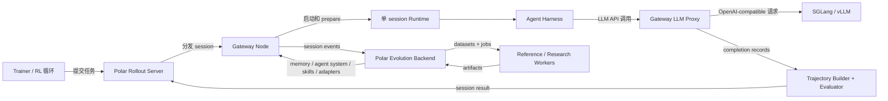

# Polar 架构文档

这个目录集中记录当前 Polar 的系统架构，以及新增的 skill/memory
evolution backend。文档中的图使用 Mermaid，便于在 GitHub 和常见
Markdown 预览器中直接渲染。

## 文档列表

- [Polar 系统总览](polar-system-overview.md)
  - Rollout server、gateway node、runtime、agent harness、inference proxy、
    trajectory/evaluation 的整体关系。
- [Evolution Backend（演化后端）](evolution-backend.md)
  - 事件摄取、dataset、job、worker、artifact registry、context resolver 和
    存储布局。
- [Evolution Runtime Context（演化运行时上下文）](evolution-runtime-context.md)
  - 自然语言 memory、agent system 文本、skill bundle、parametric memory 如何被
    解析并注入到 Polar session。
- [Evolution API 与新算法接入](evolution-api-and-method-integration.md)
  - API payload、artifact schema、context resolve response，以及如何接入新的
    skill/memory/agent-system/parametric-memory 算法。
- [Reference Evolution Worker（参考演化 Worker）](reference-evolution-worker.md)
  - 内置 reference methods：`text_memory`、`skill_bundle`、
    `agent_system`、`parametric_memory_register`。

## 高层系统图

Polar 的关键边界是 HTTP：rollout 编排、gateway 执行、inference、training
和 evolution 都可以独立扩展，只要各自 API contract 保持稳定。
