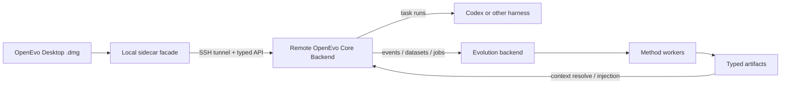

# OpenEvo Architecture Docs

This directory describes the current architecture and External Beta target.
OpenEvo is still pre-release; target documents must not be read as proof that a
packaged workflow already exists. The product surfaces are:

- **OpenEvo Desktop**: the ordinary-user macOS app and local sidecar facade.
- **OpenEvo Core Backend**: the remote Python backend that owns execution,
  deployment, trajectory capture, evolution, artifacts, and typed APIs.

Developer automation and source-checkout utilities are Core Backend workflows.
Standalone benchmark automation lives outside Core and Desktop, imports Core
capabilities, and is not a separate product surface.

## Recommended Reading Order

1. [Canonical Productization Spec](../maintainer/productization/spec.md)
   - Product boundaries, supported modes, protected algorithms, and release
     gates.
2. [Pre-release Desktop User Docs](../user/README.md)
   - Short target workflows while the packaged application is implemented.
3. [OpenEvo Core Backend API Target](../core/backend-api.md)
   - Typed backend routes, Desktop facade boundary, state-root reads, and error
     model.
4. [OpenEvo Core Backend Release](core-backend-release.md)
   - Core install artifact, backend launcher, remote install identity, and
     release smoke evidence.
5. [Evolution API And Method Integration](evolution-api-and-method-integration.md)
   - Core artifact contracts and how new evolution methods plug into the
     method registry.
6. [Pluggable Evolution Framework Contract](evolution-framework.md)
   - A2 target/method registry, plan identity, handler contributions, capability
     projection, and security contract; A2.1 has not cut over runtime paths.
7. [Protected Evolution Behavior](protected-behavior.md)
   - A1 regression tests for validated methods and the proven stage boundaries
     preserved during productization.
8. [OpenEvo Core Evolution Backend](evolution-backend.md)
   - Events, datasets, jobs, workers, artifact registry, context resolver, and
     storage layout.
9. [Evolution Runtime Context](evolution-runtime-context.md)
   - How memory, skill bundles, agent-system text, and adapters are resolved and
     staged into runtime sessions.

## Desktop And Remote Lifecycle

Pre-release Desktop workflow notes live under `docs/user/`; Core target
contracts live under `docs/core/`. Older Desktop foundation notes remain as
non-current implementation history and are not part of the recommended reading
order.

## Core Backend Internals

- [OpenEvo Core Runtime System Overview](core-runtime-system-overview.md)
  - Rollout, gateway, runtime, proxy, and transcript/proxy capture data paths.
- [PR Process Checks](pr-process-checks.md)
  - Issue/PR templates and issue-link/docs-change checks.

Source-checkout developer workflows, standalone benchmark automation notes, and
backend maintenance runner examples are maintainer material and are not
ordinary-user product paths.

Maintainer-only worker protocol details remain in
`docs/architecture/reference-evolution-worker.md` for release gate and method
contract maintenance. That file is not part of the ordinary-user reading order
and must keep maintainer command examples machine-marked as maintainer-only.

## High-Level Boundary

Desktop must not fork method registry behavior, artifact contracts, context
resolution, remote lifecycle, or harness execution semantics. Those live in
Core Backend.
