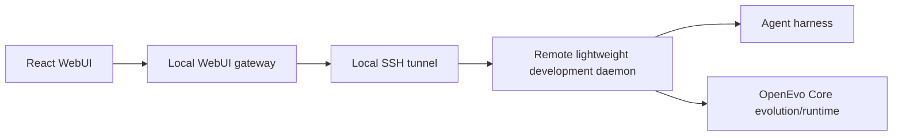

# OpenEvo architecture

The experimental product path is:

The browser talks only to the loopback WebUI gateway. The launcher owns SSH
deployment and tunnel lifecycle. The remote daemon owns authoritative project,
session, transcript, and workspace state. Core remains reusable implementation,
not a separate user-facing application.

Start with:

1. [Canonical rebuild spec](../maintainer/productization/spec.md)
2. [Remote agent Web Layer](development-agent-web-layer.md)
3. [Daemon rebuild v0](daemon-rebuild.md)
4. [WebUI gateway](webui-gateway.md)
5. [Core runtime overview](core-runtime-system-overview.md)
6. [Evolution backend](evolution-backend.md)
7. [Evolution framework](evolution-framework.md)
8. [Evolution runtime context](evolution-runtime-context.md)

The removed packaged Desktop/sidecar/Core Control/deployment architecture is
historical and must not be treated as a compatibility contract.
