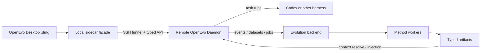

# OpenEvo Architecture Docs

This directory describes the current architecture and External Beta target.
OpenEvo `0.1.8` is the current installable unsigned exhibition Preview with a
real Desktop DMG, packaged sidecar and renderer, self-contained Daemon Bundle,
managed-runtime packaging smoke, legacy-state startup isolation, native
startup diagnostics, and immutable release asset verification. Signed
candidate-bound evidence covers two real
remote Codex subscription sessions, all three text-evolution targets,
next-session artifact reuse, and packaged-renderer observability. It has no
clean-host matrix or full macOS Tauri-to-remote-host E2E evidence. Target
documents must not be read as proof that the Preview satisfies the full
External Beta contract or G1-G12. Earlier Preview releases are historical
evidence. The product surfaces are:

- **OpenEvo Desktop**: the ordinary-user macOS app and local sidecar facade.
- **OpenEvo Daemon**: the remote Linux backend that owns execution, deployment,
  trajectory capture, evolution, artifacts, and typed APIs.

The Core implementation under `src/openevo/` is assembled into the Daemon; it
is not a third product. Developer automation and source-checkout utilities are
maintainer workflows. Standalone benchmark automation lives outside Core and
Desktop, imports Core capabilities, and is not a separate product surface.
Terminal Bench maintainer commands and package boundaries are documented in
`../../benchmarks/terminal_bench/README.md`.

## Recommended Reading Order

1. [Canonical Productization Spec](../maintainer/productization/spec.md)
   - Product boundaries, supported modes, protected algorithms, and release
     gates.
2. [Desktop Preview User Docs](../user/README.md)
   - Short target workflows while the packaged application is implemented.
3. [OpenEvo Daemon API Target](../core/backend-api.md)
   - Typed backend routes, Desktop facade boundary, state-root reads, and error
     model.
4. [OpenEvo Daemon Release](core-backend-release.md)
   - Daemon Bundle, backend launcher, remote install identity, and release
     smoke evidence.
5. [Core Control API v1 Provider](core-control-v1-provider.md)
   - Frozen remote control contract ownership, durable projects/workspaces,
     verified capabilities, service observation, SSE replay, and fail-closed gaps.
6. [Evolution API And Method Integration](evolution-api-and-method-integration.md)
   - Core artifact contracts and how new evolution methods plug into the
     method registry.
7. [Pluggable Evolution Framework Contract](evolution-framework.md)
   - A2 target/method registry, durable plan identity, verified worker dispatch,
     remote capability projection, handler contributions, and security contract.
8. [Protected Evolution Behavior](protected-behavior.md)
   - A1 regression tests for validated methods and the proven stage boundaries
     preserved during productization.
9. [OpenEvo Core Evolution Backend](evolution-backend.md)
   - Events, datasets, jobs, workers, artifact registry, context resolver, and
     storage layout.
10. [Evolution Runtime Context](evolution-runtime-context.md)
   - How memory, skill bundles, agent-system text, and adapters are resolved and
     staged into runtime sessions.

## Desktop And Remote Lifecycle

Pre-release Desktop workflow notes live under `docs/user/`; Daemon target
contracts live under `docs/core/`. [Desktop Release Packaging](openevo-desktop-release.md)
separates the published unsigned Preview packaging path from the still-open
External Beta release gates. [Desktop Active-Tunnel Core Bridge v1](desktop-core-bridge-v1.md)
documents the strict project-session bridge and its still-incomplete authority
boundary. The next contract-major authority cutover must precede deeper Task,
Files, or History state. Older Desktop foundation notes remain implementation
history.

## Daemon And Core Internals

- [Core Internal Service Supervisor](core-service-supervisor.md)
  - Host-global Core ownership of evolution, rollout, gateway, and worker
    subprocess groups; ephemeral internal authentication, secure stale-group
    recovery, service/run-readiness separation, typed status/log projection,
    and the fail-closed self-deployed model-preparation boundary.
- [OpenEvo Core Runtime System Overview](core-runtime-system-overview.md)
  - Rollout, gateway, runtime, proxy, and transcript/proxy capture data paths.
- [PR Process Checks](pr-process-checks.md)
  - Issue/PR templates and issue-link/docs-change checks.

Source-checkout developer workflows, standalone benchmark automation notes, and
backend maintenance runner examples are maintainer material and are not
ordinary-user product paths.

Maintainer-only worker protocol details remain in
`docs/architecture/reference-evolution-worker.md` for release gate and method
contract maintenance. That file is not part of the ordinary-user reading order
and must keep maintainer command examples machine-marked as maintainer-only.

## High-Level Boundary

Desktop must not fork method registry behavior, artifact contracts, context
resolution, remote lifecycle, or harness execution semantics. Those live in the
Daemon's Core implementation.
