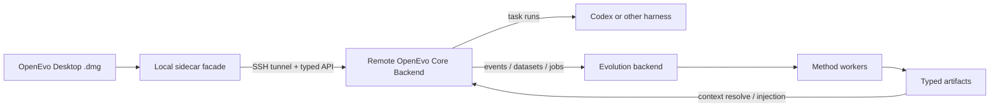

# OpenEvo Architecture Docs

This directory is the release-facing architecture index for OpenEvo. The
product surfaces are:

- **OpenEvo Desktop**: the ordinary-user macOS app and local sidecar facade.
- **OpenEvo Core Backend**: the remote Python backend that owns execution,
  deployment, trajectory capture, evolution, artifacts, and typed APIs.

Developer automation, benchmark adapters, and source-checkout utilities are
Core Backend workflows. They are not a separate product surface.

## Recommended Reading Order

1. [OpenEvo Desktop Science Foundation](openevo-desktop-science-foundation.md)
   - Ordinary-user science projects, remote lifecycle, execution modes, run
     supervision, and artifact viewing.
2. [OpenEvo Desktop Release Packaging](openevo-desktop-release.md)
   - Tauri `.dmg` packaging, bundled sidecar, exact wheel artifacts, and release
     validation.
3. [OpenEvo Core Backend API](../core/backend-api.md)
   - Typed backend routes, Desktop facade boundary, state-root reads, and error
     model.
4. [Evolution API And Method Integration](evolution-api-and-method-integration.md)
   - Core artifact contracts and how new evolution methods plug into the
     method registry.
5. [OpenEvo Core Evolution Backend](evolution-backend.md)
   - Events, datasets, jobs, workers, artifact registry, context resolver, and
     storage layout.
6. [Evolution Runtime Context](evolution-runtime-context.md)
   - How memory, skill bundles, agent-system text, and adapters are resolved and
     staged into runtime sessions.

## Desktop And Remote Lifecycle

- [OpenEvo Desktop Sidecar Foundation](openevo-desktop-sidecar-foundation.md)
  - Local sidecar config contract, project profiles, proxy/mirror fields, Core
    capability endpoints, and Desktop lifecycle endpoint boundaries.
- [OpenEvo Desktop SSH Transport Foundation](openevo-desktop-ssh-transport-foundation.md)
  - SSH transport behavior and secret-reference boundary.
- [OpenEvo Desktop Remote Executor Foundation](openevo-desktop-remote-executor-foundation.md)
  - Fakeable remote executor and workspace-preparation reports.
- [OpenEvo Desktop Remote Bootstrap Lifecycle Foundation](openevo-desktop-remote-bootstrap-lifecycle-foundation.md)
  - Remote bootstrap, exact OpenEvo Core installation, service status/log/control
    endpoints, and self-deployed service preparation.

## Core Backend Internals

- [OpenEvo Core Runtime System Overview](core-runtime-system-overview.md)
  - Rollout, gateway, runtime, proxy, and transcript/proxy capture data paths.
- [Reference Evolution Worker](reference-evolution-worker.md)
  - Built-in reference methods, including `text_memory`, `skill_bundle`,
    `agent_system`, and parametric-memory registration/training interfaces.
- [OpenEvo Core Developer Workflows](core-developer-workflows.md)
  - Source-checkout workflows for method development, benchmark adapters,
    artifact inspection, and regression fixtures.
- [PR Process Checks](pr-process-checks.md)
  - Issue/PR templates and issue-link/docs-change checks.

## High-Level Boundary

Desktop must not fork method registry behavior, artifact contracts, context
resolution, remote lifecycle, or harness execution semantics. Those live in
Core Backend.
