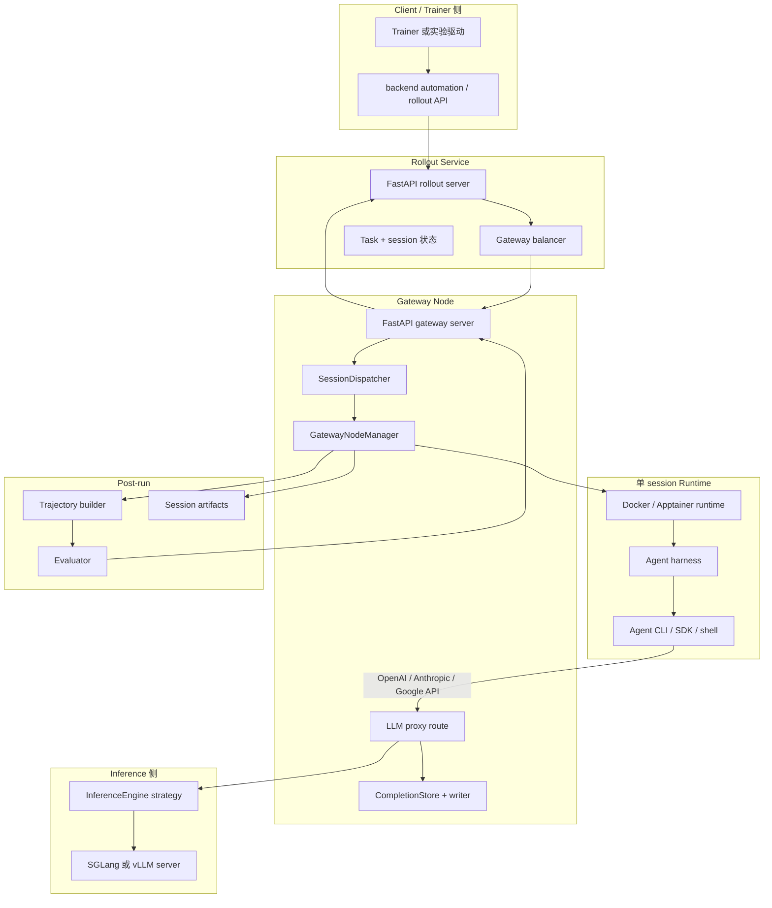
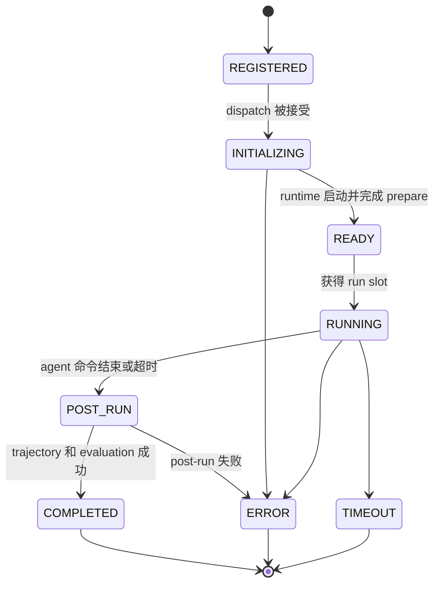
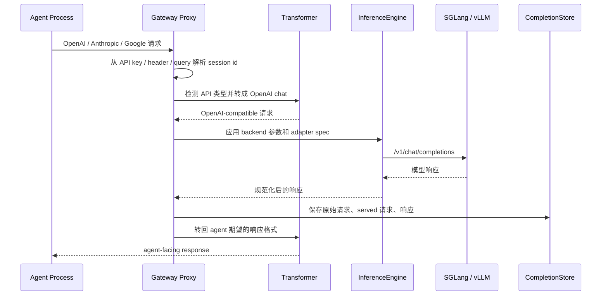

# OpenEvo Core Runtime 系统总览

OpenEvo Core 的低层 runtime 是面向真实 agent harness 的 rollout-as-a-service
框架。它通过在
准备好的 runtime 中启动 agent，并在 agent 与 inference server 之间放置
gateway proxy，使 agent 尽量不需要为 OpenEvo 改代码。proxy 会捕获模型调用，
并把这些调用转成 RL training 可消费的 token-level trajectory。对于不经过
OpenEvo proxy 的纯文本 capture 模式，OpenEvo 只保证 transcript-level
trajectory，不伪造 token id、logprob 或 token-level metric。订阅登录只是某些
harness 的 auth 方式；它必须显式开启 transcript capture 后才允许运行。

这个文档描述的是 OpenEvo Core Backend 内部 rollout/gateway/runtime/proxy 数据路径。
公开 runtime contract 使用 OpenEvo identity：`OPENEVO_*`、`/openevo/session`
和 `openevo.session_completed`。

## 组件图



## Session 生命周期



分阶段生命周期由 `SessionDispatcher` 和 `GatewayNodeManager` 实现。这个拆分
对运行时很重要：同一个 node 可以分别限制 runtime 初始化、活跃 agent 执行和
post-run 工作的并发。

## 请求路径



Streaming 请求会被处理成 synthetic stream：gateway 对 backend 发起一次
non-streaming 请求，再把完整响应格式化成 SSE events 返回给 agent。这样可以让
capture 和 trajectory 构造保持确定性。

## Capture 模式和训练信号

OpenEvo Core 当前区分两类 capture：

| 模式 | 入口 | 产物 | 适合用途 |
|---|---|---|---|
| OpenEvo proxy capture | agent 请求 `OPENAI_BASE_URL` / `ANTHROPIC_BASE_URL` / Gemini proxy | `CompletionSession`，包含请求、响应、token ids、logprobs | token-level RL、policy gradient、需要 loss mask 的训练 |
| Pure-text transcript capture | `agent.settings.capture_mode="transcript"`；可配合订阅登录或其他不走 proxy 的 harness | `agent_transcript` trajectory，来自 Core 私有 log authority 下的 `logs/agent/step.xx.stdout.log` | skill/memory/agent-system evolution、行为回放、非 token-level 评估 |

纯文本 transcript capture 是显式选项，而不是某个 harness 的隐式行为。Gateway
只有在 `agent.settings.capture_mode="transcript"` 或等价 transcript capture mode
开启、且本次 run 没有 proxy completion records 时，才会 fallback 到
`agent_transcript` builder，从 agent stdout transcript 构造 trajectory。这个
trajectory 的 `Trace.response_ids`、`Trace.loss_mask`、`Trace.response_logprobs`
为空，并在 trajectory/trace metadata 中设置：

```json
{
  "capture_mode": "transcript",
  "token_level_metrics_available": false
}
```

后续 skill/memory/agent-system evolution 可以消费这类 transcript trajectory；
token-level RL 训练必须过滤掉 `token_level_metrics_available=false` 的 traces，
或要求任务走 OpenEvo proxy 模式。

如果 harness 选择 `auth_mode="subscription"` 或 harness-specific subscription
alias，它必须同时设置 transcript capture mode。当前 managed subscription release 只接受
literal `capture_mode="transcript"`、exact managed runtime profile/image、Docker host-user
执行，并显式 unset proxy 相关环境变量。其他订阅式 harness 也应遵守同样边界：订阅负责
auth，transcript capture 负责 evolution 可消费的行为记录。

`managed_science` 的 runtime binding 不以 subscription 为条件。无论 execution mode 是
subscription 还是 self-deployed，Experiment config、`RuntimeSpec`、Core launcher 和 Gateway
admission 都要求 Docker、profile 对应的 exact canonical image 和 host user，并拒绝 custom
runtime loader/options。canonical image tag 仅用于内部 profile binding；release contract
另行声明完整 trusted `sha256`。Bootstrap 只拉取 `repository@digest` 并 inspect
`RepoDigests`/image ID；DockerRuntime 在 create 前再次复核并改用 immutable reference，之后才
允许 credential mount 进入 create argv。tag 漂移、无 digest、inspect 不一致都 fail closed。
显式 development fallback 才可现场 build，且两个 base image 必须 digest-pinned、最终 image
仍须匹配 release digest。所有 prepare/eval-prepare upload target 在 runtime 创建前必须是
`/openevo/session` 下的 canonical absolute path；实际 bind copy 从 held session-root FD 逐级
`openat`/no-follow，拒绝 symlink、special file、hard-linked leaf 和并发 ancestor replacement。
Evolution context 的临时源位于 agent 不可挂载的 Core 临时目录，不在 session bind 中 staging。

Codex subscription 的 `HOME`、`PATH` 和 `CODEX_HOME` 都由 Core 固定，agent、runtime
和 action env 不能覆盖；Codex 使用镜像内固定绝对路径启动，不能被 workspace `PATH`
shadow。Gateway 在创建 runtime 前，先 durable journal 私有 credential root，再从绝对
filesystem anchor 逐组件固定并复核宿主机 `~/.codex/auth.json`，把 bytes 写入该受管 root
内随机 `0700` staging child。在这里完成 no-follow、owner、mode、regular、link-count-one、
size、digest、UTF-8 JSON、redactor 和全路径 identity 校验后，才用 Linux
`renameat2(RENAME_NOREPLACE)` 把完整 `0600` inode 原子发布为私有 credential root 的最终
`auth.json`。空 staging inode 一经创建，Gateway 就在写入任何 secret bytes 前先 durable journal
其 device/inode；发布完成后再把 final full identity durable 更新，之后 staging 才返回。因此
copy、rename 两侧的 SIGKILL 都不会产生未绑定 cleanup authority 的 secret-bearing inode。

Gateway 把 root/auth exact identity 交给 runtime。DockerRuntime 另建并固定一个不含 secret 的
home view 和其中的空 `auth.json` placeholder，no-follow 持有 root/view/placeholder/exact-auth
四个 FD 到 container absence。Docker daemon 不能可靠访问 client PID namespace 中的
`/proc/<core-pid>/fd`，因此 runtime 给 Docker 两个 daemon-visible absolute source：把空 view
read-only bind 到 `CODEX_HOME`，再把作为 view sibling 的 exact auth file read-only bind 到
placeholder。auth source 不在 view 内，host rename source 后 mountpoint 不会随 inode 移到新名字，
原 pathname replacement 也就不会暴露给容器。Runtime 固定 `restart=no`；`docker create` 后、start
前 inspect exact immutable container ID，要求两个 mount 的 source/destination/`RW=false` 精确匹配，
并在 create 前后及 start 前重验全部 pathname 与 held FD binding。Docker 只先启动 trusted inert
command；任何 prepare/agent command 前，Core 对 stable exact container 内 adopted view/auth identity
做精确比较。任一 mismatch 会先 stop container 再 fail closed。

Subscription post-run 先完成 post-run commands。若配置 evaluator，Core 必须在 live runtime
引用仍有效时完成 trajectory build/evaluation，再按 `docker create` 返回的 container ID 执行
remove + absence inspect；未配置 evaluator 的 session 仍在 absence proof 后构造 trajectory。
无论哪条路径，只有 absence proof 成功、最终 fd-relative 递归 scan 复核每层 pathname/inode
binding 后才允许发布 `SessionResult`。Core 自己的 step stdout/stderr 不写入 agent 可写 session bind，而是在
unmounted node-private log authority 中通过 exclusive `0600` regular inode 有界写入、无覆盖
发布，并用同一 held-root authority 做最终 verified read；预置 symlink/FIFO/socket 不会被打开。
Credential scan 只以该 Core log authority 为写目标，不原地修改 workspace input、workspace
output 或 artifact。scan 在任何写入前完成 per-file、aggregate byte、node 和 depth 预算预检；
超过 4 MiB 的单文件或总量超限会显式终止 finalization，并保持原始 bytes，不写 marker。
执行 deadline 耗尽后，transcript byte recovery/build 使用独立有界 finalization budget，保留
timeout/cancel 前已经捕获的输出和原终态。结果发布前还会递归执行一次内存脱敏。失败时
post-run 先做固定次数的 stop/absence retry，仍失败则释放 stage worker，由运行期周期
reconciliation 继续。private v6 cleanup journal 除 runtime/container/session/log/credential
identities 和 exact staged auth identity 外，还保存显式 recovery phase、闭集且已脱敏的
request/agent terminal/optional result/pending status/timer finalization authority，以及 canonical
result digest 和单调的 export/callback success proof；agent terminal state 必须先 fsync 该
authority 再落入 live memory，不保存 auth bytes。Required evolution export 还绑定 normalized
backend URL、finite positive timeout、fail-open policy 及其 canonical identity digest。
Journal transition 使用 durable pending marker、candidate fsync、atomic replace 和 directory
fsync；全部成功后才 copy-on-write 发布 live phase/proof。replace/fsync 失败会回滚旧 journal 并
保留 pending marker，restart 因而不能把不确定 terminal transition 当成删除 completion/root 的
授权，live pending status/error 也保持不变，exact retry 成功后才清 marker。
journal 的 private parent 另有 immutable root marker，绑定 normalized absolute path、从 `/`
逐组件 no-follow 获得的 ancestor device/inode identity chain 和 journal root identity。重启遇到
root rename/replacement 或 ancestor symlink 必须保留 displaced records 并 fail closed。Recovery
必须先对完整目录执行 row、filename、metadata、单文件和 aggregate byte budget 预检，之后才能读取
任意 journal record 内容。
Evolution export 由稳定
source event identity 去重，callback 带稳定 result digest/idempotency key；响应失败或未知保持
pending，成功 phase 必须先持久化。恢复缺 phase/authority，或当前 evolution config/client
缺失、禁用、destination/config identity 漂移时，必须保留 transcript、event/callback authority
并 fail closed，不能把 required export 解释为成功 no-op。重启从私有
credential root 重新验证并构造 redactor（仅在仍需重建 transcript 时），证明容器 absent 后
只重试 pending phase。两项 required proof 都持久成功后才删除 completion storage、session、
credential、log roots 和 journal；无法证明时 authority 持续保留。
获得 cleanup 授权后，Core 在枚举 credential root 的普通 inventory budget 之前，先按 journal
稳定 device/inode identity 做一轮独立 node/depth budget 的递归 no-follow scan；即使 agent 把
exact inode 移入 nested subdirectory，也会复核后截断并 fsync。scan 超限、竞态或完整遍历后找不到
exact inode 时，在普通递归删除前 fail closed 并保留 root/journal。历史 publication-handoff
authority 没有 auth identity 时，会先递归擦除该专属 credential root 中全部 owned regular files，
再允许删除；这不构成 redaction authority。缺少 exact auth identity 的 credential-bearing v5
terminal-finalization journal 仍在 startup fail closed，绝不能从当前 pathname 重建 redactor。
Credential-capable dispatcher shutdown/cancel/stage、Docker create
reconciliation、init、agent postprocess、export、cleanup 和 teardown 异常日志不使用原始
`exc_info`/traceback；始终保留 exception type，只有存在 verified `CredentialRedactor` 时才附加
脱敏后的 exception text。

## 主要模块

| 区域 | 文件 | 职责 |
|---|---|---|
| Gateway server | `src/openevo/gateway/server.py` | FastAPI app、proxy route、session/admin endpoints |
| Gateway execution | `src/openevo/gateway/node.py` | runtime 生命周期、harness setup/run、post-run、evolution hooks |
| Dispatch | `src/openevo/gateway/dispatcher.py` | 分阶段 worker pools 和 session transitions |
| Sessions | `src/openevo/gateway/session.py` | 内存 session registry 和 session id 解析 |
| Proxy client | `src/openevo/gateway/proxy.py` | 到 inference backend 的 HTTP client，支持 pause/resume generation |
| Engine strategy | `src/openevo/gateway/engine.py` | SGLang/vLLM 请求与响应差异 |
| Agent contract | `src/openevo/harness/base.py`, `src/openevo/harness/models.py` | harness API 和 task schema |
| Presets | `src/openevo/harness/presets/` | Codex、Claude Code、OpenHands 等 launcher |
| Trajectory | `src/openevo/trajectory/` | completion records 到 trajectory/evaluation 数据 |

## 扩展点

- 新 agent：实现 `BaseHarness` 子类，或使用 `agent.harness: shell`。
- 新 inference backend：新增 `InferenceEngine` 实现，并在 `get_engine` 中注册。
- 新 API 请求/响应形态：在 `src/openevo/gateway/transform/` 中添加 transformer。
- 新 trajectory builder/evaluator：通过现有 registry 注册。
- 新 skill/memory/agent-system evolution 方法：通过 Evolution Backend method
  registry 添加，详见
  [Evolution API And Method Integration](evolution-api-and-method-integration.md)。
