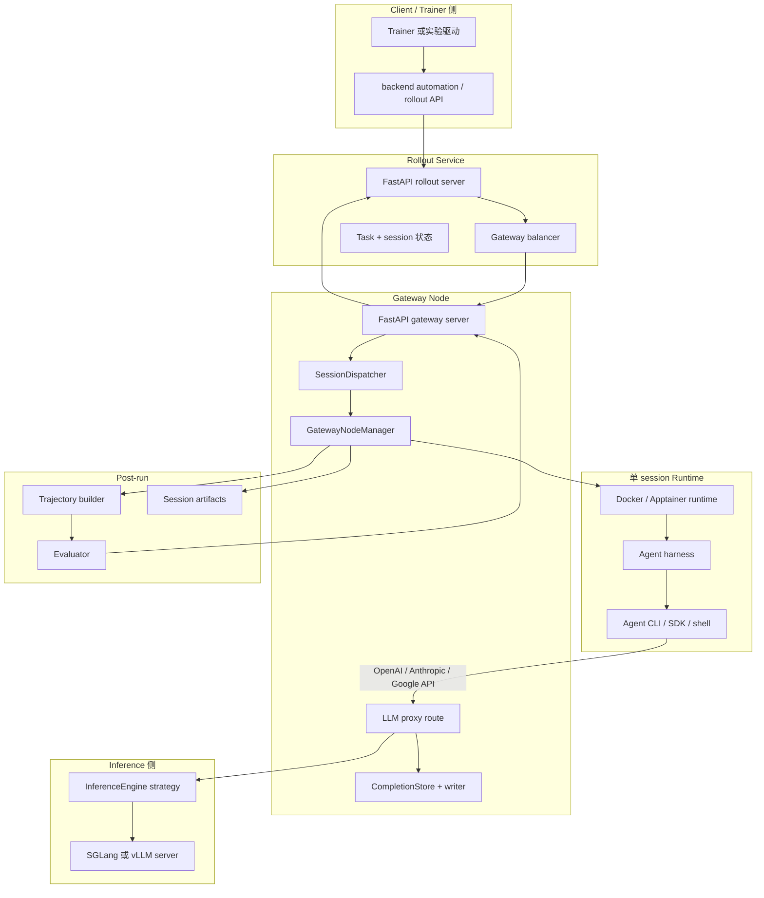
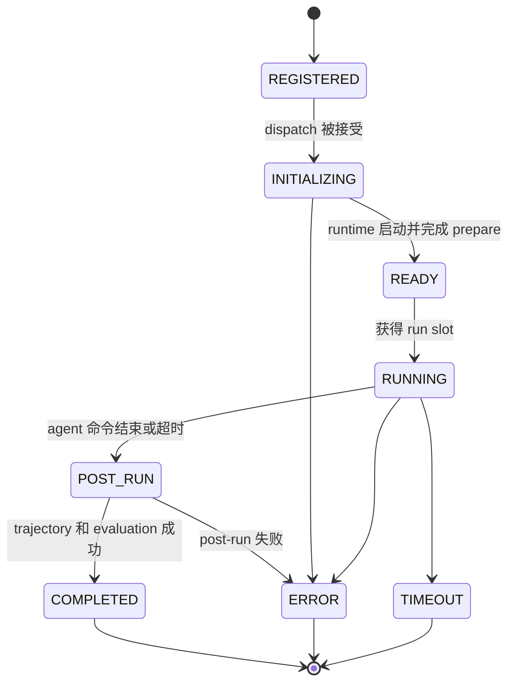
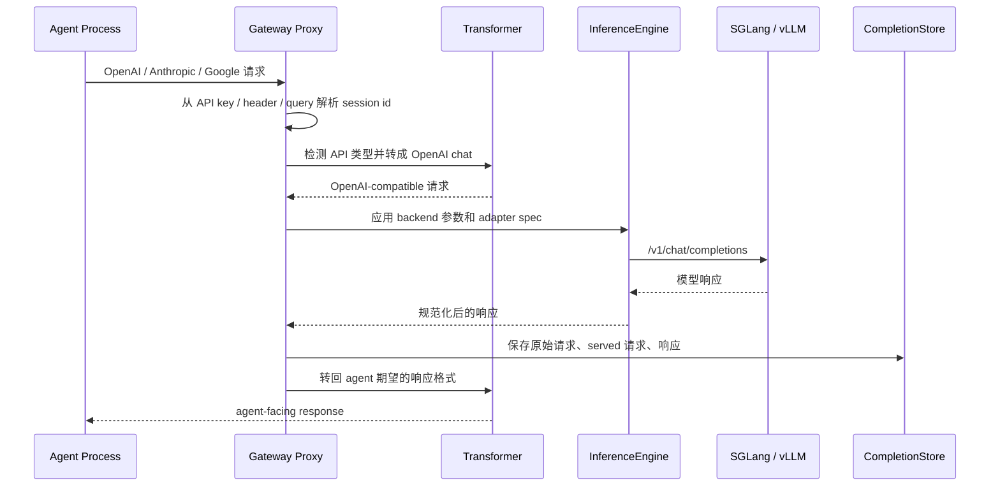

# OpenEvo Core Runtime 系统总览

OpenEvo Core 的低层 runtime 是面向真实 agent harness 的 rollout-as-a-service
框架。它通过在
准备好的 runtime 中启动 agent，并在 agent 与 inference server 之间放置
gateway proxy，使 agent 尽量不需要为 OpenEvo 改代码。proxy 会捕获模型调用，
并把这些调用转成 RL training 可消费的 token-level trajectory。对于不经过
OpenEvo proxy 的纯文本 capture 模式，OpenEvo 只保证 transcript-level
trajectory，不伪造 token id、logprob 或 token-level metric。订阅登录只是某些
harness 的 auth 方式；它必须显式开启 transcript capture 后才允许运行。

这个文档描述的是 OpenEvo Core Backend 内部 rollout/gateway/runtime/proxy 数据路径。
公开 runtime contract 使用 OpenEvo identity：`OPENEVO_*`、`/openevo/session`
和 `openevo.session_completed`。

## 组件图



## Session 生命周期



分阶段生命周期由 `SessionDispatcher` 和 `GatewayNodeManager` 实现。这个拆分
对运行时很重要：同一个 node 可以分别限制 runtime 初始化、活跃 agent 执行和
post-run 工作的并发。

## 请求路径



Streaming 请求会被处理成 synthetic stream：gateway 对 backend 发起一次
non-streaming 请求，再把完整响应格式化成 SSE events 返回给 agent。这样可以让
capture 和 trajectory 构造保持确定性。

## Capture 模式和训练信号

OpenEvo Core 当前区分两类 capture：

| 模式 | 入口 | 产物 | 适合用途 |
|---|---|---|---|
| OpenEvo proxy capture | agent 请求 `OPENAI_BASE_URL` / `ANTHROPIC_BASE_URL` / Gemini proxy | `CompletionSession`，包含请求、响应、token ids、logprobs | token-level RL、policy gradient、需要 loss mask 的训练 |
| Pure-text transcript capture | `agent.settings.capture_mode="transcript"`；可配合订阅登录或其他不走 proxy 的 harness | `agent_transcript` trajectory，来自 Core 私有 log authority 下的 `logs/agent/step.xx.stdout.log` | skill/memory/agent-system evolution、行为回放、非 token-level 评估 |

纯文本 transcript capture 是显式选项，而不是某个 harness 的隐式行为。Gateway
只有在 `agent.settings.capture_mode="transcript"` 或等价 transcript capture mode
开启、且本次 run 没有 proxy completion records 时，才会 fallback 到
`agent_transcript` builder，从 agent stdout transcript 构造 trajectory。这个
trajectory 的 `Trace.response_ids`、`Trace.loss_mask`、`Trace.response_logprobs`
为空，并在 trajectory/trace metadata 中设置：

```json
{
  "capture_mode": "transcript",
  "token_level_metrics_available": false
}
```

后续 skill/memory/agent-system evolution 可以消费这类 transcript trajectory；
token-level RL 训练必须过滤掉 `token_level_metrics_available=false` 的 traces，
或要求任务走 OpenEvo proxy 模式。

如果 harness 选择 `auth_mode="subscription"` 或 harness-specific subscription
alias，它必须同时设置 transcript capture mode。当前 managed subscription release 只接受
literal `capture_mode="transcript"`、exact managed runtime profile/image、Docker host-user
执行，并显式 unset proxy 相关环境变量。其他订阅式 harness 也应遵守同样边界：订阅负责
auth，transcript capture 负责 evolution 可消费的行为记录。

`managed_science` 的 runtime binding 不以 subscription 为条件。无论 execution mode 是
subscription 还是 self-deployed，Experiment config、`RuntimeSpec`、Core launcher 和 Gateway
admission 都要求 Docker、profile 对应的 exact canonical image 和 host user，并拒绝 custom
runtime loader/options。所有 prepare/eval-prepare upload target 在 runtime 创建前必须是
`/openevo/session` 下的 canonical absolute path；实际 bind copy 从 held session-root FD 逐级
`openat`/no-follow，拒绝 symlink、special file、hard-linked leaf 和并发 ancestor replacement。
Evolution context 的临时源位于 agent 不可挂载的 Core 临时目录，不在 session bind 中 staging。

Codex subscription 的 `HOME`、`PATH` 和 `CODEX_HOME` 都由 Core 固定，agent、runtime
和 action env 不能覆盖；Codex 使用镜像内固定绝对路径启动，不能被 workspace `PATH`
shadow。Gateway 仅在 runtime prepare 完成后，才从绝对 filesystem anchor 逐组件固定并
复核宿主机 `~/.codex/auth.json` 与私有 credential root，再把通过 no-follow、owner、
regular、link-count-one、size/digest/identity 校验的 auth staging 到 session tree 外的
专用 bind mount。

Subscription post-run 先结束所有仍可访问 credential 的进程，并按 `docker create` 返回的
container ID 执行 remove + absence inspect。只有 absence proof 成功、最终 fd-relative
递归 scan 复核每层 pathname/inode binding 后，Core 才构造 transcript trajectory 和
`SessionResult`。Core 自己的 step stdout/stderr 不写入 agent 可写 session bind，而是在
unmounted node-private log authority 中通过 exclusive `0600` regular inode 有界写入、无覆盖
发布，并用同一 held-root authority 做最终 verified read；预置 symlink/FIFO/socket 不会被打开。
Credential scan 只以该 Core log authority 为写目标，不原地修改 workspace input、workspace
output 或 artifact。scan 在任何写入前完成 per-file、aggregate byte、node 和 depth 预算预检；
超过 4 MiB 的单文件或总量超限会显式终止 finalization，并保持原始 bytes，不写 marker。
执行 deadline 耗尽后，transcript byte recovery/build 使用独立有界 finalization budget，保留
timeout/cancel 前已经捕获的输出和原终态。结果发布前还会递归执行一次内存脱敏。失败时
post-run 先做固定次数的 stop/absence retry，仍失败则释放 stage worker，由运行期周期
reconciliation 继续。private v3 cleanup journal 除 runtime/container/session/log/credential
identities 外，还保存闭集、已脱敏的 request/agent terminal/optional result/pending status/timer
finalization authority，不保存 auth bytes。重启从私有 credential root 重新验证并构造 redactor，
证明容器 absent 后继续构造或发布原 terminal result，最后才删除 roots；无法证明 absence 时
ownership 和 journal 持续保留。

## 主要模块

| 区域 | 文件 | 职责 |
|---|---|---|
| Gateway server | `src/openevo/gateway/server.py` | FastAPI app、proxy route、session/admin endpoints |
| Gateway execution | `src/openevo/gateway/node.py` | runtime 生命周期、harness setup/run、post-run、evolution hooks |
| Dispatch | `src/openevo/gateway/dispatcher.py` | 分阶段 worker pools 和 session transitions |
| Sessions | `src/openevo/gateway/session.py` | 内存 session registry 和 session id 解析 |
| Proxy client | `src/openevo/gateway/proxy.py` | 到 inference backend 的 HTTP client，支持 pause/resume generation |
| Engine strategy | `src/openevo/gateway/engine.py` | SGLang/vLLM 请求与响应差异 |
| Agent contract | `src/openevo/harness/base.py`, `src/openevo/harness/models.py` | harness API 和 task schema |
| Presets | `src/openevo/harness/presets/` | Codex、Claude Code、OpenHands 等 launcher |
| Trajectory | `src/openevo/trajectory/` | completion records 到 trajectory/evaluation 数据 |

## 扩展点

- 新 agent：实现 `BaseHarness` 子类，或使用 `agent.harness: shell`。
- 新 inference backend：新增 `InferenceEngine` 实现，并在 `get_engine` 中注册。
- 新 API 请求/响应形态：在 `src/openevo/gateway/transform/` 中添加 transformer。
- 新 trajectory builder/evaluator：通过现有 registry 注册。
- 新 skill/memory/agent-system evolution 方法：通过 Evolution Backend method
  registry 添加，详见
  [Evolution API And Method Integration](evolution-api-and-method-integration.md)。
