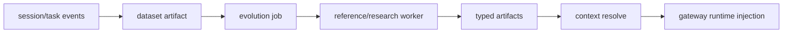

# Evolution API 与新算法接入

本文说明当前 skill/memory/agent-system/parametric-memory evolution 的 API contract，
以及如何把新的 SOTA 方法或 research 方法接入 Polar Evolution Backend。

## 总体数据流



Backend 不关心某个算法内部怎么做 reflection、clustering、prompt optimization、LoRA
training 或评估。算法只需要遵守两个边界：

- 输入边界：通过 datasets、input artifacts 和 `job.config` 获取数据和配置。
- 输出边界：注册 typed artifacts，并提供 `manifest`、`compatibility`、`scores`。

## Trajectory 输入形态

Evolution 方法读取 dataset 或 session event 时，需要先判断 trajectory 的 capture
形态：

- Polar proxy 模式会产生 token-level traces。`response_ids`、`loss_mask` 和
  `response_logprobs` 可用于 RL 或偏好优化等 token-level 训练。
- Pure-text transcript capture 模式由 `agent.settings.capture_mode="transcript"`
  或等价 transcript capture mode 显式开启。Gateway 会在无 completion 时从 agent
  stdout transcript 构造 `agent_transcript` trajectory。这类 trajectory 明确设置
  `capture_mode=transcript` 和 `token_level_metrics_available=false`，并且不会伪造
  token ids/logprobs。
- Subscription auth 只是某些 harness 的登录方式，不等于 capture mode。任何
  `auth_mode="subscription"` 或 harness-specific subscription alias 都必须同时开启
  transcript capture，才能产生 evolution backend 可消费的纯文本 trajectory。

因此，skill/memory/agent-system evolution 可以把 transcript trajectory 当作行为记录、
反思材料或 memory mining 输入；需要 token-level metric 的 RL 方法必须过滤掉
`token_level_metrics_available=false` 的 traces，或要求任务使用 Polar proxy capture。

### 外部 harness 的离线 transcript 输入

不由 Polar gateway 直接启动的 harness 也可以进入 pure-text evolution path。以
Terminal Bench + Harbor/EvoLab 为例，官方 verifier 仍负责执行和打分，离线 bridge 只把
trial/job 目录中的非 oracle 产物转换成 Polar events：

```sh
uv run polar-evolution terminal-bench-events \
  --input /tmp/evolab-tb21-run/<job-or-trial-dir> \
  --output /tmp/tb21-events.jsonl
```

本地实验可以跳过 HTTP backend，直接写 SQLite store 并生成 dataset artifact：

```sh
uv run polar-evolution terminal-bench-dataset \
  --input /tmp/evolab-tb21-run/<job-or-trial-dir> \
  --db /tmp/polar-tb21/evolution.db \
  --artifact-root /tmp/polar-tb21/artifacts \
  --name tb21_round0 \
  --purpose agent_system_reflection \
  --policy-version tb21-round0
```

如果下一步就是 agent-system evolution，可以直接生成 audited reflector job：

```sh
uv run polar-evolution terminal-bench-agent-system-job \
  --input /tmp/evolab-tb21-run/<job-or-trial-dir> \
  --db /tmp/polar-tb21/evolution.db \
  --artifact-root /tmp/polar-tb21/artifacts \
  --dataset-name tb21_round0 \
  --policy-version tb21-round0 \
  --reflector-provider codex_cli \
  --reflector-model gpt-5.4 \
  --codex-home /path/to/codex-home
```

该命令会复用同一个 offline bridge ingest events，创建 dataset artifact，然后创建
`agent_system_reflector` job。为了避免本地 DB 中不同轮次的 completed events 被混入，
`--input` 模式必须显式传 `--policy-version`。也可以跳过 ingest、直接传一个或多个已有
`--dataset-artifact-id`；当输入 dataset artifact 超过一个时，`--method auto` 会创建
`agent_system_history_reflector` job。显式 `--method agent_system_reflector`、
`--method agent_system_history_reflector` 或 `--method agent_system_pareto_reflector`
可覆盖这个选择。

转换后的 event 使用 `event_type="polar.session_completed"`，其 trajectory 由
`terminal_bench_transcript_bridge` 构造，metadata 必须包含：

```json
{
  "capture_mode": "transcript",
  "token_level_metrics_available": false
}
```

bridge 可以读取 agent instruction、stdout/stderr、EvoLab 生成的
`terminal_bench_report.md`、verifier reward、CTRF summary 和 verifier stdout 摘要。它
不能读取或写入 oracle solution、reference patch，也不能把 `config.agent.env` 中的 API key
等敏感值带入 event payload。Terminal Bench agent-system job 默认只从结构化 protected
metadata（例如 `leakage_basis` / `forbidden_literals`、article title/id、source
file/sheet/row、sequence）派生 `agent_system_audit.forbidden_literals`；公开 task id、
trial name、task instruction、task path 和 verifier failed-test 摘要会作为可学习上下文保留，
不会自动加入 forbidden list。额外 protected literal 可通过 `--audit-forbidden-literal` 传入。
后续 orchestrator 仍可把这些 JSONL events ingest 到 Evolution Backend，再按普通
`POST /v1/jobs` 路径创建自定义 job。

## 核心 API

| API | 用途 |
|---|---|
| `POST /v1/events` | 接收 Polar session/task event |
| `POST /v1/datasets` | 从 events 物化 dataset，并注册 `dataset` artifact |
| `POST /v1/jobs` | 创建 evolution job |
| `POST /v1/jobs/claim` | Worker 按 capability claim job |
| `POST /v1/jobs/{job_id}/heartbeat` | Worker 租约续约和进度上报 |
| `POST /v1/jobs/{job_id}/complete` | Worker 提交 artifacts |
| `POST /v1/jobs/{job_id}/fail` | Worker 标记失败 |
| `POST /v1/artifacts` | 直接注册外部 artifact |
| `GET /v1/artifacts/{artifact_id}` | 读取 artifact metadata 和 manifest |
| `PATCH /v1/artifacts/{artifact_id}/promotion` | 切换 artifact 的 promoted 状态，body 必须显式包含 `promoted` |
| `POST /v1/contexts/resolve` | Gateway 为新 session 解析可注入 context |
| `POST /v1/reviews` | 创建 durable HITL review request 和 immutable review packet |
| `GET /v1/reviews` / `GET /v1/reviews/{review_id}` | 查询 pending/resolved review request |
| `POST /v1/reviews/{review_id}/claim` | 标记 reviewer claim / in-review |
| `POST /v1/reviews/{review_id}/feedback` | 提交 typed human feedback |
| `POST /v1/reviews/{review_id}/adjudicate` / `resolve` / `mark-stale` | 记录 adjudication、resolved 或 stale lifecycle 状态 |
| `POST /v1/query-decisions` | 记录本轮为什么询问或不询问 human |
| `POST /v1/feedback-applications` | 记录 human feedback 被后续方法或 promotion decision 消费 |

`job_type` 是 claim selector，`method` 是 worker 内部执行的算法名。reference worker 默认让
二者同名，例如 `job_type=agent_system, method=agent_system`。专用 research worker 可以用
自己的 capability 策略，只要 claim 到 job 后返回合法 artifact 即可。

## Artifact Register Contract

Worker complete 和 direct artifact registration 都使用同一类 artifact payload：

```json
{
  "type": "text_memory",
  "name": "parser memory",
  "uri": "file:///path/to/memory.md",
  "manifest": {},
  "lineage": {"input_artifact_ids": ["art_dataset"]},
  "compatibility": {
    "task_tags": ["calculator"],
    "agent_harness": ["codex"],
    "base_model": ["Qwen/Qwen3.6-27B"]
  },
  "scores": {"quality": 0.9},
  "tags": ["calculator"],
  "promoted": true
}
```

重要字段：

- `uri`：artifact 内容位置。当前 runtime staging 主要支持 `file://`。
- `manifest`：artifact-specific metadata，例如 adapter ID 或 agent target path。
- `compatibility`：context resolver 的过滤条件；为空表示全局匹配。
- `scores`：resolver 排序依据，目前优先使用 `quality`，其次 `heldout_reward_delta`。
- `promoted`：只有 promoted 且 active/experimental 的 artifacts 会进入 context resolve。
- `manifest.promotion_support`：启用 runner/backend promotion gate 时，算法应写入
  `trajectory_findings`、`proposed_changes`、`expected_benefits`、`risks` 和
  `validation_checks`。Gate 会先评估这些材料，并读取 bounded `file://` artifact 内容摘录
  放入 review packet，再决定是否调用 backend promotion API。Backend 会强制
  `job.config.promoted=false` 的输出保持 unpromoted，即使 worker 提交了 `promoted=true`。
  Runner 只会从本次运行的 artifact output root 读取摘录；指向该 root 外部的 `file://` URI
  会在 packet 中标记为 unavailable。发给 LLM reviewer 的 packet 会 sanitize artifact
  metadata 中的 URI 字段，移除 top-level 和 nested manifest URI value 的 userinfo、
  fragment 和 query string，包括 relative URI reference 上的 query；LLM reviewer 的
  `score` 必须存在且是有限的 `0..1` 数值，缺失或非数值 score 会拒绝。
  Promotion API 要求 `PATCH /v1/artifacts/{artifact_id}/promotion` body 显式包含
  `{"promoted": true}` 或 `{"promoted": false}`；空 body 不会默认 promote。一个 method
  输出多个候选 artifact 时，gate 可以只 approve 其中一部分；human gate 会先写完同一
  review set 的所有 packet，再用一个共享 `decision_timeout_seconds` 窗口等待全部 decision
  文件，partial/malformed decision JSON 会继续保持 pending 直到写入合法 decision 或超时；
  `human_input=auto` 在 stdin/stdout 都是 TTY 时用 terminal prompt 直接询问 approve/reject/
  comment，否则回退到 decision files。`human_input=file` 强制文件模式，`human_input=tui`
  要求 terminal prompt；human decision 的 `score` 可选，但如果提供也必须是有限的 `0..1`
  数值。Human decision 还可以携带 `human_feedback`，其中可包含 `observed_issues`、
  `suggested_changes`、`risks` 和 `validation_checks`；这些 insight 会进入 promotion review
  记录，但不会替代 `approved` 的 promotion 判定。Runner 只 promotion 通过的候选。如果
  gated job 没有产出目标 artifact type，gate 会以 `missing_target_artifact` 拒绝。

## HITL Review Lifecycle

Human promotion gate 不只是本地 approve/reject 机制。Backend 会把 review packet、
human feedback、query decision 和 feedback application 当作 durable lifecycle objects
保存，runner 可以在异步 review 时停在 `pending_review`，由后续 orchestrator 在 reviewer
提交 feedback 后恢复 promotion 或继续 evolution。

Runner 行为：

- `human_input=file` / `human_input=tui` / `human_input=auto` 仍然保留。没有 backend
  review API 或 query-decision API 的旧 client 会继续使用本地 packet、decision file 和
  terminal prompt 路径。
- 当 evolution client 支持 `create_review_request` 时，runner 会把本地 packet 转成 backend
  review request。Review request 是异步对象；`decision_timeout_seconds=0` 时 runner 可写出
  packet、创建 backend review，然后以 `pending_review` 结束当前 run。创建 request 时必须为
  被 review 的 artifact ID 写入 `sha256:` 前缀的 `artifact_hashes`，用于把 feedback 绑定到
  reviewer 实际看到的 artifact metadata/content 摘要。
  Backend 会在计算 `packet_hash` 和持久化 `packet_json` 前递归 sanitize packet，包括 extra
  fields、nested artifact URI/path fields、userinfo URL、query/fragment token 和 secret-like
  key/value；GET/list review API 只返回 sanitized packet。
- Runner 会在 review request payload 中嵌入一个 deterministic query-decision payload；
  支持该字段的 backend 会在 `POST /v1/reviews` 同一事务中创建 query decision、创建 review
  request，并把返回的 `query_decision_id` 写入 review response。当前策略固定为：

```json
{
  "decision": "ask_human",
  "reason_codes": ["promotion_gate_targeted", "human_gate"],
  "estimated_value_of_information": null,
  "estimated_human_cost": null,
  "budget_context": {}
}
```

`artifact_ids`、`candidate_ids`、`task_id`、`round_index` 和 `method` 来自 review packet。
如果 backend review request 创建失败，runner 保留本地 pending review，并在 review 记录上写入
backend failure metadata；因为 query decision 在 review-create transaction 内创建，不会留下
已创建但未链接 review 的孤立 query decision。旧 backend 如果忽略 `query_decision` 字段，仍可
创建 review request，但不会记录 query-decision log。后续可以把这个 deterministic payload 替换成
learned / budgeted policy，但当前实现是 fully deterministic `ask_human` policy。

Typed feedback contract：

- `HumanFeedback` 至少包含 `feedback_id`、`review_id`、`reviewer_id`、`decision`、
  `status`、`raw_payload` 和 `normalized_payload`。可复用的状态是
  `available_for_evolution`；`rejected_invalid`、`archived_only` 或 stale review feedback 只保留
  audit，不进入 evolution signal。
- typed 字段包括 `score`、`confidence`、`rationale`、`observed_issues`、
  `suggested_changes`、`risks`、`validation_checks`、`labels` 和 preference/pairwise 结果。
  `score` 和 `confidence` 接受 0..1 的 int/float，但拒绝 JSON boolean，避免 `true`/`false`
  被强制转换成 `1.0`/`0.0`。Raw reviewer payload 只能用于审计；未来 agent 和 worker methods
  只能消费 normalized/redacted payload。
- Promotion resume 只从 post-review request 状态消费 available feedback，例如
  `submitted`、`validated`、`adjudicated` 和 `resolved`。`queued`、`in_review` 等 pre-submission
  状态保持 `pending_review`；`stale`、`rejected_invalid`、`archived_only` 等 invalid/archive
  状态不能 promotion。Resume 还必须确认 request 中每个 targeted artifact 的
  `artifact_hashes[artifact_id]` 存在且匹配当前 artifact/review hash；缺失 hash 保持
  `pending_review`，hash mismatch 作为 stale review 拒绝，不会应用已有 approve feedback。
- Backend 在 feedback 进入 `available_for_evolution` 前 sanitize `normalized_payload`，包括
  `rationale`、`observed_issues`、`suggested_changes`、`risks`、`validation_checks` 和
  `labels`。`raw_payload` 仍只作为 audit storage，不会通过 feedback GET/list 或 resume
  输出暴露。
- Dataset 物化会把 sanitized human feedback 放在
  `payload.session_result.metadata.evolution_feedback.human`，不会暴露 raw payload、secret、
  credentialed URI、raw ground truth 或 protected evaluator literals。
- 消费 human feedback 的 worker method 应在 artifact manifest/lineage 中记录
  `human_feedback_ids` 和 `human_feedback_count`。如果 method 在 prompt、candidate archive 或
  promotion support 中 disclosure 了共享 feedback，也要把这个事实写入 manifest/report，便于审计。
- `FeedbackApplication` 记录 downstream consumption，例如 promotion decision、prompt seed、
  mutation constraint、negative constraint、validation check、ranking signal 或 dataset record。
  Worker 完成 job 并注册带有 `manifest.human_feedback_ids` 的 artifact 时，backend 会为本
  backend 已知且可消费的 feedback id 自动创建 application 记录，`target_id` 指向输出 artifact，
  `consumed_in_job_id` 指向当前 job；外部 dataset 携带但本 backend 不认识的 feedback id 不阻塞
  artifact 注册。
  没有 application 记录时，系统不能声称某条 human feedback 改变了后续 evolution。

当前限制：

- 还没有 RLHF、reward model、DPO/PPO 或 learned query policy；human feedback 是 typed
  evolution signal，不是 token-level training target。
- Query policy 还不会估算真实 value-of-information / cost，也不会按 reviewer budget 排队。
- Raw reviewer payload、未 redacted freeform 文本和 reviewer 看到的 untrusted artifact excerpt
  不应暴露给未来 agents；只允许 normalized/redacted feedback 进入 dataset 和 method prompt。

## Artifact 类型

### `text_memory`

自然语言长期记忆。URI 指向 Markdown 文本文件。

```json
{
  "type": "text_memory",
  "name": "calculator memory",
  "uri": "file:///artifacts/memory.md",
  "manifest": {
    "content_path": "memory.md",
    "source_dataset_artifact_id": "art_dataset",
    "record_count": 128
  },
  "compatibility": {"task_tags": ["calculator"]},
  "scores": {"quality": 0.82},
  "promoted": true
}
```

Gateway 会把选中的 memory 写到 `POLAR_MEMORY_FILE`，并 prepend 到 agent instruction。
该路径只依赖 rendered text，因此对 proxy/local inference 和 transcript-only subscription
harness 都生效。内置 reference worker 提供三条 text-memory 方法：

- `text_memory`：把 dataset records 渲染成简单 Markdown，主要用于 smoke test；
- `text_memory_reflector`：调用 LLM 从成功/失败 trajectories 中生成 reusable memory；
- `text_memory_expel_reflector`：使用 ExpeL/Reflexion-style synthesis，要求输出包含
  `## Do`、`## Avoid`、`## Validate`、`## When Applicable` 和
  `## Retired Or Superseded`，适合 Terminal Bench memory-only ablation。

### `skill_bundle`

Agent harness 可加载的 skill 目录。URI 指向目录，目录内通常包含 `SKILL.md`。

```json
{
  "type": "skill_bundle",
  "name": "parser-helper",
  "uri": "file:///artifacts/skills/parser-helper",
  "manifest": {"entrypoint": "SKILL.md", "files": ["SKILL.md"]},
  "compatibility": {"agent_harness": ["codex"], "task_tags": ["calculator"]},
  "scores": {"quality": 0.77},
  "promoted": true
}
```

Gateway 会 stage 到 `/polar/session/evolution/skills/`，harness 通过 `POLAR_SKILLS_DIR`
消费。

### `agent_system`

Agent system prompt 或 harness-specific repository instruction 文本。URI 指向文本文件。

```json
{
  "type": "agent_system",
  "name": "codex repo instructions",
  "uri": "file:///artifacts/AGENTS.md",
  "manifest": {"target_path": "AGENTS.md"},
  "compatibility": {"agent_harness": ["codex"]},
  "scores": {"quality": 0.8},
  "promoted": true
}
```

`target_path` 是 runtime workdir 下的相对路径。当前 allowlist：

- `AGENTS.md`
- `agents.md`
- `CLAUDE.md`
- `GEMINI.md`
- `.openhands/microagents/*.md`

Backend 和 gateway 都会拒绝空路径、绝对路径、包含 `..` 的路径，以及 allowlist 外路径。
Gateway 总会把文本写到 `POLAR_AGENT_SYSTEM_FILE`；如果 target path 通过安全检查，也会写到
runtime workdir 下，并设置 `POLAR_AGENT_SYSTEM_TARGET` / `POLAR_AGENT_SYSTEM_TARGETS`。

内置 reference worker 提供四个 agent-system 相关方法：

- `agent_system`：把 `job.config.agent_system_markdown` 或 `job.config.content` 直接打包成
  `agent_system` artifact，适合人工 curated 文本或 smoke test。
- `agent_system_reflector`：消费 dataset artifact，把历史 trajectories/transcripts 中的成功
  和失败样本交给 LLM 生成新的 instruction 文本，默认写入 `AGENTS.md`。
- `agent_system_history_reflector`：消费多个 round-level dataset artifacts 和可选 best /
  previous agent-system artifact，把多轮 trajectories、共享 evaluator feedback、每轮 metrics
  以及相邻轮次 delta 汇总给 LLM，生成 history-aware 的下一版 instruction 文本。
- `agent_system_pareto_reflector`：消费多个 round-level dataset artifacts，生成多个候选
  instruction，写出 candidate archive，并根据外部 evaluator 分数和退化门控选择一个候选。

`agent_system_reflector` 不固定模型；调用方必须在 `job.config.reflector_llm.model` 中指定
reflector model。默认 provider 是 `openai_chat`：`base_url` 默认读取
`OPENAI_BASE_URL`，否则使用 `https://api.openai.com/v1`；API key 可直接传入
`reflector_llm.api_key`，或通过 `api_key_env` 从环境变量读取，默认
`OPENAI_API_KEY`。如果只有 Codex subscription 登录态，可以设置
`reflector_llm.provider="codex_cli"`，worker 会调用本机 `codex exec`，清除代理 API
key/base-url 环境变量，并使用 `reflector_llm.codex_home` 指定的 Codex 登录目录。该 nested
Codex run 会忽略用户 config、使用 `--ephemeral`、`--sandbox read-only`、
并禁用 `shell_tool`，因为 dataset transcripts 属于不可信 prompt 内容。该方法不做 promotion 评估，
推荐把产出 artifact 先保持 `promoted=false`，通过离线评估或 A/B rollout 后再 promotion。

三个 reflector 方法都会对生成的 agent-system 文本做轻量 audit。默认 audit 会要求
`AGENTS.md` 中的方法论规则不是空泛口号，而是包含 trigger、action 和 validation check；
如果规则提到 source/package/bundle coverage，还必须描述 recursive file-level source
discovery、通用结构化 evidence 格式和 per-source/per-package final validation。调用方也可以通过
`job.config.agent_system_audit.forbidden_literals` 或 `leakage_basis` 传入 protected
literals，禁止 exact article title、source filename、sheet、row、sequence 等进入
agent-system。首次生成失败时 worker 会把 redacted candidate 和 audit findings 发回同一
reflector model，默认最多重写两次；重写后仍失败则 job 报错。

示例 job：

```json
{
  "job_type": "agent_system_reflector",
  "method": "agent_system_reflector",
  "input_artifact_ids": ["art_dataset"],
  "config": {
    "name": "codex SWE reflections",
    "target_path": "AGENTS.md",
    "max_records": 20,
    "reflector_llm": {
      "provider": "openai_chat",
      "model": "gpt-4.1-mini",
      "base_url": "https://api.openai.com/v1",
      "api_key_env": "OPENAI_API_KEY",
      "temperature": 0.2,
      "max_tokens": 2000
    },
    "agent_system_audit": {
      "max_repair_attempts": 2,
      "forbidden_literals": {
        "article_titles": ["held-out title, if the shared evaluator provides one"],
        "source_files": ["held-out source filename, if available"]
      }
    },
    "compatibility": {"agent_harness": ["codex"], "task_tags": ["swe"]},
    "scores": {"quality": 0.5},
    "promoted": false
  }
}
```

输出 manifest 会包含 source dataset、record count、reflected record count、success count 和
failure count，以及 `reflector_provider` / `reflector_model`、`agent_system_audit` 和
`promotion_support`；lineage 会记录 `method=agent_system_reflector` 和所有 input artifact IDs。

`agent_system_history_reflector` 使用同一套 `reflector_llm` 配置和安全约束，但输入可以包含
多个 dataset artifacts。每个 dataset manifest 应尽量写入 `round` 或 `round_number`、
该轮 `agent_system_artifact_id`，以及 `metrics` / `summary` 中的 `precision`、`recall`、
`f1`、TP/FP/FN 和 duplicate counts。Prompt 会按 round 排序，显示每轮指标和
`delta_from_previous`，并把负向 F1 delta 标为 regression。输出 manifest 额外包含
`source_dataset_artifact_ids`、`round_count`、`latest_round` / `latest_f1`、`best_round` /
`best_f1` 和 `agent_system_audit`。典型流程是在第 3 轮后把 Round 1..3 的 dataset
artifacts 与 Round 2 或离线验证最优 agent-system artifact 一起传入，避免只根据 latest
regression 改写方法论。
如果旧 dataset manifest 没有 round 或 metrics，method 会从 record metadata 的
`round` / `rollout_step` / `policy_version` 和脱敏 golden feedback 的 `Aggregate fit`
行回退提取这些信号。

`agent_system_pareto_reflector` 使用同一套 history 输入，但不会让 LLM 单次覆盖
`AGENTS.md`。它按 `job.config.candidate_strategies` 生成多个候选，分别运行泄漏和可执行性
audit，然后把 `candidate_archive.json` 注册成 `report` artifact。若 pipeline 已经对候选跑过
paired evaluation，可把每个候选的 `precision`、`recall`、`f1` 和
`prediction_to_reference_ratio` 写入 `job.config.candidate_evaluations`；promotion gate 可用
`max_prediction_to_reference_ratio`、`max_f1_regression`、`min_precision`、`min_recall` 和
`requires_external_evaluation` 防止 coverage collapse、爆量输出或低精度候选晋级。

## Golden-standard evaluator

有 ground truth 的任务应把评估放在 evolution orchestration 层，而不是放进某个具体
method。共享实现位于 `polar_evolution.golden_standard`，负责：

- 读取 JSON / JSONL golden records；
- 按 article-scoped sequence matching 计算 TP/FP/FN、precision、recall、F1 和重复预测；
- 生成脱敏的 methodology feedback；
- 对生成的 agent-system 文本做 held-out literal 泄漏检查。

推荐数据流：

1. rollout agent 的 workspace 只包含任务允许的 evidence，例如 `input/`；
2. rollout 完成后，orchestrator 在 workspace 外读取 ground truth 和 agent 输出；
3. raw evaluation 写入实验 artifact/log，不进入后续 agent workspace；
4. 只有脱敏 feedback 写入 event payload，例如
   `payload.session_result.metadata.evolution_feedback.golden_standard`；
5. evolution methods 从 dataset records 读取 `evolution_feedback`，把它当作通用训练信号。

脱敏 feedback 只能描述方法论缺口，例如 over-inclusion、under-extraction、component
boundary、coverage pass；不能包含 exact sequence、source filename、source sheet、
row number、article title 或 reference record。这样 evaluator 可以被 text memory、
skill、agent-system、parametric 之外的后续方法共享，同时避免每个 method 重复解析大型
ground truth。

### `parametric_memory`

参数化长期记忆，例如 LoRA/adapter。URI 指向 adapter 目录或远端引用。

```json
{
  "type": "parametric_memory",
  "name": "parser-memory",
  "uri": "file:///artifacts/adapters/parser-memory",
  "manifest": {
    "adapter_id": "parser-memory",
    "base_model": "Qwen/Qwen3.6-27B",
    "adapter_format": "lora"
  },
  "compatibility": {
    "base_model": ["Qwen/Qwen3.6-27B"],
    "task_tags": ["calculator"]
  },
  "scores": {"heldout_reward_delta": 0.12},
  "promoted": true
}
```

Context resolver 会把它转成 `adapter_merge_spec`。Gateway/proxy 当前做 request-level
adapter selection，不做物理权重合并。Parametric memory 只适用于 proxy/local inference
运行：serving backend 必须能按 request 选择或加载对应 adapter。Subscription harness 直连
外部模型服务，不能应用 OpenEvo 产生的 adapter，因此 experiment config 会拒绝在 subscription
auth 下启用 `artifacts.parametric_memory`，context resolver 也会在 request 的 agent
settings 或 metadata 标记 subscription auth 时跳过 `parametric_memory` artifacts。

内置 reference worker 提供两条 parametric-memory 方法：

- `parametric_memory_register`：注册已有 adapter URI，不负责训练；
- `parametric_memory_lora_sft`：从 successful trajectories 导出 SFT JSONL，调用外部 trainer，
  并注册 trainer 产出的 adapter 目录。

两条方法都会要求 `base_model`，并确保 `compatibility.base_model` 包含该模型；如果调用方没有
显式设置 compatibility，method 会自动写入 `[base_model]`。`parametric_memory_lora_sft`
的 trainer contract 是：

- `job.config.trainer.command` 指向可执行 trainer；
- `job.config.trainer.args` 必须包含 `{training_dataset}` 和 `{adapter_dir}` 占位符；
- `job.config.trainer.timeout_seconds` 默认 600 秒；
- `job.config.training_projection` 默认 `{"type": "full_trace"}`；也可以设为
  `{"type": "response_tail", "response_tail_chars": N}`，在保留 prompt messages 的同时只把
  assistant response 尾部导出到 SFT JSONL，用于避免长工具输出 transcript 掩盖最终成功动作；
- trainer 执行前会清理旧 adapter 目录；
- 默认 `adapter_format=lora` 时，adapter 目录必须包含 `adapter_config.json`。

Reference worker 只定义训练编排和 artifact contract；具体 LoRA trainer、serving backend
的 adapter 加载方式，以及长训练过程中的续约/heartbeat 扩展，应由本地 inference/training
infrastructure 提供。

## Context Resolve Contract

Gateway 在 run 前调用：

```json
{
  "task_id": "task_1",
  "instruction": "fix parser",
  "agent": {"harness": "codex"},
  "base_model": "Qwen/Qwen3.6-27B",
  "metadata": {"task_tags": ["calculator"]},
  "limits": {
    "max_memory_chars": 12000,
    "max_agent_system_chars": 12000,
    "max_skill_bundles": 4,
    "max_adapters": 2
  }
}
```

响应会包含：

```json
{
  "context_id": "ctx_...",
  "memory": {
    "artifact_ids": ["art_memory"],
    "rendered_text": "..."
  },
  "agent_system": {
    "artifact_ids": ["art_agent_system"],
    "rendered_text": "...",
    "target_path": "AGENTS.md",
    "targets": [
      {
        "artifact_id": "art_agent_system",
        "name": "codex repo instructions",
        "target_path": "AGENTS.md",
        "rendered_text": "..."
      }
    ]
  },
  "skills": [
    {"artifact_id": "art_skill", "name": "parser-helper", "uri": "file:///..."}
  ],
  "adapter_merge_spec": {
    "base_model": "Qwen/Qwen3.6-27B",
    "merge_mode": "runtime_lora",
    "adapters": [
      {
        "artifact_id": "art_adapter",
        "adapter_id": "parser-memory",
        "uri": "file:///...",
        "weight": 1.0,
        "format": "lora"
      }
    ]
  },
  "selection": {
    "artifact_ids": ["art_memory", "art_agent_system", "art_skill", "art_adapter"],
    "reasons": ["matched promoted compatible artifacts"]
  }
}
```

## 接入新算法

### 方式一：扩展内置 method registry

适合本仓库内的 baseline 或实验方法。

1. 在 `src/polar_evolution/methods.py` 添加函数：

```python
def my_memory_method(job: WorkerClaimedJob, artifact_root: Path) -> list[ArtifactRegisterRequest]:
    ...
```

2. 在 `METHOD_REGISTRY` 注册：

```python
METHOD_REGISTRY["my_memory_method"] = my_memory_method
```

3. 创建 job 时设置：

```json
{
  "job_type": "my_memory_method",
  "method": "my_memory_method",
  "input_artifact_ids": ["art_dataset"],
  "config": {"promoted": true}
}
```

4. 为 method 输出、worker complete、context resolve 添加测试。

### 方式二：外部 research worker

适合独立仓库、GPU 训练、长任务或 SOTA 方法。外部 worker 只需要实现 worker protocol：

1. `POST /v1/jobs/claim`，带上自己的 capabilities。
2. 读取 claimed job 的 `input_artifacts` 和 `config`。
3. 运行算法，产出文件或 adapter。
4. `POST /v1/jobs/{job_id}/complete`，提交一个或多个 `ArtifactRegisterRequest`。

这种方式不需要修改 backend DB schema。新算法通过 typed artifact 与 Polar 通信。

### 方式三：直接注册 artifact

适合人工 curated memory、离线训练好的 adapter，或已有 skill bundle：

```sh
curl -X POST http://127.0.0.1:8200/v1/artifacts \
  -H 'content-type: application/json' \
  -d @artifact.json
```

直接注册也会走同样的 validation。例如 `agent_system.manifest.target_path` 会被规范化和
allowlist 校验。

## 新算法输出建议

- 总是设置 `compatibility`，避免 harness-specific memory/skill/agent-system 污染其他任务。
- 把实验指标写入 `scores`，例如 `quality`、`heldout_reward_delta`。
- 把输入 dataset、旧 artifact、训练 run ID 写入 `lineage`。
- 默认不要 `promoted=true`；先通过离线评估或 A/B rollout 再 promotion。
- Parametric memory 的 `adapter_id` 必须与 serving backend 加载 adapter 时的名字一致。
- 如果算法会生成多个 artifacts，优先拆成多个 typed artifact，而不是把所有内容塞进一个
  manifest。
