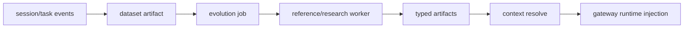

# Evolution API 与新算法接入

本文说明当前 skill/memory/agent-system/parametric-memory evolution 的 API contract，
以及如何把新的 SOTA 方法或 research 方法接入 OpenEvo Core evolution backend。
本文只描述 Core evolution contract。Source-checkout developer、benchmark
automation 和历史维护入口属于 maintainer material，不在 release-facing reading order
中展开。

## 总体数据流



Backend 不关心某个算法内部怎么做 reflection、clustering、prompt optimization、LoRA
training 或评估。算法只需要遵守两个边界：

- 输入边界：通过 datasets、input artifacts 和 `job.config` 获取数据和配置。
- 输出边界：注册 typed artifacts，并提供 `manifest`、`compatibility`、`scores`。

## Trajectory 输入形态

Evolution 方法读取 dataset 或 session event 时，需要先判断 trajectory 的 capture
形态：

- Core proxy 模式会产生 token-level traces。`response_ids`、`loss_mask` 和
  `response_logprobs` 可用于 RL 或偏好优化等 token-level 训练。
- Pure-text transcript capture 模式由 `agent.settings.capture_mode="transcript"`
  或等价 transcript capture mode 显式开启。Gateway 会在无 completion 时从 agent
  stdout transcript 构造 `agent_transcript` trajectory。这类 trajectory 明确设置
  `capture_mode=transcript` 和 `token_level_metrics_available=false`，并且不会伪造
  token ids/logprobs。
- Subscription auth 只是某些 harness 的登录方式，不等于 capture mode。任何
  `auth_mode="subscription"` 或 harness-specific subscription alias 都必须同时开启
  transcript capture，才能产生 evolution backend 可消费的纯文本 trajectory。

因此，skill/memory/agent-system evolution 可以把 transcript trajectory 当作行为记录、
反思材料或 memory mining 输入；需要 token-level metric 的 RL 方法必须过滤掉
`token_level_metrics_available=false` 的 traces，或要求任务使用 Core proxy capture。

### 外部 harness 的 transcript 输入

不由 Core gateway 直接启动的 harness 也可以进入 pure-text evolution path，只要调用方把
稳定 transcript 转换成 Core events、datasets 和 jobs。Release-facing Core contract 只要求
这些输入遵守 event/dataset/job/artifact 边界；具体 benchmark 或 source-checkout
automation 入口不属于 Core 或 Desktop 产品面。

转换后的 event 使用 `event_type="openevo.session_completed"`。Importer 或外部
automation 可以使用自己的 transcript parser，但写入 Core 的 trajectory metadata 必须包含：

```json
{
  "capture_mode": "transcript",
  "token_level_metrics_available": false
}
```

外部 transcript 输入不能包含 oracle answer、reference patch、secret、provider token 或
其他受保护材料。调用方应把可学习上下文和受保护 metadata 分离，并在 artifact lineage 或
Core-owned job config 中记录来源、policy/version、redaction evidence 和兼容性信息。Core
experiment 后续通过 `POST /v1/events`、`POST /v1/datasets` 和
`POST /v1/planned-jobs` 进入 Evolution Backend。尚未迁移的 benchmark automation 可以暂用
`POST /v1/jobs`，但这不是 plan-bound 产品路径。

## 核心 API

| API | 用途 |
|---|---|
| `POST /v1/events` | 接收 Core session/task event |
| `POST /v1/datasets` | 从 events 物化 dataset，并注册 `dataset` artifact |
| `POST /v1/planned-jobs` | 根据 frozen registry 校验并持久化 plan-bound evolution job |
| `POST /v1/jobs` | 创建 legacy unplanned job；仅限 benchmark 迁移期 |
| `POST /v1/jobs/claim` | Worker 按 queue capability claim；plan-bound job 还要求 verified method IDs 和 identity digests |
| `POST /v1/jobs/{job_id}/heartbeat` | Worker 租约续约和进度上报 |
| `POST /v1/jobs/{job_id}/complete` | Worker 提交 artifacts |
| `POST /v1/jobs/{job_id}/fail` | Worker 标记失败 |
| `POST /v1/artifacts` | 直接注册外部 artifact |
| `GET /v1/artifacts/{artifact_id}` | 读取 artifact metadata 和 manifest |
| `PATCH /v1/artifacts/{artifact_id}/promotion` | 切换 artifact 的 promoted 状态，body 必须显式包含 `promoted` |
| `POST /v1/contexts/resolve` | Gateway 为新 session 解析可注入 context |
| `POST /v1/reviews` | 创建 durable HITL review request 和 immutable review packet |
| `GET /v1/reviews` / `GET /v1/reviews/{review_id}` | 查询 pending/resolved review request |
| `POST /v1/reviews/{review_id}/claim` | 标记 reviewer claim / in-review |
| `POST /v1/reviews/{review_id}/feedback` | 提交 typed human feedback |
| `POST /v1/reviews/{review_id}/adjudicate` / `resolve` / `mark-stale` | 记录 adjudication、resolved 或 stale lifecycle 状态 |
| `POST /v1/query-decisions` | 记录本轮为什么询问或不询问 human |
| `POST /v1/feedback-applications` | 记录 human feedback 被后续方法或 promotion decision 消费 |

`job_type` 是 queue claim selector，`method` 是 plan 选择的算法名。Plan-bound request 不由
调用方重复提交 `method`：Core 从 plan selection 取得它，并绑定 method identity、execution
envelope 和 ordered artifact snapshots。Worker 同时声明可处理的 queue，以及从 verified
registry 得到的 method ID -> identity digest mapping；三者都匹配才会获得 plan-bound job。
没有 identity mapping 的 worker 只能获得 legacy job。

## Method Registry

OpenEvo Core exposes method registry metadata as a contract, not as Desktop-local
configuration. Plan compiler, plan-bound store, workers, and capability discovery
consume the same startup-verified executable registry. Desktop never imports a
method table from its bundled Core wheel.

## OpenEvo Core capability metadata

Desktop 和维护者 automation 不应硬编码 method table。远程 Core endpoint 是：

```text
GET /capabilities?execution_mode=codex_subscription_transcript
GET /capabilities?execution_mode=self-deployed
```

`execution_mode` 是 release-mode 值。唯一映射将
`codex_subscription_transcript` 转为 `subscription + transcript + codex`，将
`self-deployed` 转为 `self_deployed + transcript + codex`。它不会把 subscription
认证误写成 capture mode，也不会声称 transcript 具有 token-level metrics。

返回值是 `EvolutionCapabilitiesV1`，包含：

- `schema_version`、`core_version` 和完整 `registry_digest`；
- 实际用于支持性判断的 `evaluated_profile`；
- target-rooted `targets`，每个 target 提供 artifact/handler/renderer identity、
  configured default、nullable effective default、audience-visible `methods`、Core 可接受的
  `accepted_methods` 和 Core-owned `selection_resolvers`；
- 每个 method 的 implementation identity、ordered input bindings、output types、
  canonical JSON schema/default、execution/capture/harness/runtime 声明；
- execution、capture、harness、runtime 四个独立 support axis，以及稳定的 reason code
  和 missing requirements。

Desktop audience 只包含 descriptor `exposure=desktop` 的 targets 和 methods。未支持或依赖
尚不可用的方法仍出现在所属 target 中并携带远端 support reason；Core 只在 configured
default 对当前 profile 为 supported 时设置 `effective_default_method_id`。Desktop 不得自行
挑选另一个 fallback method。`accepted_methods` 允许 Desktop 无损保留合法但不应显示为新
选择的已有配置；`selection_resolvers` 当前表达 `agent_system.method=auto`，而不是伪造一个
method descriptor。Resolver 中每个 concrete method 的 identity 和 support 必须与
`accepted_methods` 中同 ID 条目完全一致；不一致的远端 payload 无效。

Core 启动时没有 verified executable registry 会返回 typed `503`。Sidecar endpoint
`/openevo-api/desktop/capabilities` 需要 mutation token 和远端 tunnel，只转发并校验该 payload；
它不再提供 `/openevo-api/desktop/methods` alias，也不读取 `METHOD_METADATA`。该 legacy
metadata 在 A2.5 删除前只能服务尚未迁移的内部维护路径，不能作为 capability source。
Run launch 不信任 UI cache：sidecar 每次按 active project execution mode 重新读取同一 endpoint，
验证 enabled selections 后才启动远程 Core 命令。

## Artifact Contract

Artifacts are the only durable outputs of evolution methods. Core stores typed
artifact metadata, provenance, compatibility, scores, and promotion state so
runtime injection and release gates can validate method outputs without knowing
algorithm internals.

## Artifact Register Contract

Worker complete 和 direct artifact registration 都使用同一类 artifact payload：

```json
{
  "type": "text_memory",
  "name": "parser memory",
  "uri": "file:///path/to/memory.md",
  "manifest": {},
  "lineage": {"input_artifact_ids": ["art_dataset"]},
  "compatibility": {
    "task_tags": ["calculator"],
    "agent_harness": ["codex"],
    "base_model": ["Qwen/Qwen3.6-27B"]
  },
  "scores": {"quality": 0.9},
  "tags": ["calculator"],
  "promoted": true
}
```

重要字段：

- `uri`：artifact 内容位置。当前 runtime staging 主要支持 `file://`。
- `manifest`：artifact-specific metadata，例如 adapter ID 或 agent target path。
- `compatibility`：context resolver 的过滤条件；为空表示全局匹配。
- `scores`：可由算法记录评估信息。候选生成、评估、最佳结果选择和 promotion 属于 method
  的受保护逻辑；Core context resolver 不得用一套新排序替换 method 的 promoted 结果。
  Generic run 可沿用 method-selected promoted artifact；Core managed science release run
  则携带 successor revision 的有序 artifact membership，再由 resolver 做 compatibility 和
  payload/lineage 校验，不要求或改写成员的 `promoted` 字段。Generic fallback ordering 是当前
  `src/openevo/evolution/context.py` 的实现细节，修改它需要独立 issue、回归测试和
  algorithm-impact review。
- stale artifact guard：Context resolve 验证 selected artifact 的 payload hash、source
  dataset / producing job lineage 和 compatibility，避免把无关或陈旧 artifact 注入后续
  session；productization 不通过重新排列 unpromoted candidates 来解决 stale selection。
- `promoted`：未提供 exact revision membership 时，只有 promoted 且 active/experimental 的
  artifacts 会进入通用 context resolve。显式 `context_artifact_ids` 模式按 revision 顺序读取
  active/experimental 成员，即使其 `promoted=false`；重复、缺失或额外成员 fail closed。
  Worker complete 期间新 outputs 先处于不可读取、不可 promotion、不可 resolve 的 transient
  `staged` state；只有 job success 的最终事务会把它们一起发布为 active。
- `manifest.promotion_support`：启用 runner/backend promotion gate 时，算法应写入
  `trajectory_findings`、`proposed_changes`、`expected_benefits`、`risks` 和
  `validation_checks`。Gate 会先评估这些材料，并读取 bounded `file://` artifact 内容摘录
  放入 review packet，再决定是否调用 backend promotion API。Backend 会强制
  `job.config.promoted=false` 的输出保持 unpromoted，即使 worker 提交了 `promoted=true`。
  Runner 只会从本次运行的 artifact output root 读取摘录；指向该 root 外部的 `file://` URI
  会在 packet 中标记为 unavailable。发给 LLM reviewer 的 packet 会 sanitize artifact
  metadata 中的 URI 字段，移除 top-level 和 nested manifest URI value 的 userinfo、
  fragment 和 query string，包括 relative URI reference 上的 query；LLM reviewer 的
  `score` 必须存在且是有限的 `0..1` 数值，缺失或非数值 score 会拒绝。
  Promotion API 要求 `PATCH /v1/artifacts/{artifact_id}/promotion` body 显式包含
  `{"promoted": true}` 或 `{"promoted": false}`；空 body 不会默认 promote。一个 method
  输出多个候选 artifact 时，gate 可以只 approve 其中一部分；human gate 会先写完同一
  review set 的所有 packet，再用一个共享 `decision_timeout_seconds` 窗口等待全部 decision
  文件，partial/malformed decision JSON 会继续保持 pending 直到写入合法 decision 或超时；
  `human_input=auto` 在 stdin/stdout 都是 TTY 时用 terminal prompt 直接询问 approve/reject/
  comment，否则回退到 decision files。`human_input=file` 强制文件模式，`human_input=tui`
  要求 terminal prompt；human decision 的 `score` 可选，但如果提供也必须是有限的 `0..1`
  数值。Human decision 还可以携带 `human_feedback`，其中可包含 `observed_issues`、
  `suggested_changes`、`risks` 和 `validation_checks`；这些 insight 会进入 promotion review
  记录，但不会替代 `approved` 的 promotion 判定。Runner 只 promotion 通过的候选。如果
  gated job 没有产出目标 artifact type，gate 会以 `missing_target_artifact` 拒绝。Runner 不把
  `report` 等非目标 outputs 送入 gate 或后续 target context；generic runner 无 gate 时只沿用
  method 自己 `promoted=true` 的 target output，没有这样的算法结果就 fail closed。Core
  managed science product runner 的 successor 由 typed target output membership 决定，
  `promotion_gate=none` 不注入 `promoted=true`，也不把算法的 false 改写成 true。

## HITL Review Lifecycle

Human promotion gate 不只是本地 approve/reject 机制。Backend 会把 review packet、
human feedback、query decision 和 feedback application 当作 durable lifecycle objects
保存，runner 可以在异步 review 时停在 `pending_review`，由后续 orchestrator 在 reviewer
提交 feedback 后恢复 promotion 或继续 evolution。

Runner 行为：

- `human_input=file` / `human_input=tui` / `human_input=auto` 仍然保留。没有 backend
  review API 或 query-decision API 的旧 client 会继续使用本地 packet、decision file 和
  terminal prompt 路径。
- 当 evolution client 支持 `create_review_request` 时，runner 会把本地 packet 转成 backend
  review request。Review request 是异步对象；`decision_timeout_seconds=0` 时 runner 可写出
  packet、创建 backend review，然后以 `pending_review` 结束当前 run。创建 request 时必须为
  被 review 的 artifact ID 写入 `sha256:` 前缀的 `artifact_hashes`，用于把 feedback 绑定到
  reviewer 实际看到的 artifact metadata/content 摘要。
  Backend 会在计算 `packet_hash` 和持久化 `packet_json` 前递归 sanitize packet，包括 extra
  fields、nested artifact URI/path fields、userinfo URL、query/fragment token 和 secret-like
  key/value；GET/list review API 只返回 sanitized packet。
- Runner 会在 review request payload 中嵌入一个 deterministic query-decision payload；
  支持该字段的 backend 会在 `POST /v1/reviews` 同一事务中创建 query decision、创建 review
  request，并把返回的 `query_decision_id` 写入 review response。当前策略固定为：

```json
{
  "decision": "ask_human",
  "reason_codes": ["promotion_gate_targeted", "human_gate"],
  "estimated_value_of_information": null,
  "estimated_human_cost": null,
  "budget_context": {}
}
```

`artifact_ids`、`candidate_ids`、`task_id`、`round_index` 和 `method` 来自 review packet。
如果 backend review request 创建失败，runner 保留本地 pending review，并在 review 记录上写入
backend failure metadata；因为 query decision 在 review-create transaction 内创建，不会留下
已创建但未链接 review 的孤立 query decision。旧 backend 如果忽略 `query_decision` 字段，仍可
创建 review request，但不会记录 query-decision log。后续可以把这个 deterministic payload 替换成
learned / budgeted policy，但当前实现是 fully deterministic `ask_human` policy。

Typed feedback contract：

- `HumanFeedback` 至少包含 `feedback_id`、`review_id`、`reviewer_id`、`decision`、
  `status`、`raw_payload` 和 `normalized_payload`。可复用的状态是
  `available_for_evolution`；`rejected_invalid`、`archived_only` 或 stale review feedback 只保留
  audit，不进入 evolution signal。
- typed 字段包括 `score`、`confidence`、`rationale`、`observed_issues`、
  `suggested_changes`、`risks`、`validation_checks`、`labels` 和 preference/pairwise 结果。
  `score` 和 `confidence` 接受 0..1 的 int/float，但拒绝 JSON boolean，避免 `true`/`false`
  被强制转换成 `1.0`/`0.0`。Raw reviewer payload 只能用于审计；未来 agent 和 worker methods
  只能消费 normalized/redacted payload。
- Promotion resume 只从 post-review request 状态消费 available feedback，例如
  `submitted`、`validated`、`adjudicated` 和 `resolved`。`queued`、`in_review` 等 pre-submission
  状态保持 `pending_review`；`stale`、`rejected_invalid`、`archived_only` 等 invalid/archive
  状态不能 promotion。Resume 还必须确认 request 中每个 targeted artifact 的
  `artifact_hashes[artifact_id]` 存在且匹配当前 artifact/review hash；缺失 hash 保持
  `pending_review`，hash mismatch 作为 stale review 拒绝，不会应用已有 approve feedback。
- Backend 在 feedback 进入 `available_for_evolution` 前 sanitize `normalized_payload`，包括
  `rationale`、`observed_issues`、`suggested_changes`、`risks`、`validation_checks` 和
  `labels`。`raw_payload` 仍只作为 audit storage，不会通过 feedback GET/list 或 resume
  输出暴露。
- Dataset 物化会把 sanitized human feedback 放在
  `payload.session_result.metadata.evolution_feedback.human`，不会暴露 raw payload、secret、
  credentialed URI、raw ground truth 或 protected evaluator literals。
- 消费 human feedback 的 worker method 应在 artifact manifest/lineage 中记录
  `human_feedback_ids` 和 `human_feedback_count`。如果 method 在 prompt、candidate archive 或
  promotion support 中 disclosure 了共享 feedback，也要把这个事实写入 manifest/report，便于审计。
- `FeedbackApplication` 记录 downstream consumption，例如 promotion decision、prompt seed、
  mutation constraint、negative constraint、validation check、ranking signal 或 dataset record。
  Worker 完成 job 并注册带有 `manifest.human_feedback_ids` 的 artifact 时，backend 会为本
  backend 已知且可消费的 feedback id 自动创建 application 记录，`target_id` 指向输出 artifact，
  `consumed_in_job_id` 指向当前 job；外部 dataset 携带但本 backend 不认识的 feedback id 不阻塞
  artifact 注册。
  没有 application 记录时，系统不能声称某条 human feedback 改变了后续 evolution。

当前限制：

- 还没有 RLHF、reward model、DPO/PPO 或 learned query policy；human feedback 是 typed
  evolution signal，不是 token-level training target。
- Query policy 还不会估算真实 value-of-information / cost，也不会按 reviewer budget 排队。
- Raw reviewer payload、未 redacted freeform 文本和 reviewer 看到的 untrusted artifact excerpt
  不应暴露给未来 agents；只允许 normalized/redacted feedback 进入 dataset 和 method prompt。

## Artifact 类型

### `text_memory`

自然语言长期记忆。URI 指向 Markdown 文本文件。

```json
{
  "type": "text_memory",
  "name": "calculator memory",
  "uri": "file:///artifacts/memory.md",
  "manifest": {
    "content_path": "memory.md",
    "source_dataset_artifact_id": "art_dataset",
    "record_count": 128
  },
  "compatibility": {"task_tags": ["calculator"]},
  "scores": {"quality": 0.82},
  "promoted": true
}
```

Gateway 会把选中的 memory 写到 `OPENEVO_MEMORY_FILE`，并 prepend 到 agent instruction。
该路径只依赖 rendered text，因此对 proxy/local inference 和 transcript-only subscription
harness 都生效。内置 reference worker 提供四条 text-memory 方法：

- `text_memory`：把 dataset records 渲染成简单 Markdown，主要用于 smoke test；
- `text_memory_reflector`：调用 LLM 从成功/失败 trajectories 中生成 reusable memory；
- `text_memory_expel_reflector`：使用 ExpeL/Reflexion-style synthesis，要求输出包含
  `## Do`、`## Avoid`、`## Validate`、`## When Applicable` 和
  `## Retired Or Superseded`，适合 Terminal Bench memory-only ablation。
- `text_memory_memevolve`：通过 `method_context_v1` 和 Core-owned Codex harness 对每个
  候选独立执行 trajectory analysis 与 declarative Markdown generation，再做 evidence
  selection。它不进入 legacy method table，也不接受 endpoint/API key。artifact manifest
  固定记录 `adaptation_scope=declarative_text_memory_v1` 和
  `paper_equivalent=false`；该方法不执行上游 MemEvolve 生成的 Python provider，因此不包含
  原版 provider 的 retrieval、online ingestion、management 或 task-executed tournament。

### `skill_bundle`

Agent harness 可加载的 skill 目录。URI 指向目录，目录内通常包含 `SKILL.md`。

```json
{
  "type": "skill_bundle",
  "name": "parser-helper",
  "uri": "file:///artifacts/skills/parser-helper",
  "manifest": {"entrypoint": "SKILL.md", "files": ["SKILL.md"]},
  "compatibility": {"agent_harness": ["codex"], "task_tags": ["calculator"]},
  "scores": {"quality": 0.77},
  "promoted": true
}
```

Gateway 会 stage 到 `/openevo/session/evolution/skills/`，harness 通过 `OPENEVO_SKILLS_DIR`
消费。

### `agent_system`

Agent system prompt 或 harness-specific repository instruction 文本。URI 指向文本文件。

```json
{
  "type": "agent_system",
  "name": "codex repo instructions",
  "uri": "file:///artifacts/AGENTS.md",
  "manifest": {"target_path": "AGENTS.md"},
  "compatibility": {"agent_harness": ["codex"]},
  "scores": {"quality": 0.8},
  "promoted": true
}
```

`target_path` 是 runtime workdir 下的相对路径。当前 allowlist：

- `AGENTS.md`
- `agents.md`
- `CLAUDE.md`
- `GEMINI.md`
- `.openhands/microagents/*.md`

Backend 和 gateway 都会拒绝空路径、绝对路径、包含 `..` 的路径，以及 allowlist 外路径。
Gateway 总会把文本写到 `OPENEVO_AGENT_SYSTEM_FILE`；如果 target path 通过安全检查，也会写到
runtime workdir 下，并设置 `OPENEVO_AGENT_SYSTEM_TARGET` / `OPENEVO_AGENT_SYSTEM_TARGETS`。

内置 reference worker 提供四个 agent-system 相关方法：

- `agent_system`：把 `job.config.agent_system_markdown` 或 `job.config.content` 直接打包成
  `agent_system` artifact，适合人工 curated 文本或 smoke test。
- `agent_system_reflector`：消费 dataset artifact，把历史 trajectories/transcripts 中的成功
  和失败样本交给 LLM 生成新的 instruction 文本，默认写入 `AGENTS.md`。
- `agent_system_history_reflector`：消费多个 round-level dataset artifacts 和可选 best /
  previous agent-system artifact，把多轮 trajectories、共享 evaluator feedback、每轮 metrics
  以及相邻轮次 delta 汇总给 LLM，生成 history-aware 的下一版 instruction 文本。
- `agent_system_pareto_reflector`：消费多个 round-level dataset artifacts，生成多个候选
  instruction，写出 candidate archive，并根据外部 evaluator 分数和退化门控选择一个候选。

`agent_system_reflector` 不固定模型；调用方必须在 `job.config.reflector_llm.model` 中指定
reflector model。默认 provider 是 `openai_chat`：`base_url` 默认读取
`OPENAI_BASE_URL`，否则使用 `https://api.openai.com/v1`；API key 可直接传入
`reflector_llm.api_key`，或通过 `api_key_env` 从环境变量读取，默认
`OPENAI_API_KEY`。如果只有 Codex subscription 登录态，可以设置
`reflector_llm.provider="codex_cli"`，worker 会调用本机 `codex exec`，清除代理 API
key/base-url 环境变量，并使用 `reflector_llm.codex_home` 指定的 Codex 登录目录。该 nested
Codex run 会忽略用户 config、使用 `--ephemeral`、`--sandbox read-only`、
并禁用 `shell_tool`，因为 dataset transcripts 属于不可信 prompt 内容。该方法不做 promotion 评估，
推荐把产出 artifact 先保持 `promoted=false`，通过离线评估或 A/B rollout 后再 promotion。

三个 reflector 方法都会对生成的 agent-system 文本做轻量 audit。默认 audit 会要求
`AGENTS.md` 中的方法论规则不是空泛口号，而是包含 trigger、action 和 validation check；
如果规则提到 source/package/bundle coverage，还必须描述 recursive file-level source
discovery、通用结构化 evidence 格式和 per-source/per-package final validation。调用方也可以通过
`job.config.agent_system_audit.forbidden_literals` 或 `leakage_basis` 传入 protected
literals，禁止 exact article title、source filename、sheet、row、sequence 等进入
agent-system。首次生成失败时 worker 会把 redacted candidate 和 audit findings 发回同一
reflector model，默认最多重写两次；重写后仍失败则 job 报错。

示例 job：

```json
{
  "job_type": "agent_system_reflector",
  "method": "agent_system_reflector",
  "input_artifact_ids": ["art_dataset"],
  "config": {
    "name": "codex SWE reflections",
    "target_path": "AGENTS.md",
    "max_records": 20,
    "reflector_llm": {
      "provider": "openai_chat",
      "model": "gpt-4.1-mini",
      "base_url": "https://api.openai.com/v1",
      "api_key_env": "OPENAI_API_KEY",
      "temperature": 0.2,
      "max_tokens": 2000
    },
    "agent_system_audit": {
      "max_repair_attempts": 2,
      "forbidden_literals": {
        "article_titles": ["held-out title, if the shared evaluator provides one"],
        "source_files": ["held-out source filename, if available"]
      }
    },
    "compatibility": {"agent_harness": ["codex"], "task_tags": ["swe"]},
    "scores": {"quality": 0.5},
    "promoted": false
  }
}
```

输出 manifest 会包含 source dataset、record count、reflected record count、success count 和
failure count，以及 `reflector_provider` / `reflector_model`、`agent_system_audit` 和
`promotion_support`；lineage 会记录 `method=agent_system_reflector` 和所有 input artifact IDs。

`agent_system_history_reflector` 使用同一套 `reflector_llm` 配置和安全约束，但输入可以包含
多个 dataset artifacts。每个 dataset manifest 应尽量写入 `round` 或 `round_number`、
该轮 `agent_system_artifact_id`，以及 `metrics` / `summary` 中的 `precision`、`recall`、
`f1`、TP/FP/FN 和 duplicate counts。Prompt 会按 round 排序，显示每轮指标和
`delta_from_previous`，并把负向 F1 delta 标为 regression。输出 manifest 额外包含
`source_dataset_artifact_ids`、`round_count`、`latest_round` / `latest_f1`、`best_round` /
`best_f1` 和 `agent_system_audit`。典型流程是在第 3 轮后把 Round 1..3 的 dataset
artifacts 与 Round 2 或离线验证最优 agent-system artifact 一起传入，避免只根据 latest
regression 改写方法论。
如果旧 dataset manifest 没有 round 或 metrics，method 会从 record metadata 的
`round` / `rollout_step` / `policy_version` 和脱敏 golden feedback 的 `Aggregate fit`
行回退提取这些信号。

`agent_system_pareto_reflector` 使用同一套 history 输入，但不会让 LLM 单次覆盖
`AGENTS.md`。它按 `job.config.candidate_strategies` 生成多个候选，分别运行泄漏和可执行性
audit，然后把 `candidate_archive.json` 注册成 `report` artifact。若 pipeline 已经对候选跑过
paired evaluation，可把每个候选的 `precision`、`recall`、`f1` 和
`prediction_to_reference_ratio` 写入 `job.config.candidate_evaluations`；promotion gate 可用
`max_prediction_to_reference_ratio`、`max_f1_regression`、`min_precision`、`min_recall` 和
`requires_external_evaluation` 防止 coverage collapse、爆量输出或低精度候选晋级。

## Golden-standard evaluator

有 ground truth 的任务应把评估放在 evolution orchestration 层，而不是放进某个具体
method。共享实现位于 `openevo.evolution.golden_standard`，负责：

- 读取 JSON / JSONL golden records；
- 按 article-scoped sequence matching 计算 TP/FP/FN、precision、recall、F1 和重复预测；
- 生成脱敏的 methodology feedback；
- 对生成的 agent-system 文本做 held-out literal 泄漏检查。

推荐数据流：

1. rollout agent 的 workspace 只包含任务允许的 evidence，例如 `input/`；
2. rollout 完成后，orchestrator 在 workspace 外读取 ground truth 和 agent 输出；
3. raw evaluation 写入实验 artifact/log，不进入后续 agent workspace；
4. 只有脱敏 feedback 写入 event payload，例如
   `payload.session_result.metadata.evolution_feedback.golden_standard`；
5. evolution methods 从 dataset records 读取 `evolution_feedback`，把它当作通用训练信号。

脱敏 feedback 只能描述方法论缺口，例如 over-inclusion、under-extraction、component
boundary、coverage pass；不能包含 exact sequence、source filename、source sheet、
row number、article title 或 reference record。这样 evaluator 可以被 text memory、
skill、agent-system、parametric 之外的后续方法共享，同时避免每个 method 重复解析大型
ground truth。

### `parametric_memory`

参数化长期记忆，例如 LoRA/adapter。URI 指向 adapter 目录或远端引用。

```json
{
  "type": "parametric_memory",
  "name": "parser-memory",
  "uri": "file:///artifacts/adapters/parser-memory",
  "manifest": {
    "adapter_id": "parser-memory",
    "base_model": "Qwen/Qwen3.6-27B",
    "adapter_format": "lora"
  },
  "compatibility": {
    "base_model": ["Qwen/Qwen3.6-27B"],
    "task_tags": ["calculator"]
  },
  "scores": {"heldout_reward_delta": 0.12},
  "promoted": true
}
```

Context resolver 会把它转成 `adapter_merge_spec`。Gateway/proxy 当前做 request-level
adapter selection，不做物理权重合并。Parametric memory 只适用于 proxy/local inference
运行：serving backend 必须能按 request 选择或加载对应 adapter。Subscription harness 直连
外部模型服务，不能应用 OpenEvo 产生的 adapter，因此 experiment config 会拒绝在 subscription
auth 下启用 `evolution.targets.parametric_memory`，context resolver 也会在 request 的
agent settings 或 metadata 标记 subscription auth 时跳过 `parametric_memory` artifacts。

内置 `parametric_memory_sd_lora` 是 self-deployed 模式下的实验性 continual-learning
method。它从当前 task 的成功 trajectories 训练一个新 SD-LoRA component，并把至多一个
上一代 SD-LoRA artifact 的 frozen components 一并折叠成单个 cumulative PEFT adapter。
下一 session 因而只选择一个 adapter；Core 不维护 task router，也不按 task 猜测 adapter。

训练由 Daemon-owned fixed subprocess service 执行。Method config 只包含 closed、bounded
hyperparameters，以及 exact `base_model`/`model_revision`；不接受 shell command、API
endpoint、credential 或任意 trainer plugin。Daemon 需要安装
`openevo[parametric-memory]` 并具有 CUDA，launcher 才会发布
`sd_lora_continual_trainer` capability。模型 forward/backward 全部在本地执行；生成训练
trajectory 的任务推理仍使用 OpenEvo 已有 harness，例如内置 Codex subscription harness，
不新增模型 API。不过 subscription session 本身不能加载训练出的 adapter，因此该 method
只在 self-deployed execution profile 中可启用。

每个 artifact root 只有一个 Daemon trainer service owner，且一次只运行一个 GPU training。
子进程必须只看到一个 CUDA device，并运行在独立 process group、closed environment、Linux
parent-death signal 和 bounded resource limits 下。Daemon 持久化绑定 boot/process/session/start
identity 的 active receipt；重启恢复只清理 receipt 与当前进程 identity 完全一致的遗留 trainer。
Method timeout 或 worker heartbeat/lease failure 会取消 method 并终止整个 process group。
多 GPU host 通过 Daemon 启动环境中的 `CUDA_VISIBLE_DEVICES` 选择一个 device；supervisor 的
closed child environment 只透传该 GPU selection，不透传 provider/API credentials。

Artifact 同时包含标准 PEFT adapter 和 SD-LoRA decomposition state。后一部分记录 exact
base model revision、target modules、每代 rank、A/B tensors、learned coefficients 和完整
tensor inventory；下一代训练会重新验证并冻结旧 components，只训练新 component 与共享
coefficients。Artifact 还记录实际 training wall time 和 peak allocated GPU memory；这些指标与
training loss 都不是 held-out reward。当前实现是 research/internal capability，尚不属于 External Beta release
acceptance；完整 successor readiness、serving preparation 和 run-owner activation 仍遵循
项目级 cross-session contract，不能由 method 自行绕过。


Benchmark-specific task-local builders, local evaluation adapters, serving-time adapter
rewrite helpers, and package-specific guard flags are maintainer automation outside
Core/Desktop. They may call Core APIs and reference worker methods, but the release-facing
Core contract only observes standard dataset artifacts, `WorkerClaimedJob` JSON,
registered `parametric_memory` artifacts, compatibility metadata, and runtime injection
evidence. Such automation must not be documented as a Core Backend command, Desktop
feature, or ordinary-user workflow.

Serving backend 仍负责加载 cumulative PEFT adapter。Worker 最多每 5 秒 heartbeat 一次，并把
lease ownership failure 传播为 trainer cancellation；method 不引入独立调度 API。

## Context Resolver

The context resolver is the Core-owned selection boundary between stored
artifacts and the next harness session. It filters compatibility, ranks promoted
artifacts deterministically, and returns the exact payloads that gateway runtime
injection stages.

Runtime cutover currently has two deliberately non-overlapping stages. The public
`POST /v1/contexts/resolve` contract below remains the sole Gateway path until strict
v2 transport and Gateway can switch atomically. Separately, Core has an internal projection v1
resolver that issues managed payload snapshots, invokes only handlers from the
sealed executable registry, performs single-target and context-wide validation,
and persists ordered `TargetHandlerOutput` values plus the canonical request digest.
That internal response contains
`registry_digest`, `destination_roots`, `projections`, and actual consumed-artifact
selection; it contains no source URI, host path, opaque handle, or legacy
`memory`/`skills` shadow fields. It is not a public API and has no client fallback.
Its strict request accepts only harness/auth facts, task tags, explicit context
artifact IDs, bounded target limits, and Core runtime facts; arbitrary agent env and
metadata are rejected rather than persisted. Collection elements and the complete
canonical request have explicit byte/length bounds. Manifest semantics use the deterministic immutable
DB record committed during registration, not the mutable legacy manifest file;
legacy rows without that binding are quarantined with a bounded reason code and must
be re-registered rather than silently backfilled;
managed payload reads reject symlinks, multiply linked regular files, root escapes,
and drift. The scanner fixes the configured root from an absolute filesystem anchor
one component at a time with no-follow opens, holds that verified root FD, and
revalidates the held-FD/path binding around every relative traversal. Candidate
counts are bounded before payload I/O. Manifest/scores are
validated before scanning; compatibility/scores are bounded before filtering or
ranking, and explicit artifact IDs are applied in the store query. Implicit selection
reserves its bounded row budget for local manifest-bound candidates before bounded
remote/unbound/metadata-policy skip rows. Rejected rows are projected by SQL to bounded
compatibility routing data plus identity/reason markers rather than returning their
source manifest, scores, name, or URI. Compatibility is validated before even a typed
skip is persisted; unverifiable or incompatible rows do not enter the context.
Aggregate node/file/byte resources are consumed during
every scan and verified-reread attempt without rollback when a candidate fails. Adapter projections
carry the approved payload digest and size; typed skips never expose a rejected URI
or host path. Routing metadata outside the internal projection policy is quarantined
without changing legacy artifact-registration acceptance. Semantically invalid promoted artifacts and handler/aggregate contract
violations fail the entire projection instead of triggering an inferred subset.
The internal generic materializer binds the same sealed registry and request digests,
reissues and verifies staged/adapter inventories, streams private random-ID,
digest-verified blobs, resolves generic
destination/env/instruction/adapter contributions, and publishes a fsync-backed bundle
without source URIs, host paths, or scanner handles. Context and materialization rows
are transactionally bound. The ephemeral publication receipt binds canonical manifest
bytes, context/blob-directory identities, and every blob identity; the store revalidates
that receipt under the same locked root FD immediately before DB commit. Publication and
startup reconciliation share a cross-process root lock and require matching DB/root
identity. Identity DDL and its pending row are created atomically; initial/legacy binding
then uses a recoverable pending -> two redundant
marker fsyncs -> bound protocol. A bound row with either marker missing fails closed.
Post-rename verification failure leaves the unreferenced name for identity-bound startup
recovery rather than deleting a potentially substituted directory.

Blob transport and consumers may enter only through an `EvolutionStore`-owned API. It
holds and revalidates the same locked materialization-root fd, both store-identity
markers, and the owner/mode/inode root binding; loads the authoritative
`MaterializedContext` from SQLite `context_materializations.manifest_json`; and passes
that expected manifest plus the same root fd to the lower-level materializer. The disk
`manifest.json` must byte-match the canonical DB manifest. Replacing a blob and rewriting
the disk manifest therefore cannot self-authorize content. The lower-level reader opens
the blob no-follow, revalidates size, digest, and path identity, and returns only a
controlled read-only stream, never a raw fd or host path. Strict v2 metadata/blob
transport plus Gateway switching must still land atomically before v1 is removed.
The materialization root is owner-verified mode `0700`; publish, precommit verification,
discard, and recovery reuse one locked fd. Orphan cleanup quarantines and rechecks the
enumerated inode, clears only safely fixed content, and retains a maintenance-owned
quarantine/tombstone entry; this is conservative containment, not proof of immediate
deletion. Identity mismatch is preserved and fails closed. Beyond fresh or recognized
pending bootstrap states, startup accepts only exact allowlisted historical/current schema
fingerprints and independently validates the exact `store_identity` schema, row, and two
markers; only a complete fingerprint may claim existing managed recovery state. A forged
or near-match identity fails before cleanup and leaves managed state untouched. A fresh
database cannot claim non-empty Core-managed recovery state. A legacy database may
migrate it only after that recognition, before any identity DDL/row or marker is written;
matching table names alone is not recognition.

Context snapshot reconciliation is a startup-only, DB-authorized operation: SQLite
supplies the canonical bytes for every referenced snapshot. Ordinary read and inventory
remain strict link-count-one mode-`0600` operations. Historical owner-readable/writable,
non-executable, non-group/other-writable modes are accepted only by the explicit startup
migration that tightens them to `0600`; they are never accepted by the normal reader.
Complete adapter verification finally rebinds the source-root path.

## Context Resolve Contract

Gateway 在 run 前调用：

```json
{
  "task_id": "task_1",
  "instruction": "fix parser",
  "agent": {"harness": "codex"},
  "base_model": "Qwen/Qwen3.6-27B",
  "metadata": {"task_tags": ["calculator"]},
  "limits": {
    "max_memory_chars": 12000,
    "max_agent_system_chars": 12000,
    "max_skill_bundles": 4,
    "max_adapters": 2
  }
}
```

Experiment compiler 会保留每次执行的
`openevo_run_task:<run_id>:<task_id>` tag 作为审计与单次执行身份。由 Core run owner
编译的产品运行还必须由 Science compiler 签发一个不属于 `ExperimentConfig` 或公开
experiment API、绑定 exact project ID 和 run ID 的进程内 project-scope authority。
Core run owner 只通过私有的 Core-authoritative runner/compiler 路径传递该 authority；
公开的 `run_experiment` 和 `compile_experiment` 不接收 project scope 或 successor
开关。Compiler 从签发方保存的不可变绑定中复核 authority 与当前 run，而不信任调用方可见
对象中的字段。Compiler 据此生成
`openevo_project:<project_id>` tag，并把同一有序 tag 集合同时写入 rollout metadata 和 method
output compatibility。这样 successor revision 精确固定的 artifact 可以被同一 project 的后续
run 或后续科研 task 消费，而另一个 project 仍会在 compatibility filter 处失败。通用 task
metadata 即使包含同名 `openevo.project_id` 也不能取得 project scope；没有 Core authority 的
benchmark automation 继续只使用原有 task-scoped tag。

响应会包含：

```json
{
  "context_id": "ctx_...",
  "memory": {
    "artifact_ids": ["art_memory"],
    "rendered_text": "..."
  },
  "agent_system": {
    "artifact_ids": ["art_agent_system"],
    "rendered_text": "...",
    "target_path": "AGENTS.md",
    "targets": [
      {
        "artifact_id": "art_agent_system",
        "name": "codex repo instructions",
        "target_path": "AGENTS.md",
        "rendered_text": "..."
      }
    ]
  },
  "skills": [
    {"artifact_id": "art_skill", "name": "parser-helper", "uri": "file:///..."}
  ],
  "adapter_merge_spec": {
    "base_model": "Qwen/Qwen3.6-27B",
    "merge_mode": "runtime_lora",
    "adapters": [
      {
        "artifact_id": "art_adapter",
        "adapter_id": "parser-memory",
        "uri": "file:///...",
        "weight": 1.0,
        "format": "lora"
      }
    ]
  },
  "selection": {
    "artifact_ids": ["art_memory", "art_agent_system", "art_skill", "art_adapter"],
    "reasons": ["matched promoted compatible artifacts"]
  }
}
```

## Adding Methods / 接入新算法

### 方式一：扩展内置 method catalog

适合本仓库内的 baseline 或实验方法。

1. 新方法优先实现 context ABI；已有 legacy method 的函数签名保持不变：

```python
def my_memory_method(context: MethodExecutionContext) -> list[ArtifactRegisterRequest]:
    ...
```

2. 在 `openevo.evolution.framework.builtins` 添加
   `EvolutionMethodDescriptor`，声明 target、ordered inputs、outputs、closed config schema、
   support axes 和 locked entry point。内置 entry point 使用：

```python
entry_point="openevo.evolution.methods:my_memory_method"
```

3. 声明 `invocation_abi="method_context_v1"`；loader 只接受精确 `(context)` signature。不要把
   新方法加入 `METHOD_REGISTRY` 作为 fallback。已有 legacy built-ins 继续声明
   `legacy_worker_job_v1`，并由 anti-drift tests 证明 entry point 与原 callable identity 相同。

4. 由 registry/profile 编译 plan，再创建 plan-bound job：

```json
{
  "plan": {"plan_id": "plan-...", "selections": ["..."]},
  "target_id": "text_memory",
  "job_type": "my_memory_method",
  "input_bindings": [
    {"binding_id": "current_dataset", "artifact_ids": ["art_dataset"]}
  ],
  "core_config": {}
}
```

5. 为 descriptor identity、locked loading、method 输出、worker complete、context resolve
   和 Core capability projection 添加测试。

### 方式二：显式 research plugin

适合独立仓库、GPU 训练、长任务或 SOTA 方法。插件 wheel 和 catalog entry point 必须由
维护者通过 distribution name、version、SHA-256 和 entry point lock 显式启用；Core 不扫描
或自动执行环境中碰巧安装的插件。插件 descriptor 遵守同一 frozen registry contract，专用
worker 继续实现现有 worker protocol。

Plan-bound dispatch 已支持 verified executable handles，但当前 release composition 只加载
built-ins。外部 research plugin 仍需一个显式的多 distribution registry composition；不能把
已安装插件自动合并进 release registry，也不能仅凭 direct tests 声称端到端可运行。目标流程：

1. 验证 locked wheel/install，再从该 distribution 加载 verified catalog provider。
2. 注册 provider 返回的 descriptors 并 freeze/validate descriptor graph。
3. 验证 frozen graph 中每个 implementation entry point；全部成功后才 publish loaded registry。
4. 通过 frozen snapshot 编译 plan，并用 `/v1/planned-jobs` 持久化 exact execution identity。
5. `POST /v1/jobs/claim`，带 queue capabilities、verified method IDs 和 identity digests。
6. 校验 claimed plan/envelope/inputs，按 descriptor ABI 运行算法。
7. `POST /v1/jobs/{job_id}/complete`，提交一个或多个 `ArtifactRegisterRequest`。

这种方式不需要修改 backend DB schema。新算法通过 typed artifact 与 Core 通信。

### 方式三：外部 artifact 注册 contract

适合经过维护者审核的 curated memory、离线训练好的 adapter，或已有 skill bundle。Release-facing
文档只定义 Core API payload contract；它不把手写 shell/curl 调用作为普通用户或 Desktop
路径。Desktop 通过 Core Backend 和受控 automation 提交这些 payload。

```json
{
  "type": "skill_bundle",
  "name": "curated skill bundle",
  "uri": "file:///immutable/artifacts/skill_bundle",
  "manifest": {"content_path": "SKILL.md"},
  "lineage": {"input_artifact_ids": ["art_dataset"]},
  "compatibility": {"agent_harness": ["codex"]},
  "scores": {"quality": 0.8},
  "tags": ["curated"],
  "promoted": false
}
```

外部 artifact 注册也会走同样的 validation。例如
`agent_system.manifest.target_path` 会被规范化和 allowlist 校验，payload URI、lineage、
compatibility、scores、tags 和 promotion state 必须满足 Core artifact contract。

## 新算法输出建议

- 总是设置 `compatibility`，避免 harness-specific memory/skill/agent-system 污染其他任务。
- 把实验指标写入 `scores`，例如 `quality`、`heldout_reward_delta`。
- 把输入 dataset、旧 artifact、训练 run ID 写入 `lineage`。
- 默认不要 `promoted=true`；先通过离线评估或 A/B rollout 再 promotion。
- Parametric memory 的 `adapter_id` 必须与 serving backend 加载 adapter 时的名字一致。
- 如果算法会生成多个 artifacts，优先拆成多个 typed artifact，而不是把所有内容塞进一个
  manifest。
