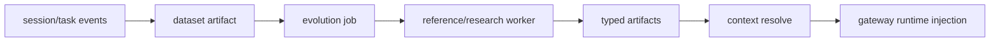

# Evolution API 与新算法接入

本文说明当前 skill/memory/agent-system/parametric-memory evolution 的 API contract，
以及如何把新的 SOTA 方法或 research 方法接入 Polar Evolution Backend。

## 总体数据流



Backend 不关心某个算法内部怎么做 reflection、clustering、prompt optimization、LoRA
training 或评估。算法只需要遵守两个边界：

- 输入边界：通过 datasets、input artifacts 和 `job.config` 获取数据和配置。
- 输出边界：注册 typed artifacts，并提供 `manifest`、`compatibility`、`scores`。

## Trajectory 输入形态

Evolution 方法读取 dataset 或 session event 时，需要先判断 trajectory 的 capture
形态：

- Polar proxy 模式会产生 token-level traces。`response_ids`、`loss_mask` 和
  `response_logprobs` 可用于 RL 或偏好优化等 token-level 训练。
- Pure-text transcript capture 模式由 `agent.settings.capture_mode="transcript"`
  或等价 transcript capture mode 显式开启。Gateway 会在无 completion 时从 agent
  stdout transcript 构造 `agent_transcript` trajectory。这类 trajectory 明确设置
  `capture_mode=transcript` 和 `token_level_metrics_available=false`，并且不会伪造
  token ids/logprobs。
- Subscription auth 只是某些 harness 的登录方式，不等于 capture mode。任何
  `auth_mode="subscription"` 或 harness-specific subscription alias 都必须同时开启
  transcript capture，才能产生 evolution backend 可消费的纯文本 trajectory。

因此，skill/memory/agent-system evolution 可以把 transcript trajectory 当作行为记录、
反思材料或 memory mining 输入；需要 token-level metric 的 RL 方法必须过滤掉
`token_level_metrics_available=false` 的 traces，或要求任务使用 Polar proxy capture。

## 核心 API

| API | 用途 |
|---|---|
| `POST /v1/events` | 接收 Polar session/task event |
| `POST /v1/datasets` | 从 events 物化 dataset，并注册 `dataset` artifact |
| `POST /v1/jobs` | 创建 evolution job |
| `POST /v1/jobs/claim` | Worker 按 capability claim job |
| `POST /v1/jobs/{job_id}/heartbeat` | Worker 租约续约和进度上报 |
| `POST /v1/jobs/{job_id}/complete` | Worker 提交 artifacts |
| `POST /v1/jobs/{job_id}/fail` | Worker 标记失败 |
| `POST /v1/artifacts` | 直接注册外部 artifact |
| `POST /v1/contexts/resolve` | Gateway 为新 session 解析可注入 context |

`job_type` 是 claim selector，`method` 是 worker 内部执行的算法名。reference worker 默认让
二者同名，例如 `job_type=agent_system, method=agent_system`。专用 research worker 可以用
自己的 capability 策略，只要 claim 到 job 后返回合法 artifact 即可。

## Artifact Register Contract

Worker complete 和 direct artifact registration 都使用同一类 artifact payload：

```json
{
  "type": "text_memory",
  "name": "parser memory",
  "uri": "file:///path/to/memory.md",
  "manifest": {},
  "lineage": {"input_artifact_ids": ["art_dataset"]},
  "compatibility": {
    "task_tags": ["calculator"],
    "agent_harness": ["codex"],
    "base_model": ["Qwen/Qwen3.6-27B"]
  },
  "scores": {"quality": 0.9},
  "tags": ["calculator"],
  "promoted": true
}
```

重要字段：

- `uri`：artifact 内容位置。当前 runtime staging 主要支持 `file://`。
- `manifest`：artifact-specific metadata，例如 adapter ID 或 agent target path。
- `compatibility`：context resolver 的过滤条件；为空表示全局匹配。
- `scores`：resolver 排序依据，目前优先使用 `quality`，其次 `heldout_reward_delta`。
- `promoted`：只有 promoted 且 active/experimental 的 artifacts 会进入 context resolve。

## Artifact 类型

### `text_memory`

自然语言长期记忆。URI 指向 Markdown 文本文件。

```json
{
  "type": "text_memory",
  "name": "calculator memory",
  "uri": "file:///artifacts/memory.md",
  "manifest": {
    "content_path": "memory.md",
    "source_dataset_artifact_id": "art_dataset",
    "record_count": 128
  },
  "compatibility": {"task_tags": ["calculator"]},
  "scores": {"quality": 0.82},
  "promoted": true
}
```

Gateway 会把选中的 memory 写到 `POLAR_MEMORY_FILE`，并 prepend 到 agent instruction。

### `skill_bundle`

Agent harness 可加载的 skill 目录。URI 指向目录，目录内通常包含 `SKILL.md`。

```json
{
  "type": "skill_bundle",
  "name": "parser-helper",
  "uri": "file:///artifacts/skills/parser-helper",
  "manifest": {"entrypoint": "SKILL.md", "files": ["SKILL.md"]},
  "compatibility": {"agent_harness": ["codex"], "task_tags": ["calculator"]},
  "scores": {"quality": 0.77},
  "promoted": true
}
```

Gateway 会 stage 到 `/polar/session/evolution/skills/`，harness 通过 `POLAR_SKILLS_DIR`
消费。

### `agent_system`

Agent system prompt 或 harness-specific repository instruction 文本。URI 指向文本文件。

```json
{
  "type": "agent_system",
  "name": "codex repo instructions",
  "uri": "file:///artifacts/AGENTS.md",
  "manifest": {"target_path": "AGENTS.md"},
  "compatibility": {"agent_harness": ["codex"]},
  "scores": {"quality": 0.8},
  "promoted": true
}
```

`target_path` 是 runtime workdir 下的相对路径。当前 allowlist：

- `AGENTS.md`
- `agents.md`
- `CLAUDE.md`
- `GEMINI.md`
- `.openhands/microagents/*.md`

Backend 和 gateway 都会拒绝空路径、绝对路径、包含 `..` 的路径，以及 allowlist 外路径。
Gateway 总会把文本写到 `POLAR_AGENT_SYSTEM_FILE`；如果 target path 通过安全检查，也会写到
runtime workdir 下，并设置 `POLAR_AGENT_SYSTEM_TARGET` / `POLAR_AGENT_SYSTEM_TARGETS`。

### `parametric_memory`

参数化长期记忆，例如 LoRA/adapter。URI 指向 adapter 目录或远端引用。

```json
{
  "type": "parametric_memory",
  "name": "parser-memory",
  "uri": "file:///artifacts/adapters/parser-memory",
  "manifest": {
    "adapter_id": "parser-memory",
    "base_model": "Qwen/Qwen3.6-27B",
    "adapter_format": "lora"
  },
  "compatibility": {
    "base_model": ["Qwen/Qwen3.6-27B"],
    "task_tags": ["calculator"]
  },
  "scores": {"heldout_reward_delta": 0.12},
  "promoted": true
}
```

Context resolver 会把它转成 `adapter_merge_spec`。Gateway/proxy 当前做 request-level
adapter selection，不做物理权重合并。

## Context Resolve Contract

Gateway 在 run 前调用：

```json
{
  "task_id": "task_1",
  "instruction": "fix parser",
  "agent": {"harness": "codex"},
  "base_model": "Qwen/Qwen3.6-27B",
  "metadata": {"task_tags": ["calculator"]},
  "limits": {
    "max_memory_chars": 12000,
    "max_agent_system_chars": 12000,
    "max_skill_bundles": 4,
    "max_adapters": 2
  }
}
```

响应会包含：

```json
{
  "context_id": "ctx_...",
  "memory": {
    "artifact_ids": ["art_memory"],
    "rendered_text": "..."
  },
  "agent_system": {
    "artifact_ids": ["art_agent_system"],
    "rendered_text": "...",
    "target_path": "AGENTS.md",
    "targets": [
      {
        "artifact_id": "art_agent_system",
        "name": "codex repo instructions",
        "target_path": "AGENTS.md",
        "rendered_text": "..."
      }
    ]
  },
  "skills": [
    {"artifact_id": "art_skill", "name": "parser-helper", "uri": "file:///..."}
  ],
  "adapter_merge_spec": {
    "base_model": "Qwen/Qwen3.6-27B",
    "merge_mode": "runtime_lora",
    "adapters": [
      {
        "artifact_id": "art_adapter",
        "adapter_id": "parser-memory",
        "uri": "file:///...",
        "weight": 1.0,
        "format": "lora"
      }
    ]
  },
  "selection": {
    "artifact_ids": ["art_memory", "art_agent_system", "art_skill", "art_adapter"],
    "reasons": ["matched promoted compatible artifacts"]
  }
}
```

## 接入新算法

### 方式一：扩展内置 method registry

适合本仓库内的 baseline 或实验方法。

1. 在 `src/polar_evolution/methods.py` 添加函数：

```python
def my_memory_method(job: WorkerClaimedJob, artifact_root: Path) -> list[ArtifactRegisterRequest]:
    ...
```

2. 在 `METHOD_REGISTRY` 注册：

```python
METHOD_REGISTRY["my_memory_method"] = my_memory_method
```

3. 创建 job 时设置：

```json
{
  "job_type": "my_memory_method",
  "method": "my_memory_method",
  "input_artifact_ids": ["art_dataset"],
  "config": {"promoted": true}
}
```

4. 为 method 输出、worker complete、context resolve 添加测试。

### 方式二：外部 research worker

适合独立仓库、GPU 训练、长任务或 SOTA 方法。外部 worker 只需要实现 worker protocol：

1. `POST /v1/jobs/claim`，带上自己的 capabilities。
2. 读取 claimed job 的 `input_artifacts` 和 `config`。
3. 运行算法，产出文件或 adapter。
4. `POST /v1/jobs/{job_id}/complete`，提交一个或多个 `ArtifactRegisterRequest`。

这种方式不需要修改 backend DB schema。新算法通过 typed artifact 与 Polar 通信。

### 方式三：直接注册 artifact

适合人工 curated memory、离线训练好的 adapter，或已有 skill bundle：

```sh
curl -X POST http://127.0.0.1:8200/v1/artifacts \
  -H 'content-type: application/json' \
  -d @artifact.json
```

直接注册也会走同样的 validation。例如 `agent_system.manifest.target_path` 会被规范化和
allowlist 校验。

## 新算法输出建议

- 总是设置 `compatibility`，避免 harness-specific memory/skill/agent-system 污染其他任务。
- 把实验指标写入 `scores`，例如 `quality`、`heldout_reward_delta`。
- 把输入 dataset、旧 artifact、训练 run ID 写入 `lineage`。
- 默认不要 `promoted=true`；先通过离线评估或 A/B rollout 再 promotion。
- Parametric memory 的 `adapter_id` 必须与 serving backend 加载 adapter 时的名字一致。
- 如果算法会生成多个 artifacts，优先拆成多个 typed artifact，而不是把所有内容塞进一个
  manifest。
