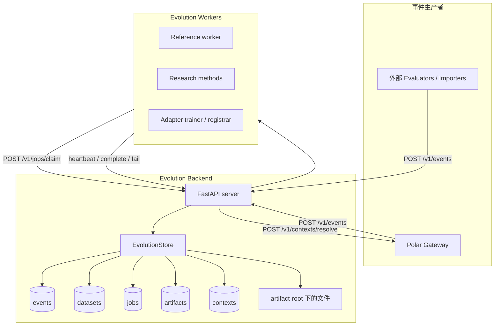
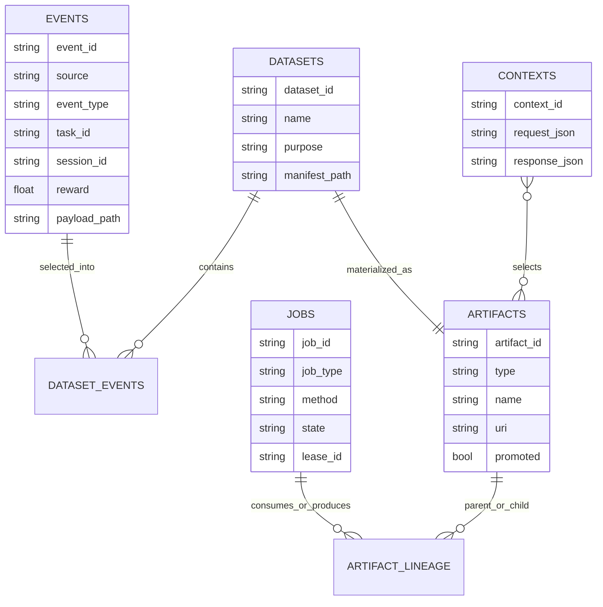
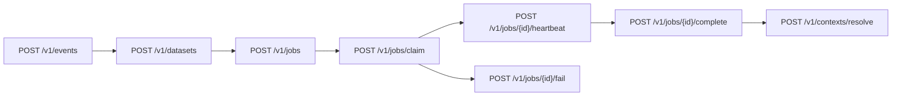
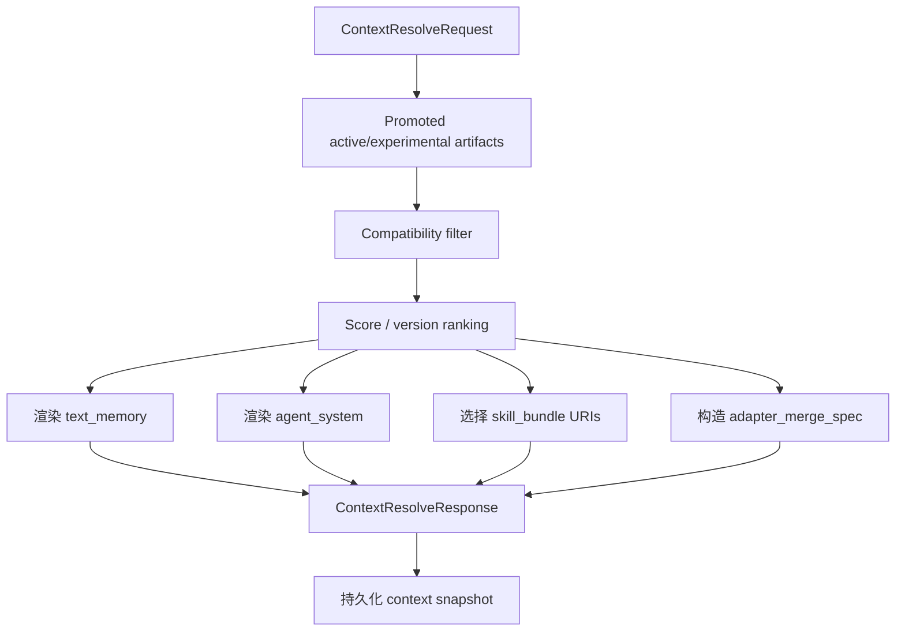

# Polar Evolution Backend（演化后端）

Polar Evolution Backend 是独立的 skill/memory evolution 控制面。它从 Polar
接收 session events，物化 datasets，把 jobs 租约给 workers，注册产出的
artifacts，并为未来的 gateway sessions 解析 runtime context。

这个 backend 有意不负责训练模型，也不负责 serving inference。训练、research
methods、adapter 生产都在 workers 中执行。backend 只保存它们的输出 artifacts，
并在 runtime 时选择需要注入的 artifacts。

## 组件图



## 数据模型



## Artifact 类型

| 类型 | 用途 | Runtime 消费方 |
|---|---|---|
| `dataset` | 物化后的 event/traces 选择，包含 `manifest.json` 和 `records.jsonl` | Evolution workers |
| `text_memory` | 长期自然语言 memory 文件 | Gateway instruction injection 和 `POLAR_MEMORY_FILE` |
| `skill_bundle` | 包含 `SKILL.md` 和可选辅助文件的目录 | Agent harness skill loaders |
| `agent_system` | 面向 agent system / harness instruction 文件的演化文本 | `AGENTS.md`、OpenHands microagent、Claude/Gemini 等 harness-specific 文本 |
| `parametric_memory` | 已注册的 adapter/LoRA 引用 | Gateway adapter merge spec for SGLang/vLLM |
| `report` | Worker/evaluation 报告 | 未来分析和审计 |
| `context_snapshot` | Context resolve 快照 | Debugging 和 reproducibility |

## API 面

完整 payload 示例和新算法接入方式见
[Evolution API 与新算法接入](evolution-api-and-method-integration.md)。



核心实现文件：

- `src/polar_evolution/server.py`：FastAPI routes。
- `src/polar_evolution/store.py`：SQLite-backed state transitions 和 context
  resolution。
- `src/polar_evolution/models.py`：API 和 artifact schemas。
- `src/polar_evolution/files.py`：artifact-root path conventions。
- `src/polar_evolution/context.py`：compatibility helpers。
- `src/polar_evolution/client.py`：gateway 使用的 async client。
- `src/polar_evolution/worker.py`：同步 worker protocol client 和 runner。
- `src/polar_evolution/methods.py`：内置 reference methods。

## 存储布局

默认情况下，backend state 保存在 `.polar_evolution/` 下。

```text
.polar_evolution/
  evolution.db
  events/
    <event_id>.json
  datasets/
    <dataset_id>/
      manifest.json
      records.jsonl
  artifacts/
    <artifact_type>/
      <artifact_id>/
        manifest.json
  contexts/
    <context_id>.json
  workers/
    <job_id>/
      ...
```

数据库是状态和 leases 的权威来源。文件系统用于保存较大的 payload 和物化后的
artifacts。

## Context Resolution



Compatibility 目前会考虑 task metadata、agent harness 和 base model。
`agent_system` artifact 的 manifest 可以声明 `target_path`，例如 `AGENTS.md` 或
`.openhands/microagents/repo.md`。注册时会规范化并校验这个路径：必须是 allowlist
中的 harness instruction 相对路径，不能为空、不能是绝对路径，也不能包含 `..`。
Gateway 会在 runtime workdir 下写出这个相对路径，并把同一段文本 prepend 到
instruction，保证不理解这些文件约定的 harness 也能消费。

Parametric memory 会优先使用 artifact manifest 中的 `adapter_id` 作为 serving
adapter name；如果旧 artifact 没有这个字段，则回退到 artifact name。

## 运行注意事项

- `job_type` 是 worker capability selector。reference worker 默认使用内置
  method 名作为 job type：`text_memory`、`skill_bundle`、`agent_system`、
  `parametric_memory_register`。
- Unknown method 会以 retryable fail 结束，这样专用 research worker 仍有机会
  重新 claim。
- Job complete 会注册输出 artifacts，并记录 input artifact IDs 到 output
  artifact IDs 的 lineage。
