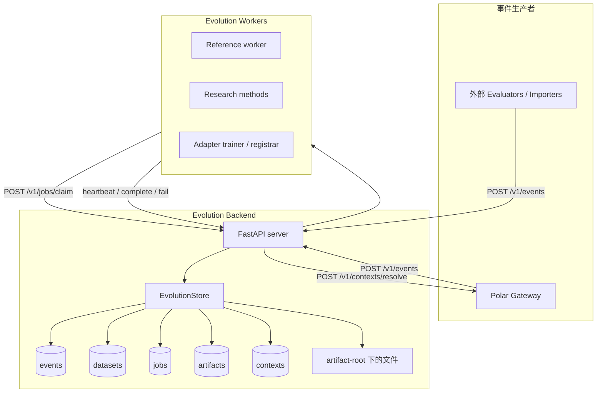
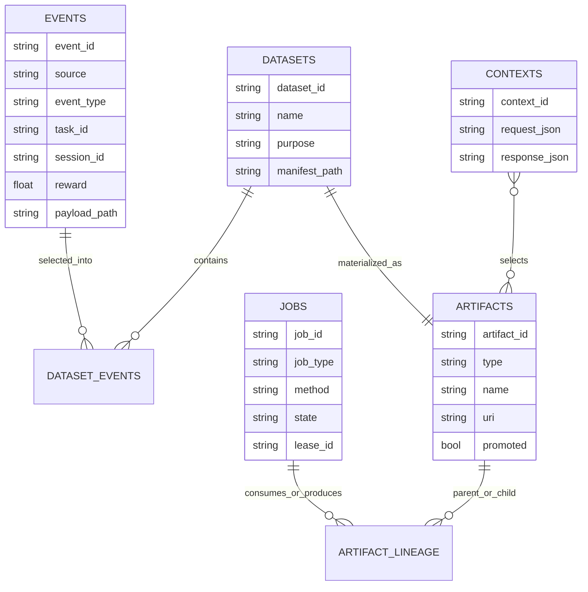
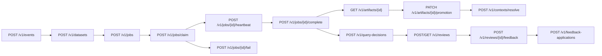
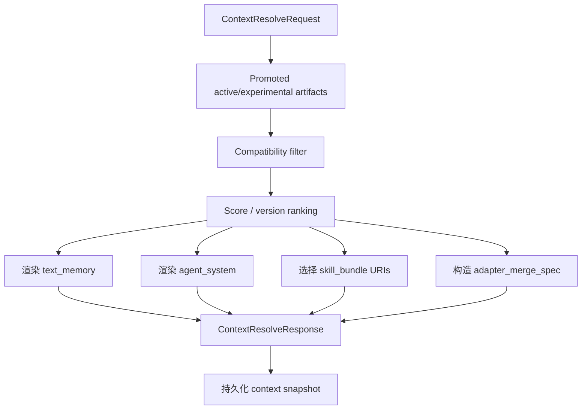

# Polar Evolution Backend（演化后端）

Polar Evolution Backend 是独立的 skill/memory evolution 控制面。它从 Polar
接收 session events，物化 datasets，把 jobs 租约给 workers，注册产出的
artifacts，并为未来的 gateway sessions 解析 runtime context。

这个 backend 有意不负责训练模型，也不负责 serving inference。训练、research
methods、adapter 生产都在 workers 中执行。backend 只保存它们的输出 artifacts，
并在 runtime 时选择需要注入的 artifacts。

## 组件图



## 数据模型



## Artifact 类型

| 类型 | 用途 | Runtime 消费方 |
|---|---|---|
| `dataset` | 物化后的 event/traces 选择，包含 `manifest.json` 和 `records.jsonl` | Evolution workers |
| `text_memory` | 长期自然语言 memory 文件 | Gateway instruction injection 和 `POLAR_MEMORY_FILE` |
| `skill_bundle` | 包含 `SKILL.md` 和可选辅助文件的目录 | Agent harness skill loaders |
| `agent_system` | 面向 agent system / harness instruction 文件的演化文本 | `AGENTS.md`、OpenHands microagent、Claude/Gemini 等 harness-specific 文本 |
| `parametric_memory` | 已注册的 adapter/LoRA 引用 | Gateway adapter merge spec for SGLang/vLLM |
| `report` | Worker/evaluation 报告 | 未来分析和审计 |
| `context_snapshot` | Context resolve 快照 | Debugging 和 reproducibility |

## API 面

完整 payload 示例和新算法接入方式见
[Evolution API 与新算法接入](evolution-api-and-method-integration.md)。



核心实现文件：

- `src/polar_evolution/server.py`：FastAPI routes。
- `src/polar_evolution/store.py`：SQLite-backed state transitions 和 context
  resolution。
- `src/polar_evolution/models.py`：API 和 artifact schemas。
- `src/polar_evolution/files.py`：artifact-root path conventions。
- `src/polar_evolution/context.py`：compatibility helpers。
- `src/polar_evolution/client.py`：gateway 使用的 async client。
- `src/polar_evolution/worker.py`：同步 worker protocol client 和 runner。
- `src/polar_evolution/methods.py`：内置 reference methods。

## 存储布局

默认情况下，backend state 保存在 `.polar_evolution/` 下。

```text
.polar_evolution/
  evolution.db
  events/
    <event_id>.json
  datasets/
    <dataset_id>/
      manifest.json
      records.jsonl
  artifacts/
    <artifact_type>/
      <artifact_id>/
        manifest.json
  contexts/
    <context_id>.json
  workers/
    <job_id>/
      ...
```

数据库是状态和 leases 的权威来源。文件系统用于保存较大的 payload 和物化后的
artifacts。

## Context Resolution



Compatibility 目前会考虑 task metadata、agent harness 和 base model。
When `metadata.evolution.context_artifact_ids` is present, context resolution
treats it as a strict allowlist for every artifact type, including
`parametric_memory`. This is required for controlled ablations because promoted
compatible artifacts from other runs must not be injected unless the rollout
explicitly selected them.

`agent_system` artifact 的 manifest 可以声明 `target_path`，例如 `AGENTS.md` 或
`.openhands/microagents/repo.md`。注册时会规范化并校验这个路径：必须是 allowlist
中的 harness instruction 相对路径，不能为空、不能是绝对路径，也不能包含 `..`。
Gateway 会在 runtime workdir 下写出这个相对路径，并把同一段文本 prepend 到
instruction，保证不理解这些文件约定的 harness 也能消费。

Parametric memory 会优先使用 artifact manifest 中的 `adapter_id` 作为 serving
adapter name；如果旧 artifact 没有这个字段，则回退到 artifact name。

## 运行注意事项

- `job_type` 是 worker capability selector。reference worker 默认使用内置
  method 名作为 job type：`text_memory`、`skill_bundle`、`agent_system`、
  `parametric_memory_register`。
- Unknown method 会以 retryable fail 结束，这样专用 research worker 仍有机会
  重新 claim。
- Job complete 会注册输出 artifacts，并记录 input artifact IDs 到 output
  artifact IDs 的 lineage。
- Human/LLM promotion gate 应让 worker 先注册 `promoted=false` artifact；backend 会强制
  `job.config.promoted=false` 的 job outputs 保持 unpromoted，避免 worker 忽略 config 后
  绕过 gate。Runner 再通过 `GET /v1/artifacts/{id}` 读取 review packet 所需 metadata；
  只有 gate 通过后才调用 `PATCH /v1/artifacts/{id}/promotion` 设置 `promoted=true`。如果同一
  job 输出多个候选 artifact，gate 可以返回 partial approval；backend 只会收到通过候选的
  promotion patch。
- `PATCH /v1/artifacts/{id}/promotion` 的请求 body 必须显式包含 `promoted`，例如
  `{"promoted": true}` 或 `{"promoted": false}`；空 body 会被拒绝，避免缺省值意外
  promote artifact。
- Review packet 会包含 bounded `file://` artifact 内容摘录，但 runner 只读取本次运行的
  artifact output root 内文件，root 外 URI 会被标记为 unavailable。发给 LLM reviewer 的
  packet 会 sanitize artifact metadata 中的 URI 字段，移除 top-level 和 nested manifest
  URI value 的 userinfo、fragment 和 query string，包括 relative URI reference 上的 query；
  LLM reviewer 的 `score` 必须存在且是有限的 `0..1` 数值，缺失或非数值 score 会拒绝。
  Human gate 会先写完同一 review set 的所有 packet，再按一个共享
  `decision_timeout_seconds` 窗口和 `decision_poll_interval_seconds` 等待
  `<artifact_id>.decision.json`；partial/malformed decision JSON 会保持 pending 直到写入合法
  decision 或超时。`human_input=auto` 在 stdin/stdout 都是 TTY 时用 terminal prompt 直接询问
  approve/reject/comment，否则回退到 decision files；`human_input=file` 强制文件模式，
  `human_input=tui` 要求 terminal prompt。Human decision 的 `score` 可选，但如果提供也必须
  是有限的 `0..1` 数值；decision 还可以携带 `human_feedback`，用于记录
  `observed_issues`、`suggested_changes`、`risks` 和 `validation_checks` 等人类 insight，
  timeout 为 `0` 时只写 packet 并返回 `pending_review`。
  如果 gated job 没有产出目标 artifact type，gate 会以 `missing_target_artifact` 拒绝。

## HITL Review Lifecycle

Backend review lifecycle 把 human gate 从同步本地 approval 扩展成可审计、可恢复的
durable lifecycle。Promotion decision、human learning signal 和 query policy 记录是分开的：

- `review_packets` 保存 reviewer 实际看到的 immutable packet 和 `packet_hash`。Packet 必须区分
  trusted metadata 与 untrusted generated artifact excerpts。Backend 在计算 `packet_hash`、
  写入 `packet_json` 和返回 GET/list response 前递归 sanitize packet，覆盖 extra fields、
  nested artifact URI/path fields、local `file://` URI、absolute local path、userinfo URL、
  query/fragment token 和 secret-like key/value。
- `review_requests` 保存异步 review request，包含 `artifact_ids`、`candidate_ids`、`job_id`、
  `task_id`、`round_index`、`method`、`artifact_type`、`artifact_hashes` 和可选
  `query_decision_id`。`POST /v1/reviews` 可以带 `query_decision` payload；backend 会在同一
  transaction 中创建 query decision、创建 review request 并写回 `query_decision_id`，避免
  孤立 query-decision 记录。Runner 创建的 request 应包含每个 reviewed artifact ID 对应的
  `sha256:` artifact hash。Runner 可以创建 request 后停在 `pending_review`；稍后的 orchestrator 只从
  `submitted`、`validated`、`adjudicated` 或 `resolved` 等 post-review 状态根据 feedback 恢复
  promotion，并且必须先验证 request 中的 artifact hash 与当前 artifact/review hash 一致。
  缺失 hash 保持 pending，hash mismatch 被视为 stale review，不会应用 approve feedback。
- `human_feedback` 保存 reviewer 提交的 typed response。`available_for_evolution` 是可进入
  后续 dataset/method 的状态；`rejected_invalid`、`archived_only`、stale review 或无效 adjudication
  只用于 audit。Backend 在标记 feedback available 前 sanitize `normalized_payload`；raw
  reviewer payload 只保留在 audit storage，不会进入 API response、resume output、dataset 或
  method prompt。
- `human_query_decisions` 保存“为什么询问 human”的策略记录。OpenEvo runner 当前把
  deterministic `ask_human` decision payload 嵌入 review request，reason codes 固定为
  `promotion_gate_targeted` 和 `human_gate`，`estimated_value_of_information`、
  `estimated_human_cost` 为空，`budget_context` 为空对象。支持该字段的 backend 会在 review
  create transaction 内原子创建并链接 query decision。未来 learned / budgeted query policy 可以
  复用这个表记录真实 cost、latency 和 downstream delta。
- `feedback_applications` 保存下游消费记录，例如 promotion decision、prompt seed、
  mutation constraint、negative constraint、validation check、ranking signal、dataset record
  或 audit note。

Human gate 的本地 file/TUI 路径仍然存在，适合 air-gapped 实验或没有 review API 的旧 backend。
当 client 支持 backend review request 时，runner 会把本地 packet 也注册到 backend；当 client
支持 inline `query_decision` payload 时，backend 会在同一事务内创建 query decision 并把
`query_decision_id` 写入 request。若 backend review 创建失败，runner 保留本地 pending review
和 failure metadata，不会留下已创建但未链接 review 的 query-decision 记录。

Typed feedback fields 包括：

- decision：`approve`、`reject`、`revise`、`abstain`、`prefer_a`、`prefer_b`、`tie` 或
  `comment_only`。
- scalar fields：`score`、`confidence`。
- `score` 和 `confidence` 接受 0..1 的 int/float，但必须拒绝 boolean，避免 JSON
  `true`/`false` 被当成 numeric feedback。
- text/taxonomy fields：`rationale`、`observed_issues`、`suggested_changes`、`risks`、
  `validation_checks`、`labels` 和 preference metadata。

Dataset ingestion 只暴露 sanitized normalized feedback，位置为
`payload.session_result.metadata.evolution_feedback.human`。Raw reviewer payload、credentialed URI、
secret、raw ground truth、source row 和 protected evaluator literal 不允许进入 future agent 可见的
dataset record 或 method prompt。消费这些反馈的 worker method 应在 artifact manifest/lineage 中
记录 `human_feedback_ids`、`human_feedback_count`，并在有共享反馈 disclosure 时写入 report 或
manifest；worker complete 注册带有 `manifest.human_feedback_ids` 的 artifact 时，backend 会为
本 backend 已知且可消费的 feedback id 自动创建 `FeedbackApplication`，`target_id` 指向输出
artifact，`consumed_in_job_id` 指向当前 job。外部 dataset 携带但本 backend 不认识的 feedback id
不会阻塞 artifact 注册；没有 application 记录时，系统不能声称某条 human feedback 改变了后续
evolution。

当前限制：backend 还没有实现 RLHF/reward model，也没有 learned query policy 或 reviewer-budget
optimizer。Human feedback 目前是 sanitized text/typed signal，用于 reflection、constraint、
candidate generation、promotion audit 和 future method input。
