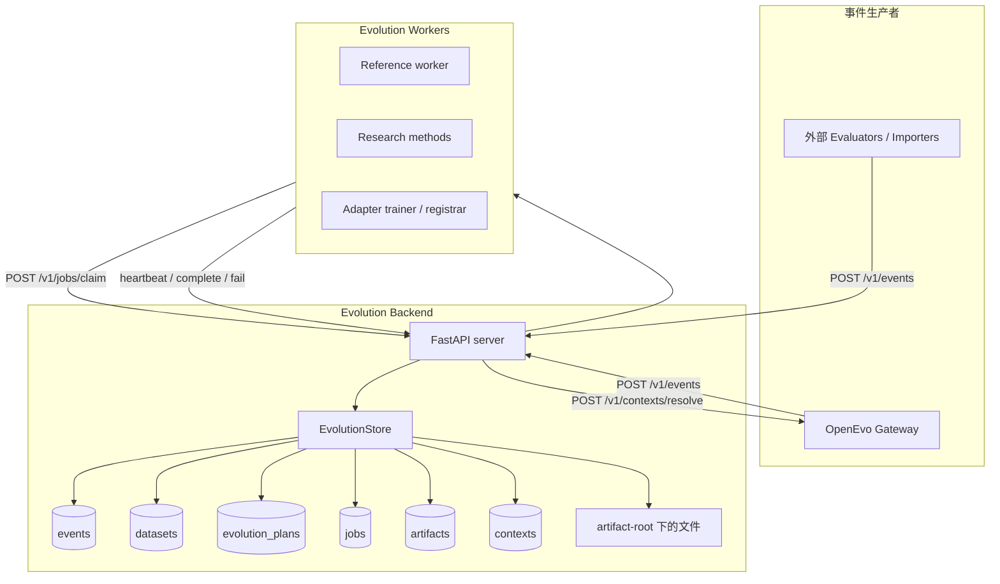
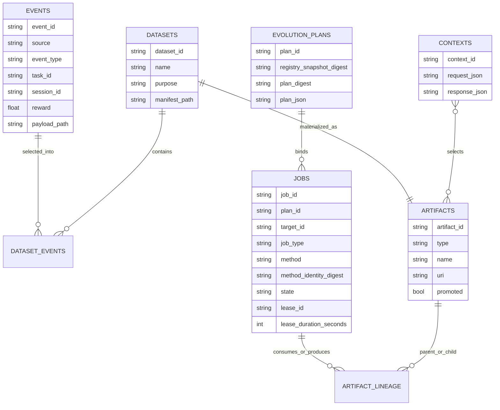
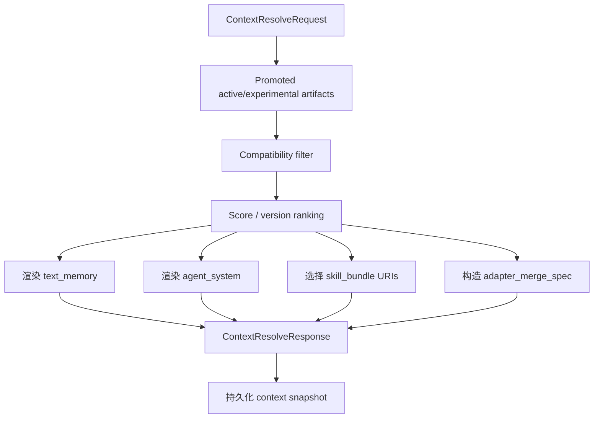

# OpenEvo Core Evolution Backend（演化后端）

OpenEvo Core Evolution Backend 是独立的 skill/memory/agent-system/adapter
evolution 控制面。实现包位于 `openevo.evolution`。Backend 从 OpenEvo Core runtime 接收 session events，物化
datasets，把 jobs 租约给 workers，注册产出的 artifacts，并为未来的 gateway
sessions 解析 runtime context。

这个 backend 有意不负责训练模型，也不负责 serving inference。训练、research
methods、adapter 生产都在 workers 中执行。backend 只保存它们的输出 artifacts，
并在 runtime 时选择需要注入的 artifacts。

## 组件图



## 数据模型



## Artifact 类型

| 类型 | 用途 | Runtime 消费方 |
|---|---|---|
| `dataset` | 物化后的 event/traces 选择，包含 `manifest.json` 和 `records.jsonl` | Evolution workers |
| `text_memory` | 长期自然语言 memory 文件 | Gateway instruction injection 和 `OPENEVO_MEMORY_FILE` |
| `skill_bundle` | 包含 `SKILL.md` 和可选辅助文件的目录 | Agent harness skill loaders |
| `agent_system` | 面向 agent system / harness instruction 文件的演化文本 | `AGENTS.md`、OpenHands microagent、Claude/Gemini 等 harness-specific 文本 |
| `parametric_memory` | 已注册的 adapter/LoRA 引用 | Gateway adapter merge spec for SGLang/vLLM |
| `report` | Worker/evaluation 报告 | 未来分析和审计 |
| `context_snapshot` | Context resolve 快照 | Debugging 和 reproducibility |

## API 面

完整 payload 示例和新算法接入方式见
[Evolution API 与新算法接入](evolution-api-and-method-integration.md)。

```mermaid
flowchart LR
    Events["POST /v1/events"]
    Datasets["POST /v1/datasets"]
    PlannedJobs["POST /v1/planned-jobs"]
    LegacyJobs["POST /v1/jobs (benchmark migration only)"]
    Claim["POST /v1/jobs/claim"]
    Heartbeat["POST /v1/jobs/{id}/heartbeat"]
    Complete["POST /v1/jobs/{id}/complete"]
    Fail["POST /v1/jobs/{id}/fail"]
    ArtifactRead["GET /v1/artifacts/{id}"]
    Promote["PATCH /v1/artifacts/{id}/promotion"]
    Resolve["POST /v1/contexts/resolve"]
    Reviews["POST/GET /v1/reviews"]
    Feedback["POST /v1/reviews/{id}/feedback"]
    Query["POST /v1/query-decisions"]
    Applications["POST /v1/feedback-applications"]

    Events --> Datasets
    Datasets --> PlannedJobs
    LegacyJobs --> Claim
    PlannedJobs --> Claim --> Heartbeat --> Complete
    Claim --> Fail
    Complete --> ArtifactRead --> Promote --> Resolve
    Complete --> Query --> Reviews --> Feedback --> Applications
```



核心实现文件：

- `src/openevo/evolution/server.py`：FastAPI routes。
- `src/openevo/evolution/store.py`：SQLite-backed state transitions 和 context
  resolution。
- `src/openevo/evolution/models.py`：API 和 artifact schemas。
- `src/openevo/evolution/files.py`：artifact-root path conventions。
- `src/openevo/evolution/context.py`：compatibility helpers。
- `src/openevo/evolution/client.py`：gateway 使用的 async client。
- `src/openevo/evolution/worker.py`：同步 worker protocol client 和 runner。
- `src/openevo/evolution/planned_jobs.py`：plan-bound job materialization 和
  execution-envelope validation。
- `src/openevo/evolution/framework/`：frozen registry、verified loading、plan 和 method ABI。
- `src/openevo/evolution/methods.py`：内置 reference methods。

## 存储布局

默认情况下，backend state 保存在 `.openevo/evolution/` 下。

```text
.openevo/evolution/
  evolution.db
  events/
    <event_id>.json
  datasets/
    <dataset_id>/
      manifest.json
      records.jsonl
  artifacts/
    <artifact_type>/
      <artifact_id>/
        manifest.json
  contexts/
    <context_id>.json
  workers/
    <job_id>/
      ...
```

数据库是状态和 leases 的权威来源。文件系统用于保存较大的 payload 和物化后的
artifacts。

`evolution_plans` 保存 canonical immutable plan。复用已有 `plan_id` 时会同时核验
`schema_version`、`registry_snapshot_digest`、`plan_digest` 和 canonical `plan_json`，任一字段
不一致都拒绝。新 experiment job 通过
`POST /v1/planned-jobs` 创建；同一个 `plan_id` 只能对应完全相同的 plan。Job row 绑定
`plan_id`、`target_id`、method identity、canonical execution envelope 和 declared output
types，并单独保存 canonical envelope digest。`(plan_id, target_id)` 唯一；完全相同的重试返回
原 job，identity/config/input 不同的重试拒绝。Input snapshots 与 job 在同一个
`BEGIN IMMEDIATE` transaction 中读取和写入。旧
数据库由 `initialize()` 以 additive columns 迁移，旧 jobs 保留 NULL identity，不会被伪装成
plan-bound jobs。

启动已有本地 state 时，`EvolutionStore.initialize()` 保留 event source 和
event type 原值，不迁移 pre-release runtime identity。Dataset queries 只匹配
显式请求的 OpenEvo event identity，例如 `openevo.session_completed`。

## Revision And Admission Ledger（内部 Primitive）

`revisions` 保存 canonical immutable manifest；`revision_id=rev-<manifest sha256>`。Manifest 显式
绑定 stream/generation/predecessor、content-addressed project/workspace refs、materialized context
manifest/request/registry digest 与 exact artifact set、registered execution snapshot 和 ordered adapters。
`execution_snapshots` 保存 closed typed model/runtime/serving identity。Store 只接受 verified producer
sealed、普通调用方不可构造的 `VerifiedExecutionSnapshot`，随后从 typed canonical bytes 自行计算
ID/digest 并记录 producer ID。Model source 是 `hugging_face`、`managed_snapshot` 或 `subscription`；identity 只允许
remote/opaque 名称，拒绝绝对 host path、`file://` 和 URI。Subscription snapshot 必须同时使用
transcript capture、subscription model/client/serving，且不能带 adapter；self-deployed snapshot 要求
非 subscription model/runtime 和 managed serving。`revision_streams` 只保存当前 committed head，
`task_admissions` 保存 canonical request、task/idempotency identity、required generation、
allowlisted canonical task envelope identity、状态和不可变 pin；不保存原始 task/run payload。
Envelope schema 只接受 content-addressed project/workspace/task refs、opaque IDs 和明确的 mode/artifact
identity，不接受 instruction、credential、env、setup command 或开放 task/runtime/model dict；不基于
字段名或文本猜测处理，非闭集字段直接拒绝。Admission request 持久化完整 closed envelope identity
字段并重算 envelope digest，调用方不能自报该 digest。未来 Core run owner 应从
immutable project/workspace snapshots 构造 envelope；本 primitive 尚未接该 owner。当前 self-deployed 与 subscription 的
genesis/admission contract 均有回归覆盖。
Store 还提供内部 `activate_successor_revision` 原子提交 primitive：只接受当前 head 的严格相邻
successor，在同一 `BEGIN IMMEDIATE` 中重验 predecessor、materialized context、registered execution
snapshot 和 ledger capacity，再同时写入 immutable revision 与推进 stream head。相同 successor 的并发或
历史重试幂等返回；竞争 fork、generation gap 和 stale predecessor 拒绝；已经 admitted 的 task 继续固定在
原 revision。事务还逐项验证下一代 queued request 与候选 revision identity；不匹配时拒绝 activation，
不会改写 request。已经推进到当前代但尚未经 retry pin 的 queued row 会阻止下一代 activation，直到它被
pin 或取消，避免提交一个 startup recovery 必然拒绝的 ledger。该 primitive 只负责最终 ledger commit，
不签发 readiness 证明，也不允许 Desktop 或 HTTP
调用方直接发布 successor；Core run/transition owner 仍必须先完成 dataset seal、全部 enabled target、
materialization、serving preparation 和 health checks。

Admission 在 `BEGIN IMMEDIATE` 中读取 stream head：请求当前 generation 时写入 `admitted` 和 exact
`pinned_revision_id`，并在同一事务 exact 匹配 project/stream、project/workspace refs、execution/capture
mode、registered execution snapshot、materialized context 和 artifact set；请求且只请求下一 generation
时写入 durable `queued` /
`required_revision_uncommitted`，pin 必须为空。更旧 generation 和 generation gap 都拒绝。同一请求
并发或重试返回同一 row；task ID 或 idempotency key 携带不同 canonical request 会冲突。Admitted
task 终结后保留 pin 供 audit；active admission count 是后续 serving drain 的 lease primitive。若 successor
activation 后在 retry 前重启，startup 接受 `active_generation == required_generation` 的未 pin queued row；
retry 重新执行 exact match 后原子 pin，不在 startup 猜测 admission。
这里的 durable `queued` row 只是尚未接入产品 run owner 的 Store 内部 primitive，不是
Desktop/Daemon 的公开 Task 状态。目标产品必须在 successor 尚未激活时返回 typed
not-ready，并且不创建 Task、admission 或 run；资源/服务调度队列只允许出现在 Task 已经
固定当前 Project Head 之后。
未 pin `cancelled` 是 closed historical audit row；它继续验证完整 request sources、terminal record 和 no-pin
语义，但 head 推进后不再与当前 active generation 建立相邻关系。Pinned `cancelled` 继续验证其原 revision、
materialization 和 execution snapshot closure，但原 pin 不必仍为 active head。
Genesis exact retry、queued/admitted/terminal retry 和 terminal transition 使用同一权威闭包校验：active
stream head/generation、revision canonical row、materialization、execution snapshot、完整 envelope identity
和 pin 中任一依赖损坏都在状态写入前 fail closed。
`get_active_revision` 和 `get_task_admission` 是权威 Store read；二者都显式开启一致 read transaction，并在
返回前分别执行 stream closure 或完整 admission closure 校验。它们不把单行 parse 当作 live integrity
证明。

Startup 对 store identity、context snapshots、execution snapshot、revision、stream、admission 和
materialization binding 使用两阶段读取。第一阶段只把 bounded PK 与
`length(CAST(value AS BLOB))` 返回 Python，并先消耗不可退回的 row/aggregate byte budget；第二阶段才以
SQL exact-length/maximum-length guarded `CASE` 逐行读取 text，再重验实际 UTF-8 bytes 后解析 JSON。超限
单值不会先进入 Python。它复核 exact schema fingerprint、canonical JSON/digest、materialized context
identity、execution snapshot、predecessor chain、active head、admission request 和完整 pin identity。写事务
使用同一 row/byte capacity；task admission 每次非幂等 UPDATE 都在写前按 old/new exact UTF-8 byte delta
验证 row 与 aggregate capacity，并在 UPDATE 后 readback 重验。Exact retry 在 capacity check 前返回；新写入
不能制造下一次 startup 必然拒绝的 B3 数据库。B3 ledger recovery 只保留 chain/head/pin 所需 compact identities，不保留全部 manifest
或 execution snapshot model；context snapshot 文件 reconciliation 仍在独立 256 MiB aggregate budget 内持有
canonical bytes。这里不宣称尚未迁移的 legacy job/artifact startup 路径具有同一预算。
该内部 contract 尚未暴露 HTTP，也未接 Gateway/run/transition/Desktop。虽然相邻 successor 的最终 ledger
commit 已具备原子、幂等和 restart-safe 语义，B3.2-B3.4 在完成 dataset seal、readiness 证明以及 run owner
编排前，仍不得把它描述成完整 cross-session evolution。Execution
snapshot persistence 也不构成 B2 verified deployment、serving readiness 或 attestation。当前仓库没有
production `VerifiedExecutionSnapshot` issuer；只有 repo-private testkit 能构造测试 seal。#160/B1 managed
deployment 提供 verified producer 前，release genesis/admission 没有可用的 snapshot registration 路径，
必须 fail closed。

## Context Resolution（当前公开 Legacy Path）

本节描述 Gateway 当前使用的 public v1 path。Verified handler、内部 projection 和 generic
materializer 的已实现边界及 strict v2 cutover 缺口见
`docs/architecture/evolution-runtime-context.md`。



Compatibility 目前会考虑 task metadata、agent harness 和 base model。
When `metadata.evolution.context_artifact_ids` is present, context resolution
treats it as a strict allowlist for every artifact type, including
`parametric_memory`. This is required for controlled ablations because promoted
compatible artifacts from other runs must not be injected unless the rollout
explicitly selected them.

`agent_system` artifact 的 manifest 可以声明 `target_path`，例如 `AGENTS.md` 或
`.openhands/microagents/repo.md`。注册时会规范化并校验这个路径：必须是 allowlist
中的 harness instruction 相对路径，不能为空、不能是绝对路径，也不能包含 `..`。
Gateway 会在 runtime workdir 下写出这个相对路径，并把同一段文本 prepend 到
instruction，保证不理解这些文件约定的 harness 也能消费。

Parametric memory 会优先使用 artifact manifest 中的 `adapter_id` 作为 serving
adapter name；如果旧 artifact 没有这个字段，则回退到 artifact name。

## 运行注意事项

- `job_type` 是 automation/queue capability selector；plan-bound claim 还必须提交从 verified
  registry 得到的 method IDs 和对应 identity digests。Queue、method 和 identity 同时匹配才
  会租出 job；没有 identity mapping 的 worker 只能 claim legacy jobs。
- Plan-bound worker 必须加载与 server 相同 external framework lock，校验 plan、reachable
  registry digest、target/method identity、execution envelope 和 ordered input snapshots 后才
  调用 method。验证失败不会退回 `METHOD_REGISTRY`。
- Unknown method 会以 retryable fail 结束，这样专用 research worker 仍有机会
  重新 claim 尚未迁移的 legacy job；plan-bound identity/contract 失败不可重试。
- Worker 在 method 执行期间每隔 claim lease 的三分之一 heartbeat，并在 complete/fail 前
  停止和 join heartbeat thread。Claim 将请求的秒数持久化到 job；heartbeat 从当前时间按同一
  duration 续租，不会把短 lease 放大成默认 600 秒。旧 active row 的 NULL duration 只从其
  `updated_at` 到 `lease_expires_at` 的有效正区间推导并持久化。Heartbeat 失败会阻止 complete，
  所有 lease 释放路径会同时清空 duration。
- Store 在更新 lease 前完成 plan JSON/digest、selection/envelope config、ordered input snapshot
  和 declared output contract 与当前 frozen registry descriptor 的校验，避免 response 构造失败后
  留下 claimed job。被选中的 plan-bound pending job 如果持久化合同已损坏，会在同一 claim
  调用中隔离为 `failed`，不发 lease；identity-filter 排除但内部合同已损坏的 row 也会被隔离。
- Job complete 会在 staging 前和最终 publish transaction 内重验完整 plan-bound contract，并拒绝
  active descriptor 未声明的 output type。合法 outputs 先注册为同一 artifact
  table 中 API/context 不可见的 `staged` rows；最终事务同时写 lineage、切换为 `active` 并把
  job 标记为 `succeeded`，且只发布由该 job 拥有的 rows。失败、lease 过期或启动恢复会清理
  不可恢复的 staged rows/files；成功重试也会删除同一 job 旧 attempt 的 staging。仍持有有效
  lease 的 job 在重启时保留其 staging，不能提前暴露已
  promoted 的半完成产物。Plan-bound outputs 还会得到 store-owned
  `lineage.openevo_execution`，记录 job/plan/target/method identity、registry digest 和 resolved
  input bindings；worker 不能伪造或覆盖这部分 lineage。
- Startup 在同一个 transaction 中完成 expired/staged DB recovery，并扫描 Core-owned
  `artifacts/*/*/manifest.json` 与剩余 artifact rows 双向 reconciliation。Transaction 提交后删除
  没有任何 DB artifact row 引用的 managed orphan，因此 DB delete 与文件 unlink 之间崩溃可在
  下次启动重复回收。扫描只接受 artifact root 内、目录/type/artifact ID 与 manifest 一致的普通
  文件，不跟随指向外部的 symlink；删除会去重并尽量移除空 artifact 目录。
- Core managed science run owner 通过 private authenticated
  `GET /v1/internal/jobs/{job_id}` 观察 job terminal state；该接口不是公开 Evolution API。
  Store 在同一个 SQLite read snapshot 中读取 job row 和按 `created_at, artifact_id` 排序的全部
  active output rows。非 `succeeded` 状态固定返回空 artifact IDs、sanitized error code，省略
  outputs 且不触碰 payload。`succeeded` 状态最多投影 128 个 outputs，完整 serialized result
  最多 4 MiB；同一个 request-scoped `ArtifactPayloadService` no-follow 扫描全部 `file://`
  payload，并共享不可退回的累计 node/file/byte attempt budget。Projection 只返回 typed artifact
  metadata 与 trusted payload manifest digest/byte size/file count，不返回 URI、host path、scanner
  handle、raw worker error 或额外字段；missing、non-file、root escape、symlink、hardlink、identity
  drift 和容量超限都会使整个 private observation fail closed。
- Identity mapping 是 loopback 上 trusted Core worker 的版本匹配，不是同一 OS user 下任意
  进程的密码学 attestation；Core API auth/process isolation 由 backend lifecycle workstream 提供。
- Human/LLM promotion gate 应让 worker 先注册 `promoted=false` artifact；backend 会强制
  `job.config.promoted=false` 的 job outputs 保持 unpromoted，避免 worker 忽略 config 后
  绕过 gate。Runner 再通过 `GET /v1/artifacts/{id}` 读取 review packet 所需 metadata；
  只有 gate 通过后才调用 `PATCH /v1/artifacts/{id}/promotion` 设置 `promoted=true`。如果同一
  job 输出多个候选 artifact，gate 可以返回 partial approval；backend 只会收到通过候选的
  promotion patch。
- Runner 只把与 target type 相同的 artifacts 交给 gate；`report` 等辅助 outputs 保留在 job
  结果中但不进入 target history/context。没有外部 gate 时，只复用 method 自己标记为
  `promoted=true` 的 target outputs；没有此类 output 会 fail closed，Core 不从 scores 猜 winner。
- `PATCH /v1/artifacts/{id}/promotion` 的请求 body 必须显式包含 `promoted`，例如
  `{"promoted": true}` 或 `{"promoted": false}`；空 body 会被拒绝，避免缺省值意外
  promote artifact。
- Review packet 会包含 bounded `file://` artifact 内容摘录，但 runner 只读取本次运行的
  artifact output root 内文件，root 外 URI 会被标记为 unavailable。发给 LLM reviewer 的
  packet 会 sanitize artifact metadata 中的 URI 字段，移除 top-level 和 nested manifest
  URI value 的 userinfo、fragment 和 query string，包括 relative URI reference 上的 query；
  LLM reviewer 的 `score` 必须存在且是有限的 `0..1` 数值，缺失或非数值 score 会拒绝。
  Human gate 会先写完同一 review set 的所有 packet，再按一个共享
  `decision_timeout_seconds` 窗口和 `decision_poll_interval_seconds` 等待
  `<artifact_id>.decision.json`；partial/malformed decision JSON 会保持 pending 直到写入合法
  decision 或超时。`human_input=auto` 在 stdin/stdout 都是 TTY 时用 terminal prompt 直接询问
  approve/reject/comment，否则回退到 decision files；`human_input=file` 强制文件模式，
  `human_input=tui` 要求 terminal prompt。Human decision 的 `score` 可选，但如果提供也必须
  是有限的 `0..1` 数值；decision 还可以携带 `human_feedback`，用于记录
  `observed_issues`、`suggested_changes`、`risks` 和 `validation_checks` 等人类 insight，
  timeout 为 `0` 时只写 packet 并返回 `pending_review`。
  如果 gated job 没有产出目标 artifact type，gate 会以 `missing_target_artifact` 拒绝。

## HITL Review Lifecycle

Backend review lifecycle 把 human gate 从同步本地 approval 扩展成可审计、可恢复的
durable lifecycle。Promotion decision、human learning signal 和 query policy 记录是分开的：

- `review_packets` 保存 reviewer 实际看到的 immutable packet 和 `packet_hash`。Packet 必须区分
  trusted metadata 与 untrusted generated artifact excerpts。Backend 在计算 `packet_hash`、
  写入 `packet_json` 和返回 GET/list response 前递归 sanitize packet，覆盖 extra fields、
  nested artifact URI/path fields、local `file://` URI、absolute local path、userinfo URL、
  query/fragment token 和 secret-like key/value。
- `review_requests` 保存异步 review request，包含 `artifact_ids`、`candidate_ids`、`job_id`、
  `task_id`、`round_index`、`method`、`artifact_type`、`artifact_hashes` 和可选
  `query_decision_id`。`POST /v1/reviews` 可以带 `query_decision` payload；backend 会在同一
  transaction 中创建 query decision、创建 review request 并写回 `query_decision_id`，避免
  孤立 query-decision 记录。Runner 创建的 request 应包含每个 reviewed artifact ID 对应的
  `sha256:` artifact hash。Runner 可以创建 request 后停在 `pending_review`；稍后的 orchestrator 只从
  `submitted`、`validated`、`adjudicated` 或 `resolved` 等 post-review 状态根据 feedback 恢复
  promotion，并且必须先验证 request 中的 artifact hash 与当前 artifact/review hash 一致。
  缺失 hash 保持 pending，hash mismatch 被视为 stale review，不会应用 approve feedback。
- `human_feedback` 保存 reviewer 提交的 typed response。`available_for_evolution` 是可进入
  后续 dataset/method 的状态；`rejected_invalid`、`archived_only`、stale review 或无效 adjudication
  只用于 audit。Backend 在标记 feedback available 前 sanitize `normalized_payload`；raw
  reviewer payload 只保留在 audit storage，不会进入 API response、resume output、dataset 或
  method prompt。
- `human_query_decisions` 保存“为什么询问 human”的策略记录。OpenEvo runner 当前把
  deterministic `ask_human` decision payload 嵌入 review request，reason codes 固定为
  `promotion_gate_targeted` 和 `human_gate`，`estimated_value_of_information`、
  `estimated_human_cost` 为空，`budget_context` 为空对象。支持该字段的 backend 会在 review
  create transaction 内原子创建并链接 query decision。未来 learned / budgeted query policy 可以
  复用这个表记录真实 cost、latency 和 downstream delta。
- `feedback_applications` 保存下游消费记录，例如 promotion decision、prompt seed、
  mutation constraint、negative constraint、validation check、ranking signal、dataset record
  或 audit note。

Human gate 的本地 file/TUI 路径仍然存在，适合 air-gapped 实验或没有 review API 的旧 backend。
当 client 支持 backend review request 时，runner 会把本地 packet 也注册到 backend；当 client
支持 inline `query_decision` payload 时，backend 会在同一事务内创建 query decision 并把
`query_decision_id` 写入 request。若 backend review 创建失败，runner 保留本地 pending review
和 failure metadata，不会留下已创建但未链接 review 的 query-decision 记录。

Typed feedback fields 包括：

- decision：`approve`、`reject`、`revise`、`abstain`、`prefer_a`、`prefer_b`、`tie` 或
  `comment_only`。
- scalar fields：`score`、`confidence`。
- `score` 和 `confidence` 接受 0..1 的 int/float，但必须拒绝 boolean，避免 JSON
  `true`/`false` 被当成 numeric feedback。
- text/taxonomy fields：`rationale`、`observed_issues`、`suggested_changes`、`risks`、
  `validation_checks`、`labels` 和 preference metadata。

Dataset ingestion 只暴露 sanitized normalized feedback，位置为
`payload.session_result.metadata.evolution_feedback.human`。Raw reviewer payload、credentialed URI、
secret、raw ground truth、source row 和 protected evaluator literal 不允许进入 future agent 可见的
dataset record 或 method prompt。消费这些反馈的 worker method 应在 artifact manifest/lineage 中
记录 `human_feedback_ids`、`human_feedback_count`，并在有共享反馈 disclosure 时写入 report 或
manifest；worker complete 注册带有 `manifest.human_feedback_ids` 的 artifact 时，backend 会为
本 backend 已知且可消费的 feedback id 自动创建 `FeedbackApplication`，`target_id` 指向输出
artifact，`consumed_in_job_id` 指向当前 job。外部 dataset 携带但本 backend 不认识的 feedback id
不会阻塞 artifact 注册；没有 application 记录时，系统不能声称某条 human feedback 改变了后续
evolution。

当前限制：backend 还没有实现 RLHF/reward model，也没有 learned query policy 或 reviewer-budget
optimizer。Human feedback 目前是 sanitized text/typed signal，用于 reflection、constraint、
candidate generation、promotion audit 和 future method input。
