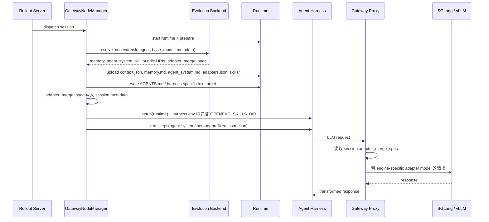
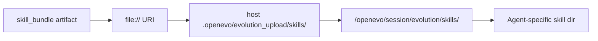
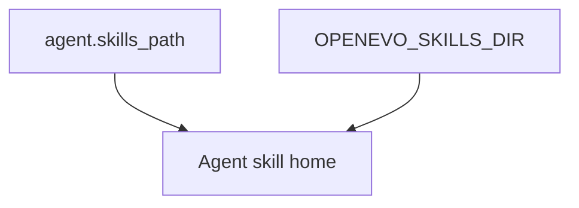
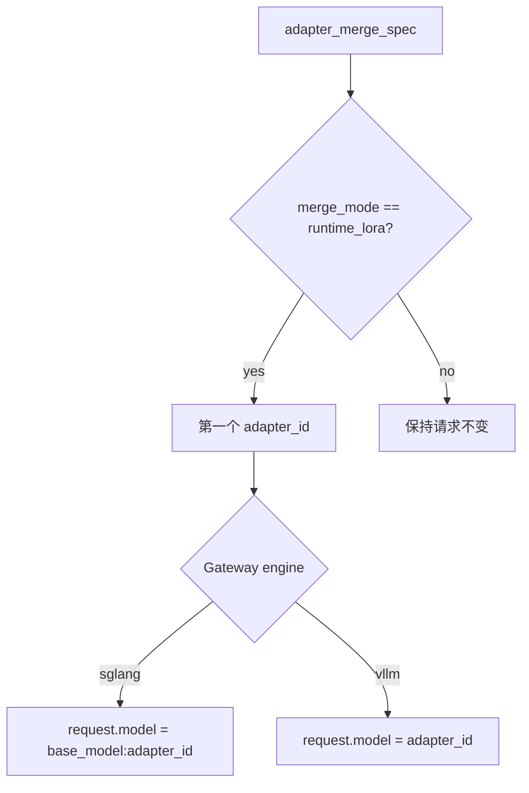

# Evolution Runtime Context（演化运行时上下文）

本文说明 Evolution Backend 选出的 artifacts 如何在一个正在运行的 OpenEvo
Core runtime session 中真正可用。文中的 `/openevo/session` 路径和 `OPENEVO_*`
环境变量是当前实现层 contract。

Runtime context 的注入发生在 gateway session 被 dispatch 之后、agent harness
`setup()` 之前。这个时机允许 OpenEvo 在 agent 启动前 staging skills 和 memory，
同时 backend 仍然可以基于真实 task、agent、policy、rollout step 和 served model
选择上下文。

当前处于 handler runtime cutover 过渡期。Core 已实现只读取 managed artifact root 的
no-follow payload scanner、opaque handle、全文件 digest/UTF-8 重验、内部 projection v1
resolver 和 generic materializer。Scanner 从绝对 filesystem anchor 逐组件 no-follow 固定
allowed root，持有稳定 root FD，并在每次相对 traversal 前后复核 held FD/path binding。内部
resolver 通过完整 verified executable registry 调用 handler，持久化
validated ordered contributions、registry digest、runtime roots 和实际 consumed selection；
不持久化 URI、host source path 或 handle。Adapter projection 额外保留批准时的 payload
inventory digest/size；manifest 语义绑定注册事务中的 deterministic immutable DB record，payload 走 managed
no-follow reader，candidate 与累计扫描资源有硬上限；所有 scan attempt 在枚举/读取时即时消费
不可退回的累计 node/file/byte budget，verified reread 的 hashing 也消费同一预算；internal
ranking 前对 artifact metadata 施加结构/byte 上限，超限只隔离于新 projection，不改变 legacy
registration/worker completion。显式 artifact IDs 下推 SQL，implicit
selection 优先保留 local manifest-bound candidates；rejected rows 只以 bounded
compatibility routing data 与 identity/reason markers 进入 Python，且必须先通过
compatibility filter 才能持久化 typed skip；source URI、name、manifest、scores 不进入该
路径。Internal materializer 绑定同一 registry 和 canonical request digest，重新签发并校验
staged/adapter inventory，把目录展开成 private random-ID、digest-verified blobs，按 descriptor
生成 instruction framing，并通用解析 env 和 adapter spec；其 manifest 不包含 source URI、host
path 或 scanner handle。Instruction view 延续 legacy trim 语义而不改变 staged bytes。Bundle 使用
temp tree、fsync 和 rename 发布；发布/DB commit/startup recovery 共用跨进程 root lock，并在 DB
store ID、resolved root、artifact-root marker 和 materialization-root marker 全部匹配后才保守
reconcile 无引用 bundle。Identity DDL 与 pending row 在一个 SQLite transaction 创建；首次/legacy binding 随后使用
pending -> 两个 marker fsync -> bound，bound 状态缺少任一 marker 都不自动重建。rename 后最终
路径校验失败时不按名称删除可能已替换的目录，而留给该 recovery。
Publication receipt 绑定 canonical manifest bytes、bundle/blob directory identity 和逐 blob
identity；Store 在 SQLite commit 前使用同一个 locked root FD 全量复核 receipt。
最终 temp bundle 使用 FD-relative atomic no-replace rename 发布；同名竞态 entry 保持不变，缺少
该平台原语时 fail closed。只有能证明 DB 未提交时才 discard publication；已提交或状态不明时保留。
临时目录初始化失败同样只能按已打开 inode quarantine。Store 在 precommit callback 后及 locked
root 正常退出时再次验证 materialization-root binding。

Blob transport/consumer 只能从 `EvolutionStore` 拥有的入口进入。该入口持有并复核同一个 locked
materialization-root fd、store identity 双 marker 与 root owner/mode/inode binding，从 SQLite
`context_materializations.manifest_json` 读取权威 `MaterializedContext`，然后把 expected manifest
和同一个 root fd 交给低层 materializer。磁盘 `manifest.json` 必须逐字节匹配 DB canonical
manifest，不能靠同时替换 blob 和磁盘 manifest 自证。Reader 相对 root fd no-follow 打开 blob，
重验 exact size、digest 和 path identity，只暴露受控 read-only stream，不暴露 raw fd 或 host path。
现有
`/v1/contexts/resolve` 和 Gateway staging 仍在消费 legacy response/URI，内部
projection/materializer 尚未成为公开 runtime path。完成 strict v2/blob transport 与 Gateway
原子切换前，scanner 不代表 skill URI copy 已具备端到端
TOCTOU 保护；release 路径不得把任意外部 `file://` root 加入 scanner allowlist。当前
scanner 依赖 Linux Core 的 `O_PATH` 和 `/proc/self/fd` fixed-object reopen；macOS Desktop
不在本地执行该 payload scan。
Materialization root 必须由当前 Core 用户拥有且 mode 为 `0700`；publish、DB precommit、discard
和 recovery 复用同一个 locked fd，并在 commit 前重新核对 root inode 与两个 marker。Orphan
候选绑定枚举时 inode，移动到随机 quarantine 后只清空可安全固定的内容并保留 maintenance-owned
quarantine/tombstone entry；这不是立即删除。Identity mismatch 会保留并使 recovery 失败。Startup
除 fresh/recognized pending bootstrap 外只识别 exact allowlisted historical/current schema，并独立
精确校验 `store_identity` schema/row 与双 marker；只有 complete fingerprint 可认领已有 managed
recovery state。伪造或 near-match identity 在任何 cleanup 前失败且不清理。Fresh DB 不得认领已有 Core-managed recovery
state；legacy DB 必须在任何 identity DDL/row 或 marker 写入前通过上述识别才可迁移，不能只按
表名识别。
Fresh DB 同时检查 context snapshots、materializations 和 managed artifact manifests。Base schema
DDL 在一个显式 SQLite transaction 内安装，exact historical allowlist 支持直接升级真实 first-parent
旧布局，不要求先运行中间版本。Base DDL、additive migrations 与 recovery DB changes 同事务提交。
Context snapshot 只在 startup 按 DB canonical bytes reconciliation；普通 read/inventory 始终要求
link-count-one `0600` regular file。较宽但安全的历史 mode 仅由显式 startup migration 接受并收紧
到 `0600`，不会放宽普通读取。
Adapter 完整 rehash 后还要重新绑定 payload-root pathname，拒绝 root 整体替换。

Core Store 现有一个内部 revision/admission ledger primitive。Generation-zero manifest 以 canonical
digest 绑定 project/workspace content refs、materialized context/registry/artifact set、registered closed
model/runtime/serving execution snapshot 和 ordered adapters。Store 只接受 verified producer sealed 的
`VerifiedExecutionSnapshot`，再从 typed canonical bytes 计算 ID/digest 并记录 producer ID；model identity
只保存 Hugging Face 名称、subscription identity 或 managed
snapshot opaque ID，拒绝 host path/URI。Subscription 只能使用 transcript capture 且不能带 adapter。
当前 generation 的 admission 在同一 `BEGIN IMMEDIATE` 中 exact 匹配 project/stream、snapshot、
execution/capture mode、context 和 artifact set 后固定 revision，下一 generation 则持久化为
`required_revision_uncommitted` 且 `pinned_revision_id=NULL`。Task identity、idempotency key、pin 和
terminal state 都采用 immutable/idempotent 语义。Admission envelope 只允许 non-secret identity fields、
content-addressed refs 和 opaque IDs；schema 不接收 instruction、credential、env、setup command 或开放
task/runtime/model dict；非闭集字段直接拒绝，也不接受调用方直接提供 digest。Activation 后重启可
保留 `active_generation == required_generation` 的未 pin queued row，retry exact 验证后原子 pin。
该 queued row 是 Store 内部、尚未接入产品编排的 primitive，不是 Desktop/Daemon 对外的
queued Task。目标 run owner 在 successor 未激活时必须返回 typed not-ready，且不创建
Task、admission 或 run；只有已经固定 active Project Head 的 Task 才能进入资源或服务调度。
未 pin `cancelled` 是 closed historical audit row：继续验证 request sources 和 no-pin 语义，但 head 任意推进
后不再要求其 generation 与当前 active generation 相邻；pinned `cancelled` 仍验证原 pin closure，而不要求
原 pin 当前 active。权威 `get_active_revision`/`get_task_admission` read 都在显式一致 transaction 中完成对应
stream/admission closure 校验后返回。

Startup 对 store identity、context snapshot/materialization 和 B3 ledger 使用两阶段读取：先只读取 bounded
PK 与 SQL octet length 并消耗不可退回的 row/aggregate budget，再以 exact-length guarded `CASE` 逐行
读取 text、重验 UTF-8 bytes 后解析。B3 ledger 内存只保留 chain/head/pin 所需 compact identity；context
snapshot reconciliation 的 canonical bytes 受独立 aggregate budget。该保证不扩展到尚未迁移的 legacy
job/artifact recovery。写入侧使用同一 B3 row/byte capacity；task admission 非幂等 UPDATE 在写前计算
old/new exact UTF-8 byte delta，并在 UPDATE 后 readback 重验，exact retry 优先于 capacity check。

Store 的内部 `activate_successor_revision` 已提供严格相邻 N+1 的最终 ledger commit：它在一个写事务中
重验 predecessor、materialized context、registered execution snapshot 和容量，再写 revision 与推进 head；
下一代 queued request 必须全部匹配候选 revision，当前代仍未 pin 的 queued row 会阻止再次推进 head，
且 activation 不改写 request。并发/重试幂等，竞争 fork 和 generation gap fail closed，旧 task pin 保持
不变。该 primitive 尚未接入
Gateway、Core run owner、Desktop 或 benchmark automation，也不自行证明 transition readiness。
Transition sealing、所有 enabled target 的 readiness、adapter load/restart、health check 和调用该 commit
的 run-owner 编排仍是 B3.2-B3.4 工作。因此 materializer、strict v2 transport、Gateway
generic cutover 或当前 genesis ledger 中任何一项都不能单独被描述为完整 revision contract。Execution
snapshot persistence 不是 B2 verified deployment/readiness attestation。当前无 production snapshot issuer，
repo-private testkit seal 仅用于测试；#160/B1 verified deployment producer 接入前 release admission 必须 fail
closed。未来 run owner 仍需从 immutable project/workspace snapshots 构造 admission envelope。

## 当前公开 Legacy Gateway 流程



## Runtime 文件和环境变量

`write_evolution_context_files()` 会把选出的 context staging 到 session runtime
的目标目录下。默认目标目录是 `/openevo/session/evolution`。

| Runtime path | Env var | 作用 |
|---|---|---|
| `/openevo/session/evolution/context.json` | `OPENEVO_EVOLUTION_CONTEXT` | 完整 resolved context，包括 warnings |
| `/openevo/session/evolution/memory.md` | `OPENEVO_MEMORY_FILE` | 渲染后的自然语言 memory |
| `/openevo/session/evolution/agent_system.md` | `OPENEVO_AGENT_SYSTEM_FILE` | 渲染后的 agent system 文本 |
| `<runtime workdir>/AGENTS.md` 或 manifest 指定相对路径 | `OPENEVO_AGENT_SYSTEM_TARGET` | 第一个成功写出的 harness-specific instruction 文件 |
| `<runtime workdir>/...` target 列表 | `OPENEVO_AGENT_SYSTEM_TARGETS` | JSON string，包含所有成功写出的 agent system targets |
| `<runtime workdir>/AGENTS.md` | `OPENEVO_AGENTS_MD` | 仅当实际 target basename 是 `AGENTS.md` 时设置 |
| `/openevo/session/evolution/skills/` | `OPENEVO_SKILLS_DIR` | staged skill bundle directories |
| `/openevo/session/evolution/adapters.json` | `OPENEVO_ADAPTER_MERGE_SPEC` | custom runtimes/tools 可读取的 adapter merge spec |

`agent_system` 和自然语言 memory 也会被 prepend 到 agent instruction：

```text
Use the following evolved agent system instructions for this task:
<rendered agent system>

Use the following long-term memory for this task:
<rendered memory>

Task:
<original task instruction>
```

文件/env 路径仍然保留，方便自定义 harness 直接读取 memory 或 agent system 文本。

## Agent System Text Updates

`agent_system` artifact 表示对 agent system prompt 或 harness-specific 指令文件的演化。
它的 URI 必须指向 `file://` 文本文件，manifest 可以包含：

```json
{
  "target_path": "AGENTS.md"
}
```

`target_path` 是 `runtime.spec.workdir` 下的相对路径；如果 runtime 没有配置 workdir，
则相对 `/openevo/session`。当前允许的目标是明确的 harness instruction 文件：

- `AGENTS.md` 或 `agents.md`：Codex/通用 repository instruction。
- `.openhands/microagents/*.md`：OpenHands repository microagent。
- `CLAUDE.md`、`GEMINI.md`：对应 harness 的 repository-level 指令文件。

Backend 注册和 Gateway staging 都会拒绝空路径、绝对路径、包含 `..` 的路径，以及
allowlist 外的相对路径，避免 evolution artifact 覆盖任意 workdir 文件。一个 context
可以包含多个 `agent_system.targets`；gateway 会分别写出对应目标，并把拼接后的文本写到
`OPENEVO_AGENT_SYSTEM_FILE`。即使所有 harness target 都因为安全校验失败被跳过，
canonical `agent_system.md` 仍会被写出并且 instruction prepend 仍然生效。

## Skill Bundle Staging



legacy Gateway 支持的 skill artifacts 是 `file://` URIs，指向以下两种之一：

- 包含 `SKILL.md` 的目录；
- 单个 skill 文件。

新的 verified `skill_bundle` handler 要求 scanned inventory 的根目录包含 `SKILL.md`
（直接指向名为 `SKILL.md` 的单文件也满足该 inventory contract）。generic
materializer 切换后，不再支持把任意文件名当作完整 skill bundle。

坏掉的 skill artifact 会被逐个跳过，并记录到 `context.json["warnings"]`。陈旧或
非 file URI 的 skill 不会再导致 memory 或 adapter context 被整体丢弃。

## Harness 消费方式

`BaseHarness.effective_skill_paths()` 会返回静态 `agent.skills_path`，以及在存在
evolution context 时返回 `OPENEVO_SKILLS_DIR`。

Copy-based harness 会先复制静态 skills，再复制 evolution skills。因此如果目录名
重复，evolution bundle 会覆盖静态 skill：



OpenHands 按 path 加载 skills，并保留第一个重复 name。因此 OpenEvo 会把
`SKILL_PATHS` 设置为 evolution 在前：

```text
SKILL_PATHS=/openevo/session/evolution/skills:/openevo/static-skills
```

## Parametric Memory Runtime 路径

Parametric memory 表示为 `parametric_memory` artifact。它的 manifest 应包含：

```json
{
  "adapter_id": "parser-memory",
  "base_model": "Qwen/Qwen3.6-27B",
  "adapter_format": "lora"
}
```

Context resolver 会把选中的 parametric artifacts 转成：

```json
{
  "base_model": "Qwen/Qwen3.6-27B",
  "merge_mode": "runtime_lora",
  "adapters": [
    {
      "artifact_id": "art_...",
      "adapter_id": "parser-memory",
      "uri": "file:///path/to/adapter",
      "weight": 1.0,
      "format": "lora"
    }
  ]
}
```

Parametric memory participates in the same explicit context allowlist as
textual memory, skills, and agent-system artifacts. If an OpenEvo rollout passes
`context_artifact_ids`, only listed adapter artifacts are converted into
`adapter_merge_spec`. It is only selected for proxy/local inference requests: if
the context request carries subscription auth in `agent.settings.auth_mode`,
`agent.auth`, `metadata.auth_mode`, or `metadata.evolution.auth_mode`, the
resolver skips `parametric_memory` artifacts and returns an empty adapter spec.

Gateway 会把这个 spec 写入 `SessionRegistry.metadata`，这样 proxy 在收到模型请求
时可以使用它。

这条路径只在 proxy/local inference 模式下生效。Gateway/proxy 需要能改写请求模型名或
adapter 选择字段，并且 serving backend 必须已经加载对应 adapter，或支持外部 dynamic
adapter loading。Subscription harness 直连外部订阅模型服务，不能消费
`adapter_merge_spec`；这类运行仍可消费 textual memory、skills 和 agent-system artifacts。

## Engine-Specific Adapter Injection



这里做的是 request-level LoRA selection，不是物理合并权重。serving backend 必须
已经加载对应 adapter，或在这条代码路径之外支持 dynamic adapter loading。

## 失败语义

- 未携带 exact `metadata.evolution.context_artifact_ids` 的通用解析：
  - Evolution backend 不可用时遵循 `evolution.context.fail_open`；坏的 legacy candidate
    仍按通用 resolver 的过滤/跳过语义处理。
- 携带 exact revision membership 的产品解析：
  - 顺序是权威 contract；resolver 不按 score/time/ID 重排，也不要求成员
    `promoted=true`。重复、缺失、不兼容、非法 payload、错误 agent-system target、
    runtime 写入或最终 readback 漂移都 fail closed，不能由 `fail_open` 降级成 warning。
  - Gateway 在 agent/postprocess 后回读 canonical 文件、完整 skill tree 和全部
    agent-system target；target 枚举在 runtime 内以有界、逐组件 no-follow 方式完成，只返回
    相对路径、大小和 SHA-256。Core 再用持久化 context 和原始 instruction 独立复算 receipt v3。
- 没有选中 adapter：
  - `merge_mode` 为 `reference_only`；proxy 保持 served base model 不变。
