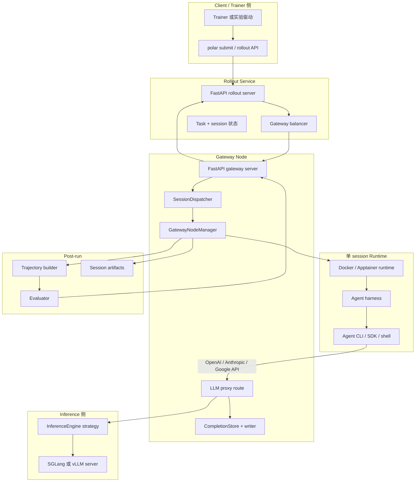
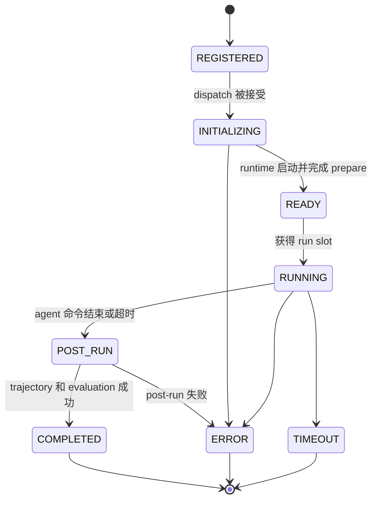
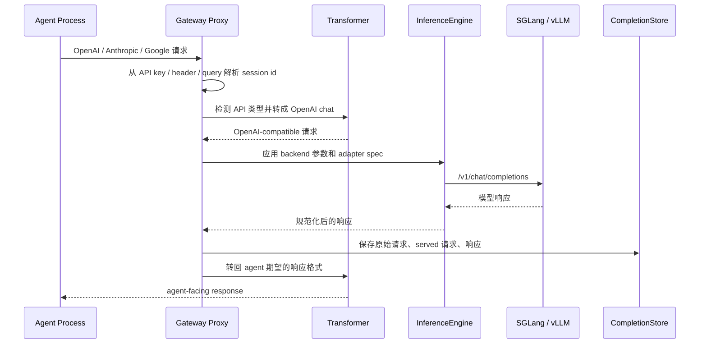

# Polar 系统总览

Polar 是面向真实 agent harness 的 rollout-as-a-service 框架。它通过在
准备好的 runtime 中启动 agent，并在 agent 与 inference server 之间放置
gateway proxy，使 agent 尽量不需要为 Polar 改代码。proxy 会捕获模型调用，
并把这些调用转成 RL training 可消费的 trajectory。

## 组件图

## Session 生命周期

分阶段生命周期由 `SessionDispatcher` 和 `GatewayNodeManager` 实现。这个拆分
对运行时很重要：同一个 node 可以分别限制 runtime 初始化、活跃 agent 执行和
post-run 工作的并发。

## 请求路径

Streaming 请求会被处理成 synthetic stream：gateway 对 backend 发起一次
non-streaming 请求，再把完整响应格式化成 SSE events 返回给 agent。这样可以让
capture 和 trajectory 构造保持确定性。

## 主要模块

| 区域 | 文件 | 职责 |
|---|---|---|
| Gateway server | `src/polar/gateway/server.py` | FastAPI app、proxy route、session/admin endpoints |
| Gateway execution | `src/polar/gateway/node.py` | runtime 生命周期、harness setup/run、post-run、evolution hooks |
| Dispatch | `src/polar/gateway/dispatcher.py` | 分阶段 worker pools 和 session transitions |
| Sessions | `src/polar/gateway/session.py` | 内存 session registry 和 session id 解析 |
| Proxy client | `src/polar/gateway/proxy.py` | 到 inference backend 的 HTTP client，支持 pause/resume generation |
| Engine strategy | `src/polar/gateway/engine.py` | SGLang/vLLM 请求与响应差异 |
| Agent contract | `src/polar/agent/base.py`, `src/polar/agent/models.py` | harness API 和 task schema |
| Presets | `src/polar/agent/presets/` | Codex、Claude Code、OpenHands 等 launcher |
| Trajectory | `src/polar/trajectory/` | completion records 到 trajectory/evaluation 数据 |

## 扩展点

- 新 agent：实现 `BaseHarness` 子类，或使用 `agent.harness: shell`。
- 新 inference backend：新增 `InferenceEngine` 实现，并在 `get_engine` 中注册。
- 新 API 请求/响应形态：在 `src/polar/gateway/transform/` 中添加 transformer。
- 新 trajectory builder/evaluator：通过现有 registry 注册。
- 新 skill/memory/agent-system evolution 方法：通过 Evolution Backend method
  registry 添加，详见 [Reference Evolution Worker](reference-evolution-worker.md)。
