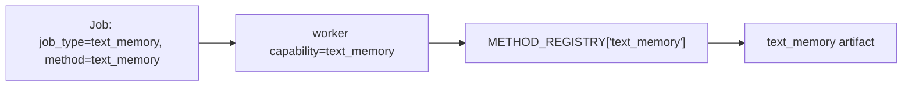
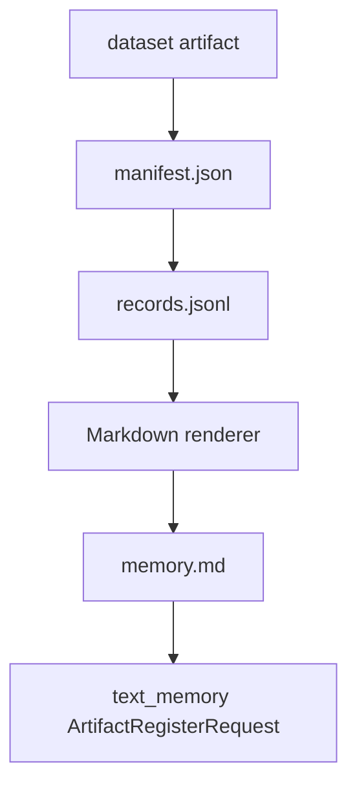
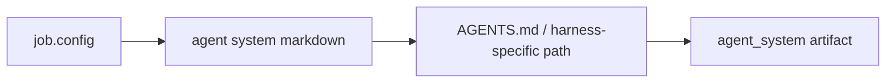
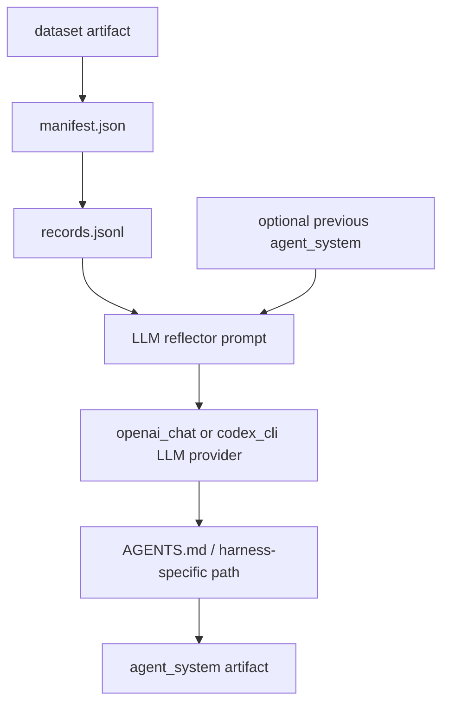
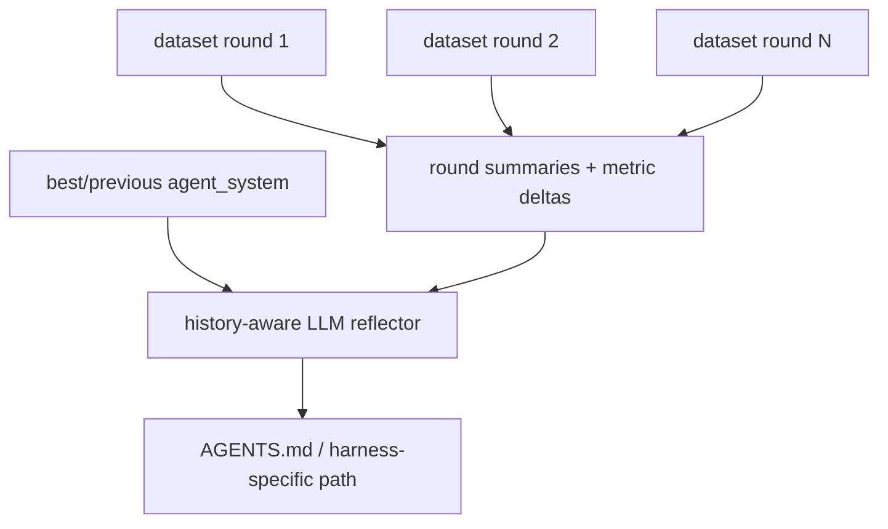
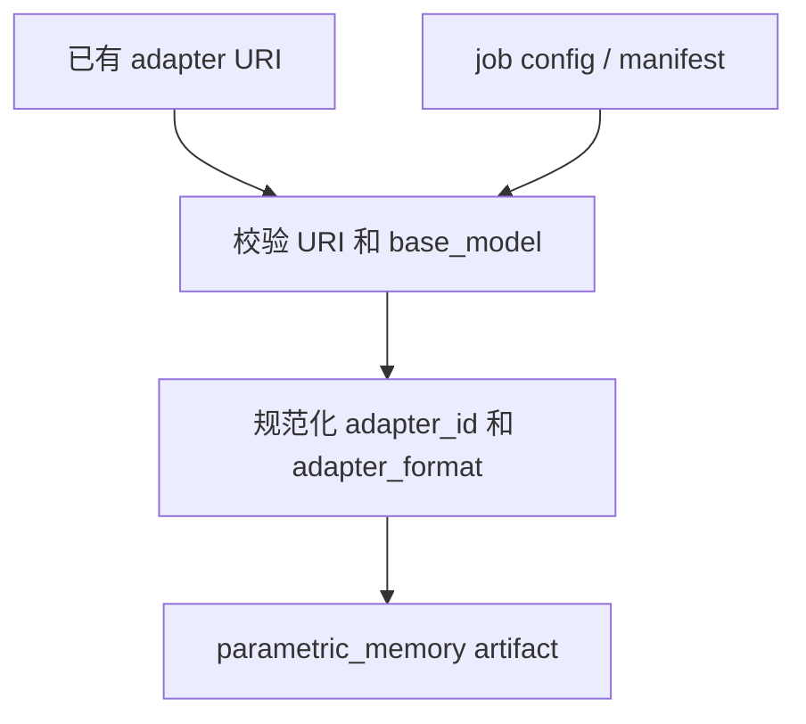

# Reference Evolution Worker（参考演化 Worker）

Reference worker 是用于本地开发和 smoke testing 的轻量 worker。它不是 SOTA
method 实现；它的作用是定义稳定的接口和 baseline 行为，让新的 skill/memory
evolution methods 可以接入 backend。

## Worker Method Boundary

Worker method boundary for External Beta is deliberately narrow: a worker claims
a typed job, reads declared input artifacts and `job.config`, runs exactly one
registered method, writes method-owned payload files under the artifact root, and
returns `ArtifactRegisterRequest` objects. The worker must not alter Core store
schemas, context resolver ranking, runtime injection policy, or release-gate
benchmark scoring.

## Inputs

Inputs come from `WorkerClaimedJob.input_artifacts`, dataset manifests, prior
artifact manifests, and method-specific `job.config`. Release-supported methods
must treat hidden benchmark answers, verifier-private logs, post-hoc rewards,
and task-specific oracle hints as forbidden inputs.

## Outputs

Outputs are typed artifacts such as `text_memory`, `skill_bundle`,
`agent_system`, and `parametric_memory`. Each output needs a URI, manifest,
lineage, compatibility, scores, tags, and promotion state that downstream Core
APIs can validate without knowing the algorithm internals.

## Artifact Registration

Artifact registration is store-authored. A method returns registration requests;
Core records artifact IDs, job lineage, source dataset IDs, compatibility, and
payload checksums. Release evidence must not rely on direct handwritten artifact
rows or bypass worker completion for counted artifacts.

## Algorithm Preservation

Algorithm preservation means productization may relocate files, imports, command
surfaces, and documentation, but must not change the validated method logic,
prompts, filtering, candidate policy, selection policy, or payload construction
for textual memory, trajectory-to-skill, or agent-system release gates.

启动一次 one-shot worker：

<!-- openevo:maintainer-only-command -->
```sh {.openevo-maintainer-only}
uv run python -m openevo.evolution.cli worker \
  --base-url http://127.0.0.1:8200 \
  --worker-id reference-worker \
  --artifact-root .openevo/evolution \
  --framework-lock /path/to/framework-lock.json \
  --once
```

## Worker Loop

```mermaid
flowchart TB
    Start[run_once]
    Claim[POST /v1/jobs/claim]
    HasJob{返回 job?}
    Validate[校验 WorkerClaimedJob]
    Heartbeat0[heartbeat progress=0.0]
    Identity[校验 plan / registry / envelope / inputs]
    Dispatch[按 descriptor ABI 调 verified handle]
    Renew[每 lease/3 heartbeat]
    Heartbeat1[heartbeat progress=1.0]
    Complete[POST /v1/jobs/{id}/complete]
    Fail[POST /v1/jobs/{id}/fail]
    Done[return]

    Start --> Claim --> HasJob
    HasJob -- no --> Done
    HasJob -- yes --> Validate --> Heartbeat0 --> Identity --> Dispatch --> Heartbeat1 --> Complete --> Done
    Dispatch -. method running .-> Renew -. renew lease .-> Dispatch
    Validate -. 带 job identity 的异常 .-> Fail --> Done
    Identity -. deterministic failure .-> Fail
    Dispatch -. exception .-> Fail --> Done
```

Plan-bound claim 同时按 `job_type`、method ID 和 verified method identity digest 过滤；没有
identity mapping 的 worker 只能获得 legacy jobs。Worker
重新计算 plan closure，检查 method/target identity、canonical flat config 和每个 input
artifact snapshot，然后按 descriptor 的 `legacy_worker_job_v1` 或 `method_context_v1` ABI
调用 verified handle。Identity/contract failure 不可重试，也不会 fallback。未迁移 legacy
job 的 unknown method 仍以 retryable fail 结束，让专用 research worker 有机会 claim。
Store 在发 lease 前发现损坏的 plan/envelope/input contract 时会直接把该 pending job 隔离为
failed 并返回空 claim；worker 下一次轮询可继续处理健康 job。

## Built-In Catalog And Legacy Registry

`src/openevo/evolution/methods.py` 暴露：

```python
METHOD_REGISTRY = {
    "text_memory": text_memory,
    "text_memory_reflector": text_memory_reflector,
    "text_memory_expel_reflector": text_memory_expel_reflector,
    "skill_bundle": skill_bundle,
    "skill_bundle_reflector": skill_bundle_reflector,
    "agent_system": agent_system,
    "agent_system_reflector": agent_system_reflector,
    "agent_system_history_reflector": agent_system_history_reflector,
    "agent_system_pareto_reflector": agent_system_pareto_reflector,
    "agent_system_gepa_reflector": agent_system_gepa_reflector,
    "parametric_memory_register": parametric_memory_register,
}
```

`METHOD_REGISTRY` 是尚未迁移 benchmark jobs 的临时 callable table，不是 plan-bound
产品路径的 dispatch source。Release worker 从外部 `framework-lock.json` 加载
`VerifiedExecutableRegistry`；每个 built-in descriptor 的 entry point 在启动时验证为同一个
现有 callable，以保护算法不因产品化迁移而改变。

`parametric_memory_sd_lora` 不在该 legacy table 中。它只通过 verified
`method_context_v1` handle 执行，不能 fallback 到 legacy dispatch。

Workers 使用 `job_type` 做 queue filtering，并使用 registry method IDs 做 method filtering。
CLI 的默认 queue capabilities 是已有 method names；experiment runner 使用 run-specific
queue capability，避免常驻 reference worker 抢占它同步等待的 job。



上图只描述 legacy benchmark job。Plan-bound job 的 Method 节点是
`VerifiedExecutableRegistry.method_handles[method_id]`。

## Method: `text_memory`

用途：从 dataset 创建 Markdown 长期 memory artifact。

输入：

- 一个类型为 `dataset` 的 input artifact；
- dataset URI 指向 `file://` manifest；
- manifest 指向 `records.jsonl`。

输出：

- `ArtifactRegisterRequest(type=text_memory)`；
- `uri=file://.../memory.md`；
- manifest 包含 source dataset ID 和 record count。



内置 renderer 会提取稳定字段，例如 task id、session id、status、reward 和短的
payload summary。Research workers 可以替换为 clustering、reflection、
distillation 或其他 memory mining 方法，只要返回相同 artifact type 即可。

## Method: `text_memory_reflector` / `text_memory_expel_reflector`

用途：从 dataset 中的历史轨迹调用 LLM 生成可复用 Markdown memory。两者都产出
`text_memory` artifact；`text_memory_expel_reflector` 在普通 reflection prompt 之上使用
ExpeL/Reflexion-style synthesis，并要求输出包含这些二级标题：

- `## Do`
- `## Avoid`
- `## Validate`
- `## When Applicable`
- `## Retired Or Superseded`

若受支持的 reflector 返回了非空 Markdown、但漏掉其中部分标题，worker 会保留模型正文，
按固定的中性条目补齐缺失章节，再重新执行五章节校验。Manifest 的
`structure_completion` 会明确记录是否补齐以及补齐了哪些章节；空输出仍然失败，补齐不会
伪造 trajectory evidence。

输入：

- 一个或多个类型为 `dataset` 的 input artifact；
- 可选旧 `text_memory` input artifact，作为可保留或淘汰的 prior memory；
- 必填 `job.config.reflector_llm.model`；
- 可选 `job.config.reflector_llm.provider`，默认 `openai_chat`，也支持 `codex_cli`；
- 可选 `job.config.max_records`、`compatibility`、`scores`、`tags` 和 `promoted`。

输出：

- `ArtifactRegisterRequest(type=text_memory)`；
- `uri=file://.../memory.md`；
- manifest 包含 `method`、source dataset IDs、record/reflected record counts、
  success/failure counts、prior memory count、`structure_completion` 和
  `promotion_support`。所有 input
  artifact IDs 仍记录在 lineage 中，便于追踪 prior memory artifact。

`text_memory` 会作为文本 prepend 到 agent instruction，因此 subscription transcript runs
和 proxy/local inference runs 都能消费。方法仍必须避免把 held-out answers、oracle
records、reference patches 或 verifier-private literals 写入 memory。

Terminal Bench text-memory jobs 默认纳入 `COMPLETED` 和 `ERROR` transcript
events。失败轨迹是 textual memory 的有效输入，因为它们通常提供可复用的
`Avoid` 和 `Validate` 规则；这不改变 `text_memory` 的 runtime 形态，它仍只是注入到
agent instruction 的 Markdown。

## Method: `skill_bundle`

用途：创建 agent harness 可加载的 skill bundle 目录。

输入：

- 可选 `job.config.name`；
- 可选 `job.config.skill_markdown` 或 `job.config.content`。

输出：

- `ArtifactRegisterRequest(type=skill_bundle)`；
- `uri=file://.../<skill-dir>`；
- 目录中包含 `SKILL.md`。


这个方法刻意保持简单。未来的 SOTA skill evolution method 可以挖掘 trajectories、
合成更丰富的 `SKILL.md`、添加辅助文件，或在 promotion 前评估 skill quality。

## Method: `agent_system`

用途：创建可写入 `AGENTS.md` 或其他 harness-specific instruction 文件的演化文本。

输入：

- 可选 `job.config.name`；
- 可选 `job.config.agent_system_markdown` 或 `job.config.content`；
- 可选 `job.config.target_path`，默认 `AGENTS.md`。
- 可选 `job.config.compatibility`、`job.config.scores`、`job.config.lineage`。

输出：

- `ArtifactRegisterRequest(type=agent_system)`；
- `uri=file://.../<target_path>`；
- manifest 包含 `content_path` 和 `target_path`。



`target_path` 必须是被支持的 harness instruction 相对路径，不能为空、不能是绝对路径，
也不能包含 `..`。当前内置 allowlist 包括 `AGENTS.md`、`agents.md`、`CLAUDE.md`、
`GEMINI.md` 和 `.openhands/microagents/*.md`。`compatibility` 应用于限制 artifact
被哪些 task tags、agent harness 或 base model 选中；例如 Codex 专用的 `AGENTS.md`
通常应设置 `{"agent_harness": ["codex"]}`。

## Method: `agent_system_reflector`

用途：从 dataset 中的历史轨迹调用 LLM 生成新的 agent-system instruction 文件。这个方法
默认使用 OpenAI-compatible Chat Completions API，也可以通过 `codex_cli` provider 使用
Codex subscription 登录态；SOTA reflector 仍可以在专用 research worker 中替换它，只要返回
同样的 `agent_system` artifact contract。

输入：

- 一个类型为 `dataset` 的 input artifact；
- dataset URI 指向 `file://` manifest；
- manifest 指向 `records.jsonl`，records 中可以包含 token-level traces 或 transcript
  traces；
- records 可以包含通用 evolution feedback，例如
  `payload.session_result.metadata.evolution_feedback.golden_standard`。这类 feedback
  应由 orchestration 层的共享 evaluator 预先生成，method 只消费脱敏摘要；
- 可选旧 `agent_system` input artifact，或 `job.config.base_agent_system_markdown`、
  `job.config.agent_system_markdown`、`job.config.content` 作为 base text；
- 必填 `job.config.reflector_llm.model`，指定 reflector 使用的模型；
- 可选 `job.config.reflector_llm.provider`，默认 `openai_chat`，也支持 `codex_cli`；
- 可选 `job.config.reflector_llm.base_url`，默认读取 `OPENAI_BASE_URL`，否则使用
  `https://api.openai.com/v1`；
- 可选 `job.config.reflector_llm.api_key`，或通过 `api_key_env` 指定环境变量，默认
  `OPENAI_API_KEY`；
- `provider=codex_cli` 时可选 `codex_home` 和 `codex_bin`；worker 会清除
  OpenAI/Anthropic/Google proxy API 环境变量，避免把 subscription run 误接到 proxy；
  nested Codex run 会忽略用户 config、使用 `--ephemeral`、`--sandbox read-only`、
  并禁用 `shell_tool`，因为 dataset transcripts 属于不可信 prompt 内容；
- 可选 `temperature`、`max_tokens` 和 `timeout_seconds`；
- 可选 `job.config.target_path`，默认 `AGENTS.md`；
- 可选 `job.config.max_records`，限制 reflector 汇总的 records 数；
- 可选 `job.config.agent_system_audit`，控制生成后文本审计。默认最多启用两次自动
  repair retry；可以传入 `forbidden_literals` / `leakage_basis`，用于禁止 exact
  article title、source filename、sheet、row、sequence 等 protected literals 进入
  `AGENTS.md`。

输出：

- `ArtifactRegisterRequest(type=agent_system)`；
- `uri=file://.../<target_path>`；
- manifest 包含 source dataset ID、record count、reflected record count、success count
  和 failure count，以及 `reflector_provider` / `reflector_model` 和
  `agent_system_audit`；
- lineage 包含 `method=agent_system_reflector` 和所有 input artifact IDs。



方法会先把成功样本、失败样本和通用 evolution feedback 压缩成 prompt，上下文包含
task、session、status、reward、prompt、observed/failure signal，以及由上游 evaluator
写入的脱敏反馈，然后要求 LLM 返回完整 Markdown instruction 文件。
它不负责评估新 instruction 的任务效果，也不会默认 promotion；但会对生成的
agent-system 文本做轻量 audit。Audit 会阻止 protected literal 泄漏，并要求 rule
不是空泛 slogan：至少要有可执行的 trigger、action 和 validation check。对于 coverage
类规则，audit 要求规则说明 recursive file-level source discovery、通用结构化 evidence 格式和最终
per-source/per-package validation。若首次生成失败，worker 会把 redacted candidate 和
audit findings 发回同一 reflector model，最多重写两次；仍失败则 job 报错。需要上线到
context resolver 时，应通过 job config 设置 `promoted=true`，并配合 `compatibility`
限制适用 harness、task tags 或 base model。

## Method: `agent_system_history_reflector`

用途：从多轮 evolution dataset 中调用 LLM 生成新的 agent-system instruction 文件。它是
`agent_system_reflector` 的 history-aware 版本，适合在第 2 轮之后使用：reflector 同时看到
每轮 agent trajectory、共享 evaluator feedback、指标和相邻轮次 delta，从而保留已验证的
改进并分析 regression，而不是只根据最近一轮改写 `AGENTS.md`。

输入：

- 一个或多个类型为 `dataset` 的 input artifacts，每个 dataset 表示一轮 rollout / eval；
- dataset manifest 应尽量包含 `round` 或 `round_number`，缺失时按 input artifact 顺序编号；
- dataset manifest 可包含 `agent_system_artifact_id`，用于记录该轮使用的 agent-system；
- dataset manifest 可包含 `metrics` 或 `summary`，字段包括 `precision`、`recall`、`f1`、
  `true_positive` / `tp`、`false_positive` / `fp`、`false_negative` / `fn`、
  `duplicate_predictions` / `duplicates`；
- 如果 manifest 缺少 `round` 或 metrics，method 会从 record metadata 中的 `round` /
  `rollout_step` / `policy_version` 回退推断轮次，并从脱敏 golden feedback 的
  `Aggregate fit: precision=..., recall=..., f1=...` 回退提取聚合指标；
- records 与 `agent_system_reflector` 一样，可以包含 traces/transcripts 和脱敏的
  `evolution_feedback`；
- 可选旧 `agent_system` input artifact，或 `job.config.base_agent_system_markdown`、
  `job.config.agent_system_markdown`、`job.config.content` 作为 base text。推荐传入当前
  best agent-system，而不是只传 latest；
- LLM 配置与 `agent_system_reflector` 相同，必须指定 `job.config.reflector_llm.model`；
- 可选 `job.config.max_records_per_round`，默认每轮最多汇总 8 条 records；
- 可选 `job.config.target_path`，默认 `AGENTS.md`；
- 可选 `job.config.agent_system_audit`，语义与 `agent_system_reflector` 相同。

输出：

- `ArtifactRegisterRequest(type=agent_system)`；
- `uri=file://.../<target_path>`；
- manifest 包含 `source_dataset_artifact_ids`、`round_count`、总 `record_count`、
  `reflected_record_count`、`success_count`、`failure_count`、`latest_round` /
  `latest_f1`、`best_round` / `best_f1`，以及 `reflector_provider` /
  `reflector_model` 和 `agent_system_audit`；
- lineage 包含 `method=agent_system_history_reflector`、所有 input artifact IDs 和
  `source_dataset_artifact_ids`。

Prompt 数据流：



这个方法仍然不读取 raw ground truth，也不默认 promotion。Ground-truth evaluator 应在
orchestration 层产生脱敏 feedback 和 metrics；history reflector 只根据这些共享信号更新
方法论。典型用法是在 Round 3 后传入 Round 1、Round 2、Round 3 的 dataset artifacts，
并把 Round 2 或离线验证最好的 agent-system artifact 作为 base text。

### Shared golden-standard feedback

有 ground truth 的任务不要让 `agent_system_reflector` 直接读取 reference answers。应由
orchestrator 或独立 evaluator 先调用 `openevo.evolution.golden_standard`：

- 在 agent workspace 外比较最终输出和 golden records；
- 保存 raw metrics 供离线分析；
- 只把脱敏 methodology feedback 写入 dataset event；
- 对生成的 `AGENTS.md` / `agents.md` 运行泄漏检查，禁止 exact sequence、source
  filename、source sheet、row number、article title 或 reference record 进入 agent
  system。

这样同一份 golden-standard evaluation 可以被多个 evolution methods 复用，避免每个
method 重复读取大型 ground truth，也避免把评估答案泄漏给下一轮 rollout agent。

示例 config：

```json
{
  "reflector_llm": {
    "provider": "openai_chat",
    "model": "gpt-4.1-mini",
    "base_url": "https://api.openai.com/v1",
    "api_key_env": "OPENAI_API_KEY",
    "temperature": 0.2,
    "max_tokens": 2000,
    "timeout_seconds": 30
  },
  "target_path": "AGENTS.md",
  "promoted": false
}
```

Codex subscription provider 示例：

```json
{
  "reflector_llm": {
    "provider": "codex_cli",
    "model": "gpt-5.4",
    "codex_home": "/root/.codex",
    "timeout_seconds": 900
  },
  "target_path": "AGENTS.md",
  "promoted": false
}
```

## Method: `agent_system_pareto_reflector`

用途：从多轮 evolution dataset 中生成多个候选 agent-system instruction，并用
promotion gate 选择一个候选。它用于替代“reflector 直接覆盖 latest `AGENTS.md`”的流程：
reflector 负责提出候选，shared evaluator / orchestration layer 负责给候选分数，worker
只做安全审计、退化门控和 archive 注册。

输入：

- 一个或多个类型为 `dataset` 的 input artifacts，语义与
  `agent_system_history_reflector` 相同；
- 可选旧 `agent_system` input artifact，或 `job.config.base_agent_system_markdown` 作为
  base text；
- 必填 `job.config.reflector_llm.model`；
- 可选 `job.config.candidate_strategies`，默认生成 precision、recall、provenance 等多个
  策略候选；
- 可选 `job.config.candidate_evaluations`，由外部 paired evaluator 写入每个 candidate 的
  `precision`、`recall`、`f1` 和 `prediction_to_reference_ratio` 等指标；
- 可选 `job.config.promotion_gate`，例如 `max_prediction_to_reference_ratio`、
  `max_f1_regression`、`min_precision`、`min_recall`、`requires_external_evaluation`。

输出：

- 一个 `agent_system` artifact，内容是 gate 选中的候选；
- 一个 `report` artifact，`candidate_archive.json` 记录所有候选、审计结果、外部分数、
  gate failures 和 selected candidate；
- agent-system manifest 包含 `candidate_count`、`selected_candidate`、
  `promotion_gate`、`best_round` / `latest_round` 和 archive path。

这个方法不会读取 raw ground truth。若需要真正 paired evaluation，pipeline 应先对每个候选
跑 rollout/evaluator，再把脱敏指标写回 `candidate_evaluations`。没有外部分数时，method
只能用静态 guardrail score 排序；若不希望静态排序自动 promotion，可设置
`promotion_gate.requires_external_evaluation=true` 或保持 `promoted=false`。

## Method: `parametric_memory_register`

用途：把已有 LoRA/adapter 注册为 parametric memory。它不训练 adapters。
注册后的 artifact 只在 proxy/local inference runtime 中可用于 request-level adapter
selection；subscription harness 不能消费 parametric adapters。

输入：

- `job.config.adapter_uri` 或 `job.config.uri`；
- `job.config.base_model` 或 `job.config.manifest.base_model`；
- 可选 `job.config.adapter_id`；
- 可选 `job.config.adapter_format`，默认 `lora`。

输出：

- `ArtifactRegisterRequest(type=parametric_memory)`；
- `uri` 是 adapter URI；
- manifest 包含 `adapter_id`、`base_model` 和 `adapter_format`。



`adapter_id` 是 serving-time name，应该匹配 SGLang 或 vLLM 加载 adapter 时使用的
名字。artifact display `name` 可以和 adapter ID 相同，但 runtime selection 会优先
使用 manifest `adapter_id`。若 `job.config.compatibility.base_model` 未设置，method 会自动
写入 `[base_model]`；若显式设置但不包含当前 `base_model`，job 会失败，避免 adapter
被不兼容模型选中。

## Method: `parametric_memory_sd_lora`

用途：在 Daemon 内对当前 successful trajectories 训练一个 SD-LoRA component，并把它与
上一代 artifact 中冻结的 components 组合成一个 cumulative LoRA adapter。该方法只支持
self-deployed inference，且只在下一 task/session 生效。

输入：

- exactly one current `dataset` artifact；
- at most one prior `parametric_memory_sd_lora` artifact；
- exact `base_model` 和 immutable `model_revision`；
- closed method config 中的 rank、target modules、optimizer、steps/epochs、sequence length、
  current record cap、replay capacity、dtype、quantization 和 timeout。

执行边界：

- worker 从 verified dataset payload 读取成功 trace 的 prompt/response messages；
- Daemon 通过固定 Python module command 启动 trainer，不接受用户 command、shell、endpoint
  或 credential；
- 一个 artifact root 只能由一个 trainer service 持有；service 串行化 GPU training，并要求
  trainer 进程只看到一个 `CUDA_VISIBLE_DEVICES` device；
- trainer 使用独立 process group、Linux parent-death signal、closed environment 和
  core/file/open-file/CPU resource limits。active receipt 绑定 boot ID、PID、process group、
  session 和进程 start time，service 重启时只终止 identity 仍完全匹配的遗留进程；
- 旧的全局单位 Frobenius directions 冻结，上一代 magnitudes 从 state 恢复，新 A/B component
  和全部共享 magnitudes 在 current trajectories 与 bounded historical replay 上参与训练；
  magnitude 使用独立学习率；新 component 在 generation boundary 规范化并把 norm 吸收到
  magnitude，因而 cumulative export 和下一代加载保持同一个 effective update；
- 输出前把所有 components 折叠成一个标准 PEFT adapter，同时保存可继续训练的
  `openevo_sd_lora_state.json`、`openevo_sd_lora_state.safetensors` 和 digest-bound
  `openevo_sd_lora_replay.jsonl`；
- task inference 继续使用 OpenEvo 已有 harness。该 trainer 不调用额外模型 API。

输出是一个 `parametric_memory` artifact。Manifest 将其声明为
`routing_mode=single_cumulative_adapter`，并绑定 exact model revision、component/rank
inventory、source datasets、prior artifact、replay retention/counts、实际 trainer wall time
和 peak allocated GPU memory。该语言-agent adaptation 显式声明
`paper_equivalent=false`、`rehearsal_free=false`；bounded replay 用于约束一个累计 memory，
不产生 task-specific adapter bank。它不声称 training loss 或这些 resource metrics 是
held-out performance。

该方法要求 Daemon 安装 `openevo[parametric-memory]`、CUDA 可用，并由 launcher 发布
`adapter_serving`、`gpu`、`sd_lora_continual_trainer`。它是 internal/experimental research
capability，不属于当前 External Beta release acceptance。多 GPU host 应在启动 Daemon 时用
`CUDA_VISIBLE_DEVICES` 选择一个 device；supervisor 只把这个选择透传给 closed child
environment，trainer capability 仍要求最终恰好一个 CUDA device 可见。


## Maintainer Worker Options

These options document the maintainer/source-checkout worker launcher. They are
not an ordinary-user CLI product surface.

<!-- openevo:maintainer-only-command -->
```text {.openevo-maintainer-only}
python -m openevo.evolution.cli worker
  --base-url http://127.0.0.1:8200
  --worker-id reference-worker
  --capability text_memory
  --capability skill_bundle
  --capability agent_system
  --capability agent_system_reflector
  --capability agent_system_history_reflector
  --capability agent_system_pareto_reflector
  --capability agent_system_gepa_reflector
  --capability text_memory_reflector
  --capability text_memory_expel_reflector
  --capability parametric_memory_register
  --capability parametric_memory_sd_lora
  --artifact-root .openevo/evolution
  --once
  --sleep-seconds 5
  --lease-seconds 600
  --framework-lock /path/to/framework-lock.json
```

如果提供 verified registry 且不传 `--capability`，worker 默认使用 frozen registry 中的
全部 method IDs，包括 context-native SD-LoRA。也可以传逗号分隔的值：

<!-- openevo:maintainer-only-command -->
```sh {.openevo-maintainer-only}
uv run python -m openevo.evolution.cli worker --capability text_memory,skill_bundle,agent_system,agent_system_reflector,agent_system_history_reflector,agent_system_pareto_reflector,text_memory_expel_reflector,parametric_memory_sd_lora
```

Worker 在 method 运行期间每隔 claim lease 的三分之一续租，间隔最多为 5 秒。Store 会持久化
claim 请求的 `lease_seconds`，每次 heartbeat 都从当前时间续租相同 duration；短 lease 不会被
放大成 600 秒。
旧 active job 的 NULL duration 会从原 `updated_at`/`lease_expires_at` 区间安全推导并持久化，
无法得到正 duration 时拒绝续租。线程在 method 成功或异常后都会停止并 join；heartbeat 失败
会设置 method cancellation signal，SD-LoRA service 随即终止整个 trainer process group，并阻止
complete。configured timeout 走同一 process-group termination 路径。这样长时间运行的 trainer
不会因为只有开始/结束 heartbeat 而被另一 worker 重新 claim，也不会在 lease ownership 丢失后
继续训练。

## 添加 Research Method

1. 新方法优先实现 `(MethodExecutionContext) -> list[ArtifactRegisterRequest]`；不要修改已有
   legacy 算法函数。
2. 注册 method descriptor，声明 target、ABI、ordered inputs、closed config schema、outputs、
   support axes 和 locked implementation entry point。
3. 由 verified registry/profile 编译 plan，并通过 `/v1/planned-jobs` 创建 job；不要给新方法
   增加 `METHOD_REGISTRY` fallback。
4. 为 descriptor identity、fresh-process loading、plan materialization、worker dispatch、artifact
   registration、context/runtime consumption 添加测试。
5. 当前 release composition 只加载 built-ins；外部 plugin 还必须完成显式 lock/registry
   composition 才能声称端到端可运行。

Backend 不需要 method-specific DB schema。新 methods 通过 typed artifacts 和
manifest metadata 与系统通信。
Worker complete 的 outputs 先在现有 artifact table 中以 `staged` 注册；它们对读取、promotion
和 context resolve 不可见，直到最终事务在重验 plan/envelope/active descriptor 后，只发布该
job 拥有的 outputs 并提交 job success。失败、lease 过期和启动恢复会回收不可恢复的 staging。
Startup 的 DB staging recovery 与 Core-owned artifact manifest inventory 在同一 transaction 中
reconcile；提交后幂等删除不再由任何 artifact row 引用的 managed orphan。扫描不跟随外部
symlink，所以 DB delete 与 manifest unlink 之间的 crash window 可恢复且不会越过 artifact root。
