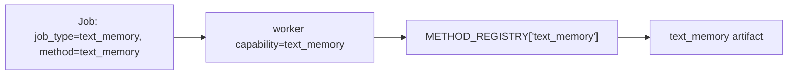
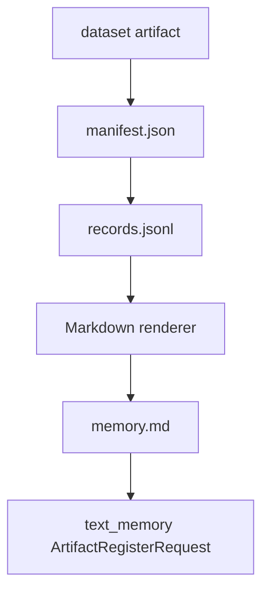
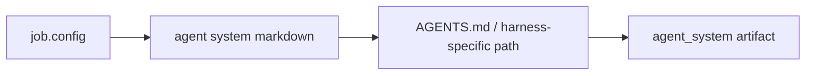
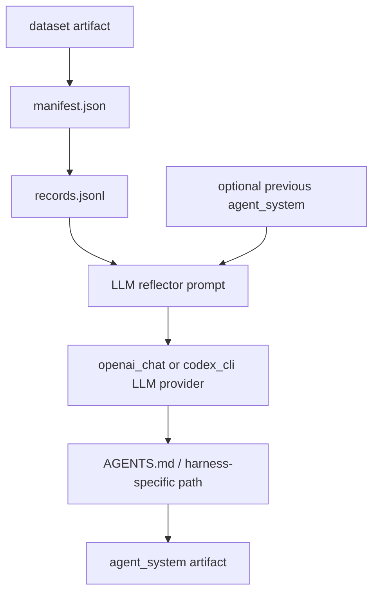
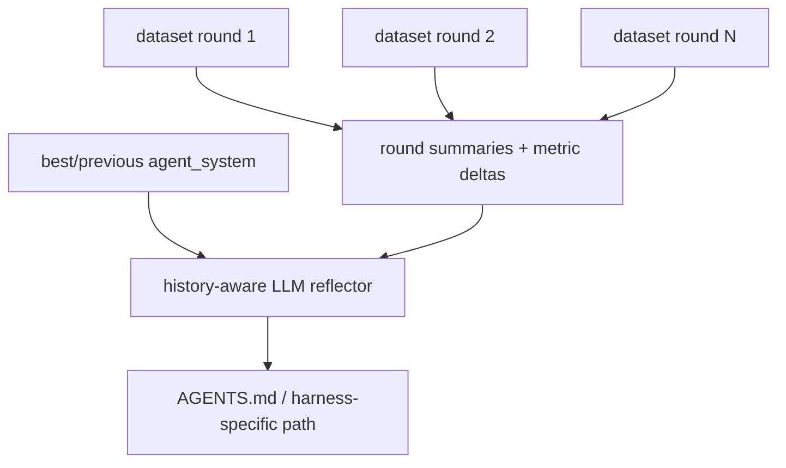
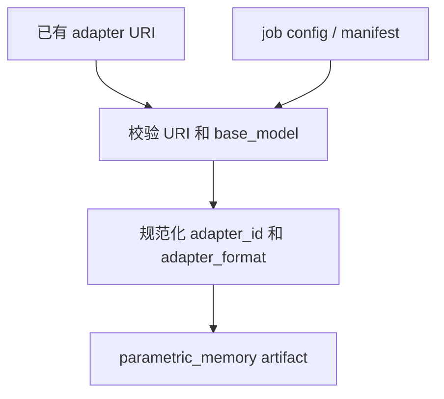

# Reference Evolution Worker（参考演化 Worker）

Reference worker 是用于本地开发和 smoke testing 的轻量 worker。它不是 SOTA
method 实现；它的作用是定义稳定的接口和 baseline 行为，让新的 skill/memory
evolution methods 可以接入 backend。

启动一次 one-shot worker：

```sh
uv run polar-evolution worker \
  --base-url http://127.0.0.1:8200 \
  --worker-id reference-worker \
  --artifact-root .polar_evolution \
  --once
```

## Worker Loop

```mermaid
flowchart TB
    Start[run_once]
    Claim[POST /v1/jobs/claim]
    HasJob{返回 job?}
    Validate[校验 WorkerClaimedJob]
    Heartbeat0[heartbeat progress=0.0]
    Dispatch[按 job.method 调 run_method]
    Heartbeat1[heartbeat progress=1.0]
    Complete[POST /v1/jobs/{id}/complete]
    Fail[POST /v1/jobs/{id}/fail]
    Done[return]

    Start --> Claim --> HasJob
    HasJob -- no --> Done
    HasJob -- yes --> Validate --> Heartbeat0 --> Dispatch --> Heartbeat1 --> Complete --> Done
    Validate -. 带 job identity 的异常 .-> Fail --> Done
    Dispatch -. exception .-> Fail --> Done
```

Unknown method 会以 retryable fail 结束。这样 reference worker 不会把本应由专用
research worker 处理的 jobs 永久失败掉。

## Method Registry

`src/polar_evolution/methods.py` 暴露：

```python
METHOD_REGISTRY = {
    "text_memory": text_memory,
    "text_memory_reflector": text_memory_reflector,
    "text_memory_expel_reflector": text_memory_expel_reflector,
    "skill_bundle": skill_bundle,
    "skill_bundle_reflector": skill_bundle_reflector,
    "agent_system": agent_system,
    "agent_system_reflector": agent_system_reflector,
    "agent_system_history_reflector": agent_system_history_reflector,
    "agent_system_pareto_reflector": agent_system_pareto_reflector,
    "agent_system_gepa_reflector": agent_system_gepa_reflector,
    "parametric_memory_register": parametric_memory_register,
    "parametric_memory_lora_sft": parametric_memory_lora_sft,
}
```

Workers 根据 `job_type` claim jobs，而不是根据 method。CLI 默认 capabilities 是已
注册的 method names。因此最简单的约定是创建 reference jobs 时让 `job_type` 和
`method` 都使用同一个内置 method name。



## Method: `text_memory`

用途：从 dataset 创建 Markdown 长期 memory artifact。

输入：

- 一个类型为 `dataset` 的 input artifact；
- dataset URI 指向 `file://` manifest；
- manifest 指向 `records.jsonl`。

输出：

- `ArtifactRegisterRequest(type=text_memory)`；
- `uri=file://.../memory.md`；
- manifest 包含 source dataset ID 和 record count。



内置 renderer 会提取稳定字段，例如 task id、session id、status、reward 和短的
payload summary。Research workers 可以替换为 clustering、reflection、
distillation 或其他 memory mining 方法，只要返回相同 artifact type 即可。

## Method: `text_memory_reflector` / `text_memory_expel_reflector`

用途：从 dataset 中的历史轨迹调用 LLM 生成可复用 Markdown memory。两者都产出
`text_memory` artifact；`text_memory_expel_reflector` 在普通 reflection prompt 之上使用
ExpeL/Reflexion-style synthesis，并要求输出包含这些二级标题：

- `## Do`
- `## Avoid`
- `## Validate`
- `## When Applicable`
- `## Retired Or Superseded`

输入：

- 一个或多个类型为 `dataset` 的 input artifact；
- 可选旧 `text_memory` input artifact，作为可保留或淘汰的 prior memory；
- 必填 `job.config.reflector_llm.model`；
- 可选 `job.config.reflector_llm.provider`，默认 `openai_chat`，也支持 `codex_cli`；
- 可选 `job.config.max_records`、`compatibility`、`scores`、`tags` 和 `promoted`。

输出：

- `ArtifactRegisterRequest(type=text_memory)`；
- `uri=file://.../memory.md`；
- manifest 包含 `method`、source dataset IDs、record/reflected record counts、
  success/failure counts、prior memory count 和 `promotion_support`。所有 input
  artifact IDs 仍记录在 lineage 中，便于追踪 prior memory artifact。

`text_memory` 会作为文本 prepend 到 agent instruction，因此 subscription transcript runs
和 proxy/local inference runs 都能消费。方法仍必须避免把 held-out answers、oracle
records、reference patches 或 verifier-private literals 写入 memory。

Terminal Bench text-memory jobs 默认纳入 `COMPLETED` 和 `ERROR` transcript
events。失败轨迹是 textual memory 的有效输入，因为它们通常提供可复用的
`Avoid` 和 `Validate` 规则；这不改变 `text_memory` 的 runtime 形态，它仍只是注入到
agent instruction 的 Markdown。

## Method: `skill_bundle`

用途：创建 agent harness 可加载的 skill bundle 目录。

输入：

- 可选 `job.config.name`；
- 可选 `job.config.skill_markdown` 或 `job.config.content`。

输出：

- `ArtifactRegisterRequest(type=skill_bundle)`；
- `uri=file://.../<skill-dir>`；
- 目录中包含 `SKILL.md`。


这个方法刻意保持简单。未来的 SOTA skill evolution method 可以挖掘 trajectories、
合成更丰富的 `SKILL.md`、添加辅助文件，或在 promotion 前评估 skill quality。

## Method: `agent_system`

用途：创建可写入 `AGENTS.md` 或其他 harness-specific instruction 文件的演化文本。

输入：

- 可选 `job.config.name`；
- 可选 `job.config.agent_system_markdown` 或 `job.config.content`；
- 可选 `job.config.target_path`，默认 `AGENTS.md`。
- 可选 `job.config.compatibility`、`job.config.scores`、`job.config.lineage`。

输出：

- `ArtifactRegisterRequest(type=agent_system)`；
- `uri=file://.../<target_path>`；
- manifest 包含 `content_path` 和 `target_path`。



`target_path` 必须是被支持的 harness instruction 相对路径，不能为空、不能是绝对路径，
也不能包含 `..`。当前内置 allowlist 包括 `AGENTS.md`、`agents.md`、`CLAUDE.md`、
`GEMINI.md` 和 `.openhands/microagents/*.md`。`compatibility` 应用于限制 artifact
被哪些 task tags、agent harness 或 base model 选中；例如 Codex 专用的 `AGENTS.md`
通常应设置 `{"agent_harness": ["codex"]}`。

## Method: `agent_system_reflector`

用途：从 dataset 中的历史轨迹调用 LLM 生成新的 agent-system instruction 文件。这个方法
默认使用 OpenAI-compatible Chat Completions API，也可以通过 `codex_cli` provider 使用
Codex subscription 登录态；SOTA reflector 仍可以在专用 research worker 中替换它，只要返回
同样的 `agent_system` artifact contract。

输入：

- 一个类型为 `dataset` 的 input artifact；
- dataset URI 指向 `file://` manifest；
- manifest 指向 `records.jsonl`，records 中可以包含 token-level traces 或 transcript
  traces；
- records 可以包含通用 evolution feedback，例如
  `payload.session_result.metadata.evolution_feedback.golden_standard`。这类 feedback
  应由 orchestration 层的共享 evaluator 预先生成，method 只消费脱敏摘要；
- 可选旧 `agent_system` input artifact，或 `job.config.base_agent_system_markdown`、
  `job.config.agent_system_markdown`、`job.config.content` 作为 base text；
- 必填 `job.config.reflector_llm.model`，指定 reflector 使用的模型；
- 可选 `job.config.reflector_llm.provider`，默认 `openai_chat`，也支持 `codex_cli`；
- 可选 `job.config.reflector_llm.base_url`，默认读取 `OPENAI_BASE_URL`，否则使用
  `https://api.openai.com/v1`；
- 可选 `job.config.reflector_llm.api_key`，或通过 `api_key_env` 指定环境变量，默认
  `OPENAI_API_KEY`；
- `provider=codex_cli` 时可选 `codex_home` 和 `codex_bin`；worker 会清除
  OpenAI/Anthropic/Google proxy API 环境变量，避免把 subscription run 误接到 proxy；
  nested Codex run 会忽略用户 config、使用 `--ephemeral`、`--sandbox read-only`、
  并禁用 `shell_tool`，因为 dataset transcripts 属于不可信 prompt 内容；
- 可选 `temperature`、`max_tokens` 和 `timeout_seconds`；
- 可选 `job.config.target_path`，默认 `AGENTS.md`；
- 可选 `job.config.max_records`，限制 reflector 汇总的 records 数；
- 可选 `job.config.agent_system_audit`，控制生成后文本审计。默认最多启用两次自动
  repair retry；可以传入 `forbidden_literals` / `leakage_basis`，用于禁止 exact
  article title、source filename、sheet、row、sequence 等 protected literals 进入
  `AGENTS.md`。

输出：

- `ArtifactRegisterRequest(type=agent_system)`；
- `uri=file://.../<target_path>`；
- manifest 包含 source dataset ID、record count、reflected record count、success count
  和 failure count，以及 `reflector_provider` / `reflector_model` 和
  `agent_system_audit`；
- lineage 包含 `method=agent_system_reflector` 和所有 input artifact IDs。



方法会先把成功样本、失败样本和通用 evolution feedback 压缩成 prompt，上下文包含
task、session、status、reward、prompt、observed/failure signal，以及由上游 evaluator
写入的脱敏反馈，然后要求 LLM 返回完整 Markdown instruction 文件。
它不负责评估新 instruction 的任务效果，也不会默认 promotion；但会对生成的
agent-system 文本做轻量 audit。Audit 会阻止 protected literal 泄漏，并要求 rule
不是空泛 slogan：至少要有可执行的 trigger、action 和 validation check。对于 coverage
类规则，audit 要求规则说明 recursive file-level source discovery、通用结构化 evidence 格式和最终
per-source/per-package validation。若首次生成失败，worker 会把 redacted candidate 和
audit findings 发回同一 reflector model，最多重写两次；仍失败则 job 报错。需要上线到
context resolver 时，应通过 job config 设置 `promoted=true`，并配合 `compatibility`
限制适用 harness、task tags 或 base model。

## Method: `agent_system_history_reflector`

用途：从多轮 evolution dataset 中调用 LLM 生成新的 agent-system instruction 文件。它是
`agent_system_reflector` 的 history-aware 版本，适合在第 2 轮之后使用：reflector 同时看到
每轮 agent trajectory、共享 evaluator feedback、指标和相邻轮次 delta，从而保留已验证的
改进并分析 regression，而不是只根据最近一轮改写 `AGENTS.md`。

输入：

- 一个或多个类型为 `dataset` 的 input artifacts，每个 dataset 表示一轮 rollout / eval；
- dataset manifest 应尽量包含 `round` 或 `round_number`，缺失时按 input artifact 顺序编号；
- dataset manifest 可包含 `agent_system_artifact_id`，用于记录该轮使用的 agent-system；
- dataset manifest 可包含 `metrics` 或 `summary`，字段包括 `precision`、`recall`、`f1`、
  `true_positive` / `tp`、`false_positive` / `fp`、`false_negative` / `fn`、
  `duplicate_predictions` / `duplicates`；
- 如果 manifest 缺少 `round` 或 metrics，method 会从 record metadata 中的 `round` /
  `rollout_step` / `policy_version` 回退推断轮次，并从脱敏 golden feedback 的
  `Aggregate fit: precision=..., recall=..., f1=...` 回退提取聚合指标；
- records 与 `agent_system_reflector` 一样，可以包含 traces/transcripts 和脱敏的
  `evolution_feedback`；
- 可选旧 `agent_system` input artifact，或 `job.config.base_agent_system_markdown`、
  `job.config.agent_system_markdown`、`job.config.content` 作为 base text。推荐传入当前
  best agent-system，而不是只传 latest；
- LLM 配置与 `agent_system_reflector` 相同，必须指定 `job.config.reflector_llm.model`；
- 可选 `job.config.max_records_per_round`，默认每轮最多汇总 8 条 records；
- 可选 `job.config.target_path`，默认 `AGENTS.md`；
- 可选 `job.config.agent_system_audit`，语义与 `agent_system_reflector` 相同。

输出：

- `ArtifactRegisterRequest(type=agent_system)`；
- `uri=file://.../<target_path>`；
- manifest 包含 `source_dataset_artifact_ids`、`round_count`、总 `record_count`、
  `reflected_record_count`、`success_count`、`failure_count`、`latest_round` /
  `latest_f1`、`best_round` / `best_f1`，以及 `reflector_provider` /
  `reflector_model` 和 `agent_system_audit`；
- lineage 包含 `method=agent_system_history_reflector`、所有 input artifact IDs 和
  `source_dataset_artifact_ids`。

Prompt 数据流：



这个方法仍然不读取 raw ground truth，也不默认 promotion。Ground-truth evaluator 应在
orchestration 层产生脱敏 feedback 和 metrics；history reflector 只根据这些共享信号更新
方法论。典型用法是在 Round 3 后传入 Round 1、Round 2、Round 3 的 dataset artifacts，
并把 Round 2 或离线验证最好的 agent-system artifact 作为 base text。

### Shared golden-standard feedback

有 ground truth 的任务不要让 `agent_system_reflector` 直接读取 reference answers。应由
orchestrator 或独立 evaluator 先调用 `polar_evolution.golden_standard`：

- 在 agent workspace 外比较最终输出和 golden records；
- 保存 raw metrics 供离线分析；
- 只把脱敏 methodology feedback 写入 dataset event；
- 对生成的 `AGENTS.md` / `agents.md` 运行泄漏检查，禁止 exact sequence、source
  filename、source sheet、row number、article title 或 reference record 进入 agent
  system。

这样同一份 golden-standard evaluation 可以被多个 evolution methods 复用，避免每个
method 重复读取大型 ground truth，也避免把评估答案泄漏给下一轮 rollout agent。

示例 config：

```json
{
  "reflector_llm": {
    "provider": "openai_chat",
    "model": "gpt-4.1-mini",
    "base_url": "https://api.openai.com/v1",
    "api_key_env": "OPENAI_API_KEY",
    "temperature": 0.2,
    "max_tokens": 2000,
    "timeout_seconds": 30
  },
  "target_path": "AGENTS.md",
  "promoted": false
}
```

Codex subscription provider 示例：

```json
{
  "reflector_llm": {
    "provider": "codex_cli",
    "model": "gpt-5.4",
    "codex_home": "/root/.codex",
    "timeout_seconds": 900
  },
  "target_path": "AGENTS.md",
  "promoted": false
}
```

## Method: `agent_system_pareto_reflector`

用途：从多轮 evolution dataset 中生成多个候选 agent-system instruction，并用
promotion gate 选择一个候选。它用于替代“reflector 直接覆盖 latest `AGENTS.md`”的流程：
reflector 负责提出候选，shared evaluator / orchestration layer 负责给候选分数，worker
只做安全审计、退化门控和 archive 注册。

输入：

- 一个或多个类型为 `dataset` 的 input artifacts，语义与
  `agent_system_history_reflector` 相同；
- 可选旧 `agent_system` input artifact，或 `job.config.base_agent_system_markdown` 作为
  base text；
- 必填 `job.config.reflector_llm.model`；
- 可选 `job.config.candidate_strategies`，默认生成 precision、recall、provenance 等多个
  策略候选；
- 可选 `job.config.candidate_evaluations`，由外部 paired evaluator 写入每个 candidate 的
  `precision`、`recall`、`f1` 和 `prediction_to_reference_ratio` 等指标；
- 可选 `job.config.promotion_gate`，例如 `max_prediction_to_reference_ratio`、
  `max_f1_regression`、`min_precision`、`min_recall`、`requires_external_evaluation`。

输出：

- 一个 `agent_system` artifact，内容是 gate 选中的候选；
- 一个 `report` artifact，`candidate_archive.json` 记录所有候选、审计结果、外部分数、
  gate failures 和 selected candidate；
- agent-system manifest 包含 `candidate_count`、`selected_candidate`、
  `promotion_gate`、`best_round` / `latest_round` 和 archive path。

这个方法不会读取 raw ground truth。若需要真正 paired evaluation，pipeline 应先对每个候选
跑 rollout/evaluator，再把脱敏指标写回 `candidate_evaluations`。没有外部分数时，method
只能用静态 guardrail score 排序；若不希望静态排序自动 promotion，可设置
`promotion_gate.requires_external_evaluation=true` 或保持 `promoted=false`。

## Method: `parametric_memory_register`

用途：把已有 LoRA/adapter 注册为 parametric memory。它不训练 adapters。
注册后的 artifact 只在 proxy/local inference runtime 中可用于 request-level adapter
selection；subscription harness 不能消费 parametric adapters。

输入：

- `job.config.adapter_uri` 或 `job.config.uri`；
- `job.config.base_model` 或 `job.config.manifest.base_model`；
- 可选 `job.config.adapter_id`；
- 可选 `job.config.adapter_format`，默认 `lora`。

输出：

- `ArtifactRegisterRequest(type=parametric_memory)`；
- `uri` 是 adapter URI；
- manifest 包含 `adapter_id`、`base_model` 和 `adapter_format`。



`adapter_id` 是 serving-time name，应该匹配 SGLang 或 vLLM 加载 adapter 时使用的
名字。artifact display `name` 可以和 adapter ID 相同，但 runtime selection 会优先
使用 manifest `adapter_id`。若 `job.config.compatibility.base_model` 未设置，method 会自动
写入 `[base_model]`；若显式设置但不包含当前 `base_model`，job 会失败，避免 adapter
被不兼容模型选中。

## Method: `parametric_memory_lora_sft`

用途：把 successful trajectory records 导出成 SFT JSONL，调用外部 LoRA/adapter trainer，
并把 trainer 产出的 adapter 目录注册为 `parametric_memory`。Reference worker 只定义
训练编排 contract，不内置具体 trainer。

输入：

- 至少一个类型为 `dataset` 的 input artifact；
- `job.config.base_model`，或 `job.config.manifest.base_model` / `job.config.context.base_model`；
- `job.config.trainer.command`，必须是可执行文件名或路径；
- `job.config.trainer.args`，必须包含 `{training_dataset}` 和 `{adapter_dir}` 占位符；
- 可选 `job.config.trainer.timeout_seconds`，默认 600 秒，必须为正数；
- 可选 `job.config.training_projection`，控制 successful trace 到 SFT JSONL 的投影。
  默认 `{"type": "full_trace"}` 会保留完整 prompt/response messages；
  `{"type": "response_tail", "response_tail_chars": N}` 会保留 prompt messages，并把
  assistant response content 截为最后 `N` 个字符，适合长 Terminal Bench transcript 中
  最终成功动作位于尾部的训练集；
  `{"type": "terminal_bench_final_actions", "max_events": N, "max_output_chars": M}`
  会解析 Codex-style JSONL transcript 中的 `item.completed` command/message events，只保留
  最后 N 个事件，并把每个 command output 限制在 M 个字符以内，适合 tool-heavy Terminal
  Bench 轨迹中最终成功动作被大型中间输出稀释的训练集；
  `{"type": "terminal_bench_tool_call_policy", "max_commands": N}` 会导出包含
  `assistant.tool_calls`、`tool` response messages 和 top-level `tools` 的 Qwen SFT records，
  让本地 vLLM/Qwen parametric-memory adapter 学习真实 `tb_read_task`/`tb_exec` 工具调用形态。
  使用该 projection 的 trainer 必须把 record-level `tools` 传给 tokenizer chat template；
  `{"type": "terminal_bench_corrective_tool_call_policy", "target_tool_call": {...}}`
  会从 trace metadata 中 opt-in 保存的 compact `llm_calls` 导出真实失败 prefix 的监督
  next tool-call。它可使用 `input_contains` 选择特定工具输出后的 prefix，并允许 failed 或
  zero-reward records 进入训练；长 prefix 可用 `max_input_tool_messages` 只保留最近 N 条
  tool result，用于本地推理 adapter 的 corrective SFT；该 projection 也支持
  `{"type": "terminal_bench_corrective_tool_call_policy", "stages": [...]}`，每个 stage 可设置
  `name`、二选一的 `target_tool_call` 或 `target_assistant_message`、
  `input_contains`、`max_examples`、`repeat` 和 `max_input_tool_messages`。worker 会按
  stage 独立扫描 `llm_calls`，并在 `repeat > 1` 时导出加权重复样本，JSONL metadata
  会记录 `projection_stage`、`projection_stage_index` 和
  `projection_repeat_index`。`target_assistant_message` 导出不带 `tool_calls` 的普通
  assistant message，用于训练 `tb_collect_result` 后的 finish/stop 行为；也可以设为
  `{"type": "terminal_bench_password_recovery_shorttarget_recipe", "target_command": "..."}`
  让 worker 生成同样的 staged corrective projection。该 recipe 面向本地 Qwen
  `password-recovery` short-target smoke，默认用 `static-terminal-bench-harbor` 匹配
  read-task prefix、用 `recovered_passwords.txt` 匹配 after-read prefix，并在配置了
  `correction_input_contains` 时额外导出 `correct_back_to_short_exec` 样本；
- 可选 `job.config.output_adapter_id`、`adapter_format`、`compatibility`、`scores`、
  `tags`、`promoted`；
- 可选旧 `parametric_memory` input artifact，当前只记录在 manifest，后续 trainer 可以用
  lineage 决定是否做继续训练。

输出：

- worker output 目录下的 `training.jsonl`，每行形如
  `{"messages": [...], "metadata": {...}}`。默认 projection 只包含成功轨迹；同一个
  successful record 中多个可训练 trace 会分别导出为多行。`terminal_bench_corrective_tool_call_policy`
  是例外，它可以从 failed/zero-reward records 导出真实 prefix 的纠偏样本。默认
  `full_trace` 会保留 assistant `tool_calls`，即使对应 message 的 `content` 为空；如果
  trace 提供 top-level `tools`，worker 也会把它写入对应 SFT JSONL 行；
- `trainer.stdout.txt` 和 `trainer.stderr.txt`，用于排障；
- `ArtifactRegisterRequest(type=parametric_memory)`；
- `uri=file://.../adapter`，该目录会在 trainer 执行前清理旧内容，并且 trainer 必须写出
  至少一个文件；
- 对默认 `adapter_format=lora`，adapter 目录必须包含 `adapter_config.json`；
- manifest 包含 `adapter_id`、`base_model`、`adapter_format`、training dataset path、
  record count、`training_projection`、source dataset IDs 和 prior parametric-memory IDs。

Trainer contract:

- 使用 chat template SFT 时，trainer 必须确保第一个 generated response token 参与 loss。
  不要分别 tokenize 完整 conversation 和 generation prefix 后仅用 prefix token 数切 mask；
  BPE 可能把 prompt 末尾换行和 response 开头换行合并，导致首个 response token 被误 mask。
  推荐流程是 render full text 和 generation prefix，确认 full 以 prefix 开头，然后分别
  `add_special_tokens=False` tokenize prefix 和 suffix，拼接 token ids，并只 mask prefix ids。
- 对 Qwen/vLLM tool-use records，trainer 必须把 top-level `tools` 传入
  `tokenizer.apply_chat_template(..., tools=record["tools"])`，否则训练格式不会匹配 runtime 的
  `qwen3_xml` tool parser。

Task-local Terminal Bench parametric jobs can be prepared without going through
the event store:

```sh
OPEN_EVO_REPO=/path/to/OpenEvo
uv run polar-evolution terminal-bench-task-local-parametric-memory-job \
  --trajectory-pool /path/to/trajectory_pool.jsonl \
  --task-id train-fasttext \
  --output-root /tmp/tb21-task-local-parametric/train-fasttext \
  --base-model Qwen/Qwen3.6-35B-A3B \
  --adapter-id tb-parametric-memory-train-fasttext \
  --trainer-command /root/evolab-vllm/bin/python \
  --trainer-arg "${OPEN_EVO_REPO}/scripts/qwen_lora_sft.py" \
  --trainer-arg --train-file \
  --trainer-arg '{training_dataset}' \
  --trainer-arg --output-dir \
  --trainer-arg '{adapter_dir}' \
  --command-contains /app/model.bin \
  --output /tmp/tb21-task-local-parametric/train-fasttext/job.json
```

The command selects tasks that have at least one failed and one successful pool
row, reads successful Codex command events from `agent/codex.txt`, writes a
standalone dataset artifact manifest plus `records.jsonl`, and emits a
`parametric_memory_lora_sft` `WorkerClaimedJob` payload. It only invokes the
trainer when `--run-worker` is set. If multiple successful commands match the
filters, the builder prefers write-like commands over later validation commands,
so post-hoc existence checks do not become the supervised target.
`scripts/qwen_lora_sft.py` is a repository-provided experiment helper; it should
be run with a trainer environment that provides `torch`, `transformers`, and
`peft`, rather than making those libraries mandatory package dependencies. Pass
the helper as an absolute path, or expand a repo-root variable in the shell,
because the worker invokes the trainer from the artifact output directory.

Serving contract:

- `terminal-bench-local-parametric-memory-eval` 可用
  `--adapter-key-rewrite qwen3_5_moe_vllm_language_model` 为 Qwen3.5/Qwen3.6 MoE PEFT LoRA
  生成 vLLM-compatible adapter 副本。该 rewrite 把
  `base_model.model.model.layers.*` key 映射为 vLLM language-model-only wrapper 期望的
  `base_model.model.model.language_model.layers.*` key；summary 会记录 source adapter path、
  prepared serving adapter path、rewrite 名称和改写 key 数。
- 该 rewrite 是 serving-time 兼容层，不改变 evolution artifact 的原始 URI。只有使用 vLLM
  managed server 的本地评估需要它；其他 serving backend 应按自身 adapter key contract 处理。
- 本地 eval 会记录 `requested_max_output_tokens` 和实际传给 Harbor agent 的
  `max_output_tokens`。实际值会被 `context_reserve_tokens` clamp；默认
  `context_window_tokens=16384`、`context_reserve_tokens=1536`。Managed vLLM server 使用同一个
  `context_window_tokens` 作为 `--max-model-len`，并把 context budget 通过
  `EVOLAB_TB_CONTEXT_WINDOW_TOKENS`、`EVOLAB_TB_CONTEXT_RESERVE_TOKENS` 暴露给支持新版 contract 的
  Terminal Bench/EvoLab package。

该 artifact 只适用于 proxy/local inference runtime。Subscription harness 直连外部模型
服务，不能选择 OpenEvo 训练出的 adapter；上层 experiment config 和 Terminal Bench
Codex subscription runner 都应拒绝启用 `parametric_memory`，context resolver 也会在
subscription request 中跳过已存在的 parametric-memory artifact。

## CLI Options

```text
polar-evolution worker
  --base-url http://127.0.0.1:8200
  --worker-id reference-worker
  --capability text_memory
  --capability skill_bundle
  --capability agent_system
  --capability agent_system_reflector
  --capability agent_system_history_reflector
  --capability agent_system_pareto_reflector
  --capability agent_system_gepa_reflector
  --capability text_memory_reflector
  --capability text_memory_expel_reflector
  --capability parametric_memory_register
  --capability parametric_memory_lora_sft
  --artifact-root .polar_evolution
  --once
  --sleep-seconds 5
  --lease-seconds 600
```

如果不传 `--capability`，worker 默认使用内置 method names。也可以传逗号分隔的值：

```sh
uv run polar-evolution worker --capability text_memory,skill_bundle,agent_system,agent_system_reflector,agent_system_history_reflector,agent_system_pareto_reflector,text_memory_expel_reflector,parametric_memory_lora_sft
```

Worker heartbeat 会续租 job lease，但不会缩短 claim 时已经获得的更长 lease。这样本地
one-shot worker 可以为长时间运行的 `parametric_memory_lora_sft` trainer 使用较长 claim
lease，并在 trainer 结束后正常 heartbeat 和 complete job。

## 添加 Research Method

1. 添加一个接收 `WorkerClaimedJob` 和 `artifact_root` 的 method function。
2. 返回一个或多个 `ArtifactRegisterRequest`。
3. 在 `METHOD_REGISTRY` 中注册。
4. 创建 jobs 时，让 `method` 和 `job_type` 匹配你的 worker capability 策略。
5. 为 artifact 文件、manifest、runner fail/complete 行为添加测试。

Backend 不需要 method-specific DB schema。新 methods 通过 typed artifacts 和
manifest metadata 与系统通信。
