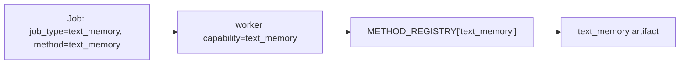
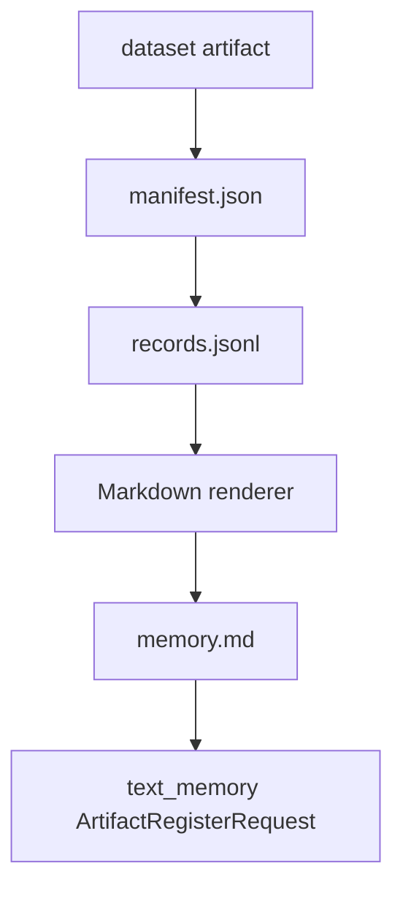
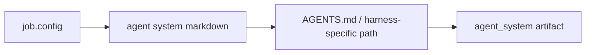
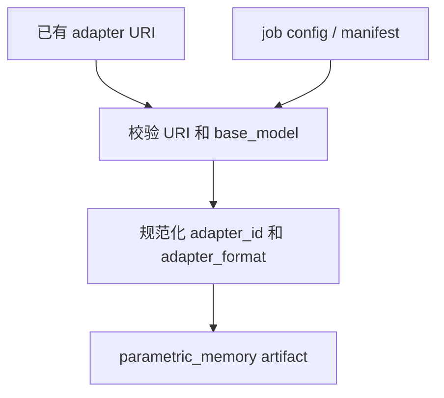

# Reference Evolution Worker（参考演化 Worker）

Reference worker 是用于本地开发和 smoke testing 的轻量 worker。它不是 SOTA
method 实现；它的作用是定义稳定的接口和 baseline 行为，让新的 skill/memory
evolution methods 可以接入 backend。

启动一次 one-shot worker：

```sh
uv run polar-evolution worker \
  --base-url http://127.0.0.1:8200 \
  --worker-id reference-worker \
  --artifact-root .polar_evolution \
  --once
```

## Worker Loop

```mermaid
flowchart TB
    Start[run_once]
    Claim[POST /v1/jobs/claim]
    HasJob{返回 job?}
    Validate[校验 WorkerClaimedJob]
    Heartbeat0[heartbeat progress=0.0]
    Dispatch[按 job.method 调 run_method]
    Heartbeat1[heartbeat progress=1.0]
    Complete[POST /v1/jobs/{id}/complete]
    Fail[POST /v1/jobs/{id}/fail]
    Done[return]

    Start --> Claim --> HasJob
    HasJob -- no --> Done
    HasJob -- yes --> Validate --> Heartbeat0 --> Dispatch --> Heartbeat1 --> Complete --> Done
    Validate -. 带 job identity 的异常 .-> Fail --> Done
    Dispatch -. exception .-> Fail --> Done
```

Unknown method 会以 retryable fail 结束。这样 reference worker 不会把本应由专用
research worker 处理的 jobs 永久失败掉。

## Method Registry

`src/polar_evolution/methods.py` 暴露：

```python
METHOD_REGISTRY = {
    "text_memory": text_memory,
    "skill_bundle": skill_bundle,
    "agent_system": agent_system,
    "parametric_memory_register": parametric_memory_register,
}
```

Workers 根据 `job_type` claim jobs，而不是根据 method。CLI 默认 capabilities 是已
注册的 method names。因此最简单的约定是创建 reference jobs 时让 `job_type` 和
`method` 都使用同一个内置 method name。



## Method: `text_memory`

用途：从 dataset 创建 Markdown 长期 memory artifact。

输入：

- 一个类型为 `dataset` 的 input artifact；
- dataset URI 指向 `file://` manifest；
- manifest 指向 `records.jsonl`。

输出：

- `ArtifactRegisterRequest(type=text_memory)`；
- `uri=file://.../memory.md`；
- manifest 包含 source dataset ID 和 record count。



内置 renderer 会提取稳定字段，例如 task id、session id、status、reward 和短的
payload summary。Research workers 可以替换为 clustering、reflection、
distillation 或其他 memory mining 方法，只要返回相同 artifact type 即可。

## Method: `skill_bundle`

用途：创建 agent harness 可加载的 skill bundle 目录。

输入：

- 可选 `job.config.name`；
- 可选 `job.config.skill_markdown` 或 `job.config.content`。

输出：

- `ArtifactRegisterRequest(type=skill_bundle)`；
- `uri=file://.../<skill-dir>`；
- 目录中包含 `SKILL.md`。


这个方法刻意保持简单。未来的 SOTA skill evolution method 可以挖掘 trajectories、
合成更丰富的 `SKILL.md`、添加辅助文件，或在 promotion 前评估 skill quality。

## Method: `agent_system`

用途：创建可写入 `AGENTS.md` 或其他 harness-specific instruction 文件的演化文本。

输入：

- 可选 `job.config.name`；
- 可选 `job.config.agent_system_markdown` 或 `job.config.content`；
- 可选 `job.config.target_path`，默认 `AGENTS.md`。
- 可选 `job.config.compatibility`、`job.config.scores`、`job.config.lineage`。

输出：

- `ArtifactRegisterRequest(type=agent_system)`；
- `uri=file://.../<target_path>`；
- manifest 包含 `content_path` 和 `target_path`。



`target_path` 必须是被支持的 harness instruction 相对路径，不能为空、不能是绝对路径，
也不能包含 `..`。当前内置 allowlist 包括 `AGENTS.md`、`agents.md`、`CLAUDE.md`、
`GEMINI.md` 和 `.openhands/microagents/*.md`。`compatibility` 应用于限制 artifact
被哪些 task tags、agent harness 或 base model 选中；例如 Codex 专用的 `AGENTS.md`
通常应设置 `{"agent_harness": ["codex"]}`。

## Method: `parametric_memory_register`

用途：把已有 LoRA/adapter 注册为 parametric memory。它不训练 adapters。

输入：

- `job.config.adapter_uri` 或 `job.config.uri`；
- `job.config.base_model` 或 `job.config.manifest.base_model`；
- 可选 `job.config.adapter_id`；
- 可选 `job.config.adapter_format`，默认 `lora`。

输出：

- `ArtifactRegisterRequest(type=parametric_memory)`；
- `uri` 是 adapter URI；
- manifest 包含 `adapter_id`、`base_model` 和 `adapter_format`。



`adapter_id` 是 serving-time name，应该匹配 SGLang 或 vLLM 加载 adapter 时使用的
名字。artifact display `name` 可以和 adapter ID 相同，但 runtime selection 会优先
使用 manifest `adapter_id`。

## CLI Options

```text
polar-evolution worker
  --base-url http://127.0.0.1:8200
  --worker-id reference-worker
  --capability text_memory
  --capability skill_bundle
  --capability agent_system
  --artifact-root .polar_evolution
  --once
  --sleep-seconds 5
  --lease-seconds 600
```

如果不传 `--capability`，worker 默认使用内置 method names。也可以传逗号分隔的值：

```sh
uv run polar-evolution worker --capability text_memory,skill_bundle,agent_system
```

## 添加 Research Method

1. 添加一个接收 `WorkerClaimedJob` 和 `artifact_root` 的 method function。
2. 返回一个或多个 `ArtifactRegisterRequest`。
3. 在 `METHOD_REGISTRY` 中注册。
4. 创建 jobs 时，让 `method` 和 `job_type` 匹配你的 worker capability 策略。
5. 为 artifact 文件、manifest、runner fail/complete 行为添加测试。

Backend 不需要 method-specific DB schema。新 methods 通过 typed artifacts 和
manifest metadata 与系统通信。
