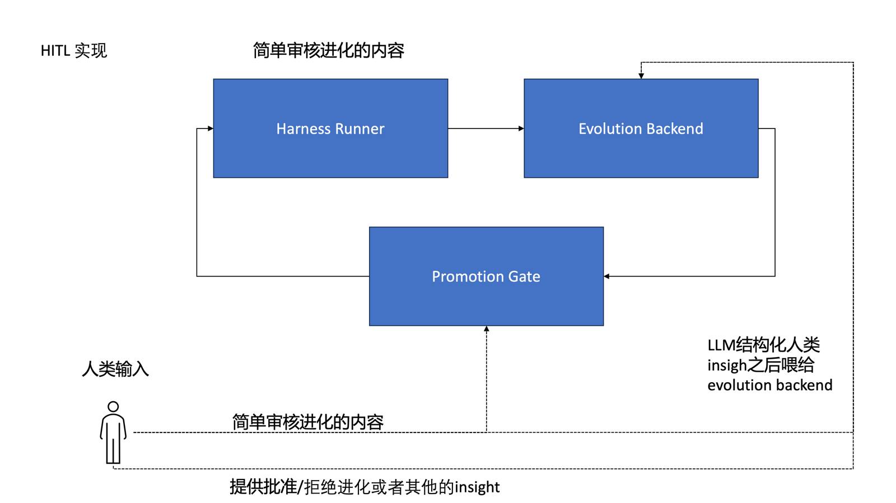

# HITL Feedback Lifecycle Design

Date: 2026-06-27

## Context

Polar/OpenEvo currently has a runner/backend promotion gate that can ask a human
or LLM reviewer to approve evolved artifacts before they are promoted into later
rollouts. The current human path supports decision files and a line-oriented
terminal prompt. Human decisions may include structured `human_feedback`, but
that feedback is still stored inside promotion review results rather than being
a first-class, replayable evolution signal.

This spec turns human-in-the-loop feedback from a local approval mechanism into
a lifecycle that supports asynchronous review, typed feedback, promotion
decisions, and downstream algorithm consumption.

## Problem

The current design answers "may this artifact be promoted?" better than it
answers "what did the human teach the evolution loop?"

That creates several gaps:

- Human comments can be preserved, but there is no durable object that tracks
  reviewer identity, packet hash, artifact hash, review question, feedback
  provenance, adjudication, or downstream use.
- Runner execution can block on review when the more robust default should be
  to emit a pending review and resume later.
- Human approval and human learning signal are coupled, even though a rejected
  artifact may contain the most useful learning signal for the next generation.
- There is no explicit record of whether feedback was consumed by a later
  method, candidate prompt, evaluator, or promotion decision.
- There is no query policy deciding when a human should be asked, so review
  volume is controlled only by static promotion-gate configuration.

## Goals

- Represent human review requests, human feedback, promotion decisions, and
  feedback applications as first-class lifecycle objects.
- Make review asynchronous by default. A runner should be able to stop at
  `pending_review` and a later orchestrator action should resume promotion or
  evolution.
- Preserve enough provenance to audit what a reviewer saw and which artifact
  version they judged.
- Keep promotion decisions separate from learning signals.
- Support yes/no approval, scores, pairwise preferences, critiques, suggested
  changes, risks, validation checks, and abstentions.
- Allow human feedback to enter future evolution jobs as sanitized
  `evolution_feedback.human` records.
- Add a query-decision layer that can later be optimized for human value per
  unit cost.

## Non-Goals

- This spec does not implement RLHF, PPO, DPO, or a learned reward model.
- This spec does not require a full-screen TUI. The existing terminal prompt can
  remain as one client.
- This spec does not require all evolution methods to consume human feedback in
  the first milestone.
- This spec does not expose raw ground truth or protected evaluator data to
  reviewers or future agents.

## Lifecycle Overview

There are three related but separate lifecycles.

### Review lifecycle

The review lifecycle tracks a request for human judgment.

```text
created
  -> queued
  -> assigned
  -> in_review
  -> submitted
  -> validated
  -> adjudicated
  -> resolved
```

Allowed side states:

```text
created/submitted -> stale
submitted -> needs_revision
submitted -> rejected_invalid
validated -> conflict
adjudicated -> archived_only
```

### Feedback lifecycle

The feedback lifecycle tracks raw human input becoming a reusable evolution
signal.

```text
submitted
  -> validated
  -> normalized
  -> redacted
  -> indexed
  -> available_for_evolution
  -> consumed
```

Rejected or unusable feedback should still be retained for audit, but it should
not be exposed to evolution methods as trusted signal.

### Promotion lifecycle

The promotion lifecycle remains artifact-focused.

```text
registered_unpromoted
  -> review_requested
  -> approved | partially_approved | rejected | pending_review
  -> promoted | left_unpromoted
```

Promotion is only one possible effect of human feedback. A rejection can still
produce feedback that is consumed by later evolution.

## Data Model

The exact persistence layer can be SQL tables or equivalent backend models. The
contract should be stable even if storage changes.

### ReviewRequest

Represents a question posed to a human.

Required fields:

- `review_id`
- `review_type`: `promotion`, `comparison`, `critique`, `annotation`,
  `validation`, or `query_policy_audit`
- `status`
- `artifact_ids`
- `candidate_ids`
- `job_id`
- `task_id`
- `round_index`
- `method`
- `artifact_type`
- `packet_id`
- `packet_hash`
- `artifact_hashes`
- `created_at`
- `updated_at`

Optional fields:

- `assigned_to`
- `reviewer_role`
- `due_at`
- `priority`
- `query_decision_id`
- `parent_review_id`
- `supersedes_review_id`

### ReviewPacket

Represents the immutable material shown to a reviewer.

Required fields:

- `packet_id`
- `packet_hash`
- `trusted_metadata`
- `untrusted_artifact_excerpts`
- `promotion_support`
- `questions`
- `created_at`

The packet must separate trusted metadata from untrusted generated artifact
content. Generated artifact text, transcript snippets, and model-produced
support text should be rendered as untrusted content in UI clients.

Packet contents should include, when available:

- artifact metadata and content excerpt
- artifact diff against previous artifact
- candidate archive entry
- trajectory findings
- proposed changes
- expected benefits
- risks
- validation checks
- evaluator metrics
- failure traces or summarized failure modes
- competing candidates for pairwise review

### HumanFeedback

Represents a submitted human response.

Required fields:

- `feedback_id`
- `review_id`
- `reviewer_id`
- `reviewer_role`
- `status`: `submitted`, `validated`, `normalized`, `rejected_invalid`,
  `redacted`, `available_for_evolution`, or `archived_only`
- `decision`: `approve`, `reject`, `revise`, `abstain`, `prefer_a`,
  `prefer_b`, `tie`, or `comment_only`
- `raw_payload`
- `normalized_payload`
- `created_at`

Recommended normalized fields:

- `score`
- `confidence`
- `rationale`
- `observed_issues`
- `suggested_changes`
- `risks`
- `validation_checks`
- `labels`
- `preference`
- `redaction_status`
- `provenance`

`observed_issues`, `suggested_changes`, `risks`, and `validation_checks` should
allow both freeform text and typed taxonomy labels.

### FeedbackApplication

Records how a feedback item affected later work.

Required fields:

- `application_id`
- `feedback_id`
- `target_type`: `promotion_decision`, `prompt_seed`,
  `mutation_constraint`, `negative_constraint`, `validation_check`,
  `ranking_signal`, `dataset_record`, or `audit_note`
- `target_id`
- `consumed_by_method`
- `consumed_in_job_id`
- `effect_summary`
- `created_at`

Without this object, the system cannot answer whether human feedback changed
future evolution.

### HumanQueryDecision

Records why the system did or did not ask a human.

Required fields:

- `query_decision_id`
- `artifact_ids`
- `candidate_ids`
- `task_id`
- `round_index`
- `method`
- `decision`: `ask_human`, `ask_llm`, `auto_promote`, `auto_reject`,
  `run_more_eval`, or `defer`
- `reason_codes`
- `estimated_value_of_information`
- `estimated_human_cost`
- `budget_context`
- `created_at`

Recommended follow-up fields:

- `actual_latency_seconds`
- `feedback_changed_promotion`
- `feedback_changed_next_candidate`
- `downstream_delta`
- `review_id`

This object is the training data for a future learned query policy.

## API Surface

The backend should expose review and feedback APIs instead of relying only on
filesystem decision files.

Initial API:

```text
POST /v1/reviews
GET /v1/reviews
GET /v1/reviews/{review_id}
POST /v1/reviews/{review_id}/claim
POST /v1/reviews/{review_id}/feedback
POST /v1/reviews/{review_id}/adjudicate
POST /v1/reviews/{review_id}/resolve
POST /v1/reviews/{review_id}/mark-stale
POST /v1/evolution/resume-pending-review
```

Decision files and the terminal prompt should become clients of this lifecycle,
not separate sources of truth. For local operation, the file path can still be
used as a transport layer and then imported into the backend.

## Runner and Orchestrator Behavior

The runner should not block indefinitely for humans.

Default behavior:

1. Evolution worker registers artifacts as unpromoted.
2. Runner builds review packets and creates review requests.
3. Runner marks the job or round as `pending_review`.
4. Runner exits cleanly or continues independent work.
5. A human or client submits feedback.
6. Backend validates and adjudicates feedback.
7. Orchestrator resumes the pending review.
8. Approved artifacts are promoted.
9. Valid feedback is written into future evolution inputs.

Synchronous terminal review can remain available for local experiments through
`human_input=tui`, but it should not be the only lifecycle path.

## Feedback Ingestion

Validated feedback should be available to evolution methods as sanitized dataset
records or job config references.

Recommended dataset shape:

```json
{
  "metadata": {
    "evolution_feedback": {
      "human": {
        "feedback_id": "fb_...",
        "review_id": "rv_...",
        "decision": "reject",
        "confidence": 0.8,
        "observed_issues": ["..."],
        "suggested_changes": ["..."],
        "risks": ["..."],
        "validation_checks": ["..."],
        "labels": ["..."]
      }
    }
  }
}
```

Rules:

- Raw feedback is stored for audit.
- Evolution methods consume only normalized, redacted feedback.
- Raw ground truth, source rows, protected literals, secrets, and credentialed
  URIs must not enter feedback records exposed to agents.
- Feedback should retain links back to immutable review and artifact hashes.

## Algorithm Consumption

Each evolution method should declare which feedback targets it consumes.

Initial mappings:

- `approve` / `reject`: promotion and candidate selection signal.
- `score` / `confidence`: weak ranking signal, never a replacement for
  verifier reward.
- `observed_issues`: negative constraints in the next reflection prompt.
- `suggested_changes`: mutation seeds or candidate strategy hints.
- `risks`: audit checklist and guardrail prompts.
- `validation_checks`: evaluator hooks or required next-review packet fields.
- `prefer_a` / `prefer_b`: pairwise ranking signal for multi-candidate methods.

Methods that consume feedback should record a `FeedbackApplication` and mention
consumed feedback IDs in their output artifact manifest or lineage.

## Query Policy

"When should we ask a human?" is itself an optimization problem.

The initial query policy should be rules-based and fully logged.

Ask a human when:

- evaluator score is close to a promotion threshold
- candidates are tied or metrics disagree
- a candidate has high novelty or large instruction diff
- safety/leakage/audit results are ambiguous
- a method has a history of reward hacking or brittle improvements
- the candidate targets high-impact runtime artifacts such as `agent_system`
- prior human feedback on this task family had high downstream effect

Avoid asking a human when:

- the candidate clearly fails verifier gates
- the artifact has missing support material
- the artifact has deterministic safety violations
- the same packet hash was already reviewed and remains valid

Every query decision should log the estimated value of information, estimated
human cost, reason codes, and later outcome. This makes it possible to train a
budgeted query policy later.

Future policy options:

- classifier: should this item be reviewed by a human?
- ranker: which pending items are worth review first?
- budgeted bandit: maximize downstream lift under review budget
- active learning: ask on uncertainty, disagreement, and high expected value
- cost-sensitive policy: account for reviewer cost, latency, and expertise

Primary metric:

```text
downstream causal lift per human-minute
```

Supporting metrics:

- bad promotion rate
- missed improvement rate
- review latency
- feedback reuse rate
- conflict rate
- percentage of feedback with a recorded application

## Adjudication

Single-reviewer approval is enough for local experiments but not for important
artifacts.

The lifecycle should support:

- quorum rules
- reviewer role weighting
- conflict status
- required second review for high-risk artifacts
- override decisions with rationale
- stale review invalidation when artifact hash changes
- abstain and comment-only outcomes

Conflicts should preserve all feedback. The adjudicated promotion decision may
choose one path, but minority objections remain useful evolution signal.

## Security and Safety

Review packets are adversarial surfaces.

Requirements:

- Separate trusted metadata from untrusted artifact content.
- Sanitize top-level and nested URI fields before external LLM review.
- Redact secrets, tokens, credentialed URLs, raw golden answers, source rows,
  protected literals, and environment details.
- Only read artifact content from allowed artifact roots.
- Hash packet contents and artifact contents used for review.
- Treat human-entered freeform text as untrusted until normalized and redacted.
- Do not let reviewed artifact text issue instructions to the reviewer client.

## MVP Plan

### Milestone 1: Async review lifecycle

- Add `ReviewRequest` and `ReviewPacket` persistence.
- Convert current promotion gate output into review requests.
- Add `pending_review` resume flow.
- Keep file and terminal input as clients.

Acceptance:

- A gated run can stop at `pending_review`.
- A later submitted decision can resume and promote only approved artifacts.
- Review packet and artifact hashes are recorded.

### Milestone 2: Typed feedback

- Add `HumanFeedback`.
- Normalize current `human_feedback` fields into the new object.
- Validate score, confidence, decision type, and structured fields.
- Preserve raw payload separately from normalized payload.

Acceptance:

- Rejected promotion can still produce available evolution feedback.
- Invalid feedback is retained for audit but not consumed.

### Milestone 3: Feedback ingestion

- Export validated feedback as sanitized `evolution_feedback.human`.
- Add dataset records or job config references for next evolution jobs.
- Track `FeedbackApplication`.

Acceptance:

- A reflector job can show which feedback IDs it consumed.
- Output artifacts record feedback lineage.

### Milestone 4: Method consumption

- Teach `agent_system_history_reflector` and `agent_system_gepa_reflector` to
  consume human feedback.
- Map issues to constraints, suggestions to mutation seeds, risks to audits,
  and validation checks to reviewer/evaluator prompts.

Acceptance:

- Generated `promotion_support` identifies human feedback used.
- Tests cover feedback influencing the next candidate prompt.

### Milestone 5: Query policy

- Add `HumanQueryDecision`.
- Start with deterministic reason-code rules.
- Log outcomes needed for a learned policy.

Acceptance:

- The system can report why it asked or did not ask a human.
- Review budget and estimated value of information are visible in logs.

## Testing Strategy

Focused tests:

- Review request creation for gated artifacts.
- Pending review resume and promotion patch behavior.
- File and terminal clients submitting equivalent feedback.
- Multi-candidate partial approval.
- Feedback validation and redaction.
- Feedback ingestion into dataset records.
- Method prompt includes sanitized human feedback.
- `FeedbackApplication` is recorded when feedback is consumed.
- Query policy reason codes are deterministic.
- Stale review is created when artifact hash changes.

Regression tests:

- Promotion gate still rejects missing support.
- Backend still prevents worker-side promote bypass.
- LLM review packets still sanitize nested URI values.
- No raw ground truth enters review packets or evolution records.

## Open Questions

- Should reviewer identity be local-only initially, or tied to GitHub/user auth?
- Should feedback be stored in the evolution backend database or as artifacts
  plus database indexes?
- Should review packet hashes include redacted or raw packet content?
- Which artifacts require quorum by default?
- Should `human_input=file` be deprecated once backend review APIs exist, or
  kept as a long-term air-gapped mode?
- Which method consumes human feedback first: history reflector or GEPA?

## Design Check

This design intentionally separates:

- asking a human from promoting an artifact
- raw feedback from normalized evolution signal
- human approval from algorithmic learning
- synchronous local review from asynchronous backend lifecycle
- current rules-based query policy from future learned query policy

The critical implementation test is not whether a human can click approve. It
is whether the system can later answer:

- what the human saw
- what they decided
- what insight they provided
- how that insight was validated
- whether it changed promotion
- whether it changed a later candidate
- whether the later candidate causally improved downstream performance
