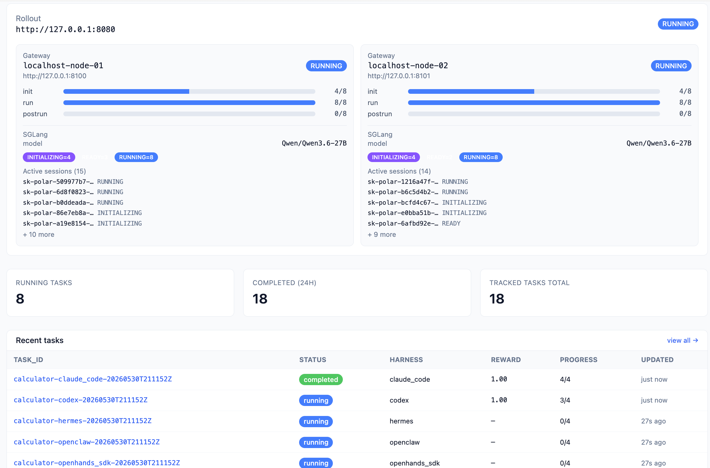
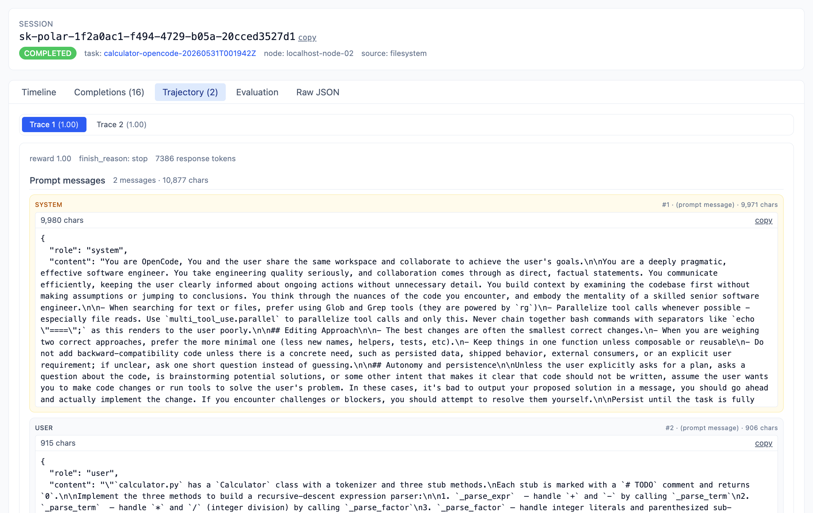

# Calculator Example

The smallest end-to-end OpenEvo run. Each harness gets a tiny `calculator.py`
with parser stubs, edits it, and the evaluator runs `python3 test_calculator.py`.
Use it as a quick smoke test that rollout, gateway, runtime, harness execution,
and evaluation all work together.

## Prerequisites

Install **OpenEvo** and **vLLM** as described in the [top-level README](../../../README.md#development-setup).
This example uses 1 node 8×B200 — two vLLM servers (tensor-parallel 4 each).
Adjust the setup and topology for your hardware.

## Quick Start

### 1. Build the runtime image (once)

```bash
uv run python examples/research-benchmarks/calculator/build_image.py
```

### 2. Start two vLLM servers

```bash
CUDA_VISIBLE_DEVICES=0,1,2,3 uv run vllm serve Qwen/Qwen3.6-27B --port 8000 \
  --tensor-parallel-size 4 --max-model-len 262144 \
  --reasoning-parser qwen3 --enable-auto-tool-choice --tool-call-parser qwen3_coder

CUDA_VISIBLE_DEVICES=4,5,6,7 uv run vllm serve Qwen/Qwen3.6-27B --port 8001 \
  --tensor-parallel-size 4 --max-model-len 262144 \
  --reasoning-parser qwen3 --enable-auto-tool-choice --tool-call-parser qwen3_coder
```

### 3. Start OpenEvo Core Servers

```bash
uv run python -m openevo.rollout.server --config examples/research-benchmarks/calculator/topology.yaml
uv run python -m openevo.gateway.server --config examples/research-benchmarks/calculator/topology.yaml --node-id localhost-node-01
uv run python -m openevo.gateway.server --config examples/research-benchmarks/calculator/topology.yaml --node-id localhost-node-02
```

### 4. Run

Submits example harness at once and prints a reward comparison:

```bash
uv run python examples/research-benchmarks/calculator/run.py
```

Use Apptainer instead of Docker with `--backend apptainer`.

### 5. (Optional) Inspect the services

```bash
curl http://127.0.0.1:8080/health
```

Use the rollout and gateway logs for live task/session progress.

<p align="center">
  
  
</p>
